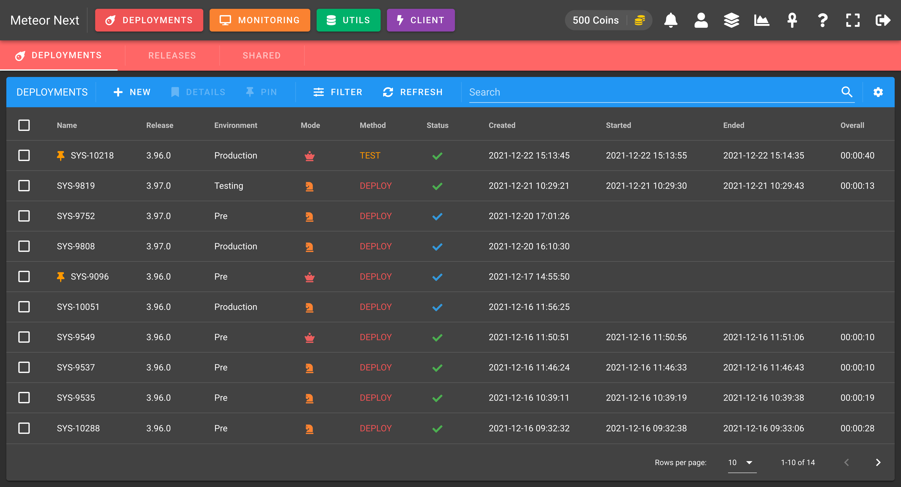
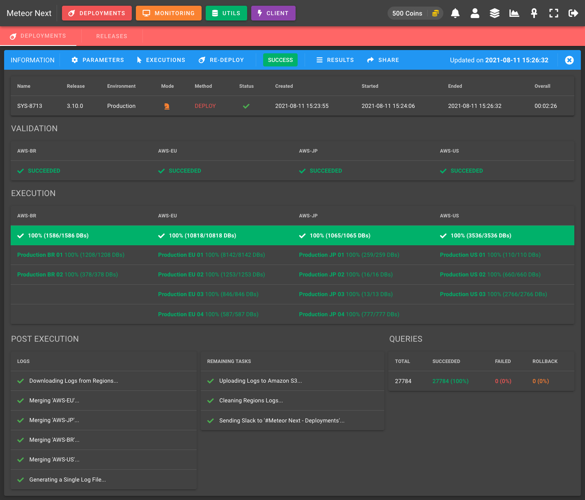
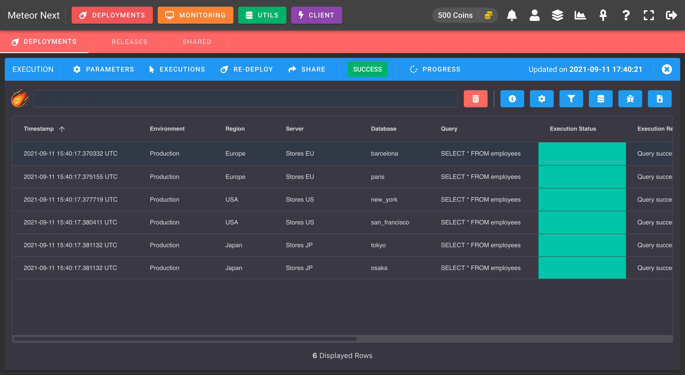
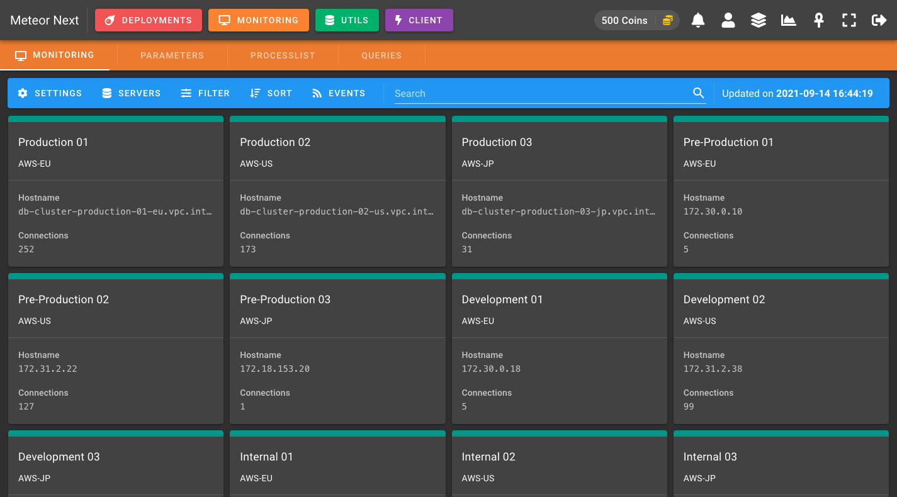

# Introduction

Meteor Next is a multiplatform web application that fully automatizes MySQL database workload operations in a Production ready environment.

## Features

- **Deployments**: Execute thousands or millions of SQL queries to multiple servers/databases in a secured and automated way getting a detailed summary.
- **Monitoring**: Perform active monitoring in all the database servers (server metrics, parameters and queries).
- **Utils**: A suite of different apps to perform massive data transfer operations.
    - **Imports**: Perform imports from files (on the local drive, URL or directly from Amazon S3) in any server/database.
    - **Exports**: Perform exports from any server/database.
    - **Clones**: Perform copies of databases/tables from any server/database in another server/database.
- **Client**: A complete MySQL Client.

### Deployments

Execute thousands or millions of SQL queries to multiple servers/databases in a secured and automated way getting a detailed summary.

Deployments - List

Deployments - Execution

Deployments - Results

### Monitoring

Perform active monitoring in all the database servers (server metrics, parameters and queries).

Monitoring - List

### Utils

A suite of different apps to perform massive data transfer.

- **IMPORTS**

Perform imports from files (on the local drive, URL or directly from Amazon S3) in any server/database.

 - List")

Utils (Imports) - List

 - Information")

Utils (Imports) - Execution

- **EXPORTS**

Perform exports from any server/database.

 - List")

Utils (Exports) - List

 - Information")

Utils (Exports) - Execution

- **CLONES**

Perform copies of databases/tables from any server/database in another server/database.

 - List")

Utils (Clones) - List

 - Information")

Utils (Clones) - Execution

### Client

A complete MySQL Client.

Client - Executing a query

## Security

Meteor Next has been built to be secure and reliable. Here are some aspects to take into account:

- Meteor Next does NOT collect any kind of data. All data stored in your database stays in your database.
- Meteor Next can work offline without needing internet connection with one exception. The application needs connection to https://license.meteor2.io to be able to check if the license is either activated or expired.
- Meteor Next has been audited by Ackcent to guarantee that there's no security vulnerabilities.
- All stored user passwords created by the app are encrypted.
- Meteor Next supports up to two MFA methods: Virtual 2FA Device and Security Keys.
- Be able to define a customized password policy to enforce that all users have an strong password and decide the password age.
- Be able to force that all users have the MFA enabled.
- Be able to restrict the access to the administration panel only to a specific IP addreess or domain.

## Why using Meteor Next?

As Database Engineers, we spend a lot of time managing all the data infrastructure, and it can be hard to find relevant products that helps us with our daily needs. Most of the time we're coding scripts to automatize some repeating operations.

This is what happened me when I started working as a Database Engineer in my last job position. I had to start performing some concurrent tasks such as massive and dangerous SQL deployments on each Release, monitor some metrics in hundreds of database servers and also manage all the database user's accounts.

At first, when I started working on this position, I only had a MySQL client and some legacy scripts to perform all those sql deployments.

I started digging in the net hoping to find a competent app that could aid me to perform all these repeated tasks in a secured and automated way. All I found was multiple applications, one to perform deployments, another one to manage all the database servers inventory, another to perform active monitoring and another one to give me access to all the servers (a MySQL Client).

Most of these applications I found were useful, but in some cases I had to continue write python scripts to solve corner cases that those apps could not fulfill.

At this point I thought, "why not building a multiplatform web app that could automatize all those concurrent database operations that every company need to handle?"

After four years designing and coding this application in my free time, today the company where I work has all the database infrastructure automated and secured. Now I don't have to think about all those daily tasks. Everything works as it should. Developers also have their accounts with their set of privileges and most of the tasks now can be done without the need of being reviewed by the Data Engineer.

Developers are happy and the boring stuff Is now fully automated. I can say that all the time I spent developing this application was worth it.

Now it's time to share this project with everyone and I hope you can find it useful.