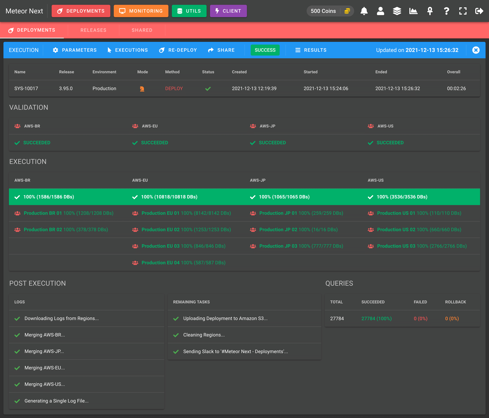

# Introduction

Meteor Next is a cross-platform web application that fully automatizes MySQL database workload operations in a Production ready environment.

## Features

- 🚀 **Deployments**: Execute thousands or millions of SQL queries to multiple servers/databases in a secured and automated way, getting a detailed summary.
- 🖥️ **Monitoring**: Perform active monitoring in all the database servers (server metrics, parameters and queries).
- 💾 **Utils**: A suite of different apps to perform massive data transfer operations.
- ⚡ **Client**: A complete MySQL Client.

### 🚀 Deployments

Execute thousands or millions of SQL queries to multiple servers/databases in a secured and automated way, getting a detailed summary.

Deployments - List

Deployments - Execution

Deployments - Results

### 🖥️ Monitoring

Perform active monitoring in all the database servers (server metrics, parameters and queries).

Monitoring - List

### 💾 Utils

A suite of different apps to perform massive data transfer operations.

- **IMPORTS**

Perform imports from files (on the local drive, URL or directly from Amazon S3) in any server/database.

 - List")

Utils (Imports) - List

 - Information")

Utils (Imports) - Execution

- **EXPORTS**

Perform exports from any server/database.

 - List")

Utils (Exports) - List

 - Information")

Utils (Exports) - Execution

- **CLONES**

Perform copies of databases/tables from any server/database in another server/database.

 - List")

Utils (Clones) - List

 - Information")

Utils (Clones) - Execution

### ⚡ Client

A complete MySQL Client.

Client - Executing a query

