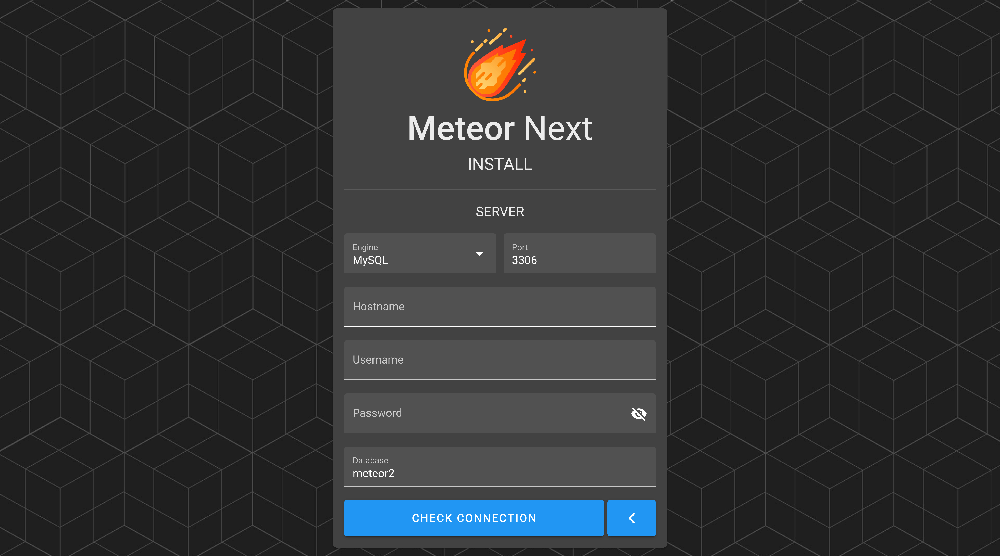
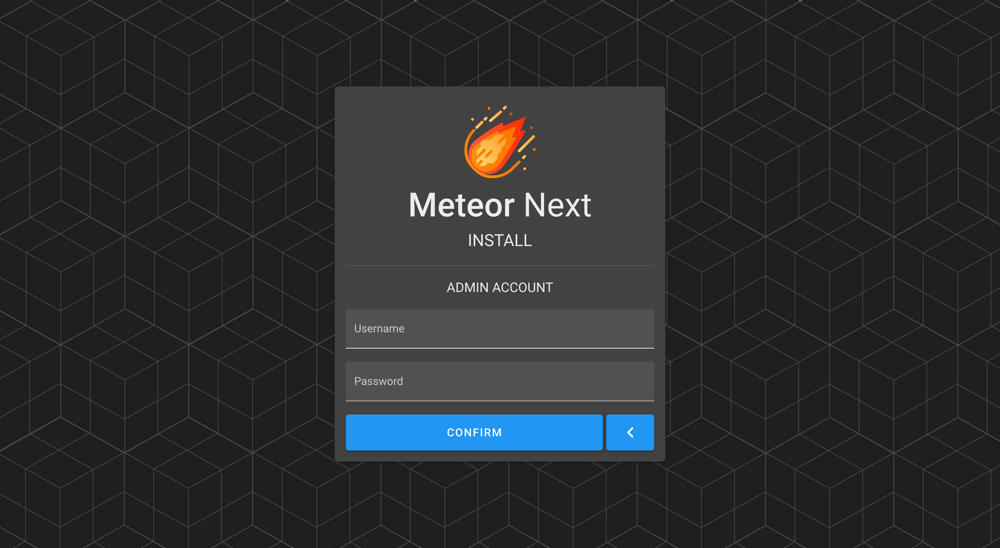

# Getting started

## Install

Before we start, you will need to install Docker. You can find guides for your platform on the [official documentation](https://docs.docker.com/get-docker/).

Once Docker is installed, you will need to pull the meteor2 image from Docker Hub and create a container. You can do both in one command using `docker run`:

```bash
docker run -itd --name meteor2 -p 1234:80 meteor2/meteor2
```

### Docker arguments

| Argument | Description |
| -------- | :---------- |
| `-it`    | Interactive process (allocate a tty for the container process) |
| `-d`     | Start the container in detached mode |
| `--name` | Assign a name to the container |
| `-p`     | Publish a container's port or a range of ports to the host |


After starting the meteor2 container, you can check the status using `docker ps`.

:::: code-group
::: code-group-item Result
```bash
CONTAINER ID        IMAGE               COMMAND                  CREATED             STATUS              PORTS                    NAMES
70bf3cd3ee3c        meteor2/meteor2     "/docker-entrypoint.…"   3 seconds ago       Up 2 seconds        0.0.0.0:1234->80/tcp     meteor2
```
:::
::::

---

### Docker Environment variables

These are all the environment variables that meteor2 supports:

| Argument         | Description |
| ---------------- | :---------- |
| `LIC_ACCESS_KEY` | The license access key |
| `LIC_SECRET_KEY` | The license secret key |
| `SQL_ENGINE`     | The server's engine [MySQL \| Amazon Aurora (MySQL)] |
| `SQL_HOST`       | The server's hostname  |
| `SQL_USER`       | The server's username |
| `SQL_PASS`       | The server's password |
| `SQL_PORT`       | The server's port |
| `SQL_DB`         | The server's database where meteor2 will be stored |
| `SECURE=1`       | Force app to serve all requests over HTTPS (make sure you have previously configured a SSL certificate pointing to the meteor2 container before enabling this flag) |

Example:

:::: code-group
::: code-group-item Enabling SECURE flag
```bash
docker run -itd --name meteor2 -p 1234:80 -e SECURE=1 meteor2/meteor2
```
:::
::::

### Data persistence

Meteor Next stores all the deployment's execution results inside the Docker to later be consumed.

So, what would happen if we updated the app? Since the Docker storage is by default ephemeral, all the data stored inside the meteor2 container would be wiped. If we would like to make sure that all the past deployments results persists we must setup data persistence.

This application supports two file storage engines:

- **[Local](#local)**: The files are stored inside the docker (into the `/root/files` folder).
- **[Amazon S3 (preferred)](#amazon-s3)**: The files are stored in Amazon S3.

:::tip
⭐ We strongly recommend using the Amazon S3 storage engine over Local
:::

**LOCAL**

To ensure the data persistence, mount a volume to the meteor2 container using the `-v` flag in a Docker `run` command.

:::: code-group
::: code-group-item Store all the deployments results in the present/current working directory
```bash
docker run -itd --name meteor2 -p 1234:80 -v "$(pwd):/root/files/" meteor2/meteor2
```
:::
::::

In this way, in case of updating the meteor2 app all the deployment's results will be preserved.

**AMAZON S3**

This file storage is the easiest one to manage. You don't need to pass any extra arguments to the `docker run`. Read the next [Setup](#setup) section and you will be able to enable it.

## Setup

After starting the meteor2 container it's now time to configure the application.

Open a web browser such as Firefox or Google Chrome and go to the following page:

```bash
http://host-ip:1234
```

> Change `host-ip` for the host ip where the meteor2 container is running.

After entering the URL the Login page will be shown. At this point click the `INSTALL` button.


### License

The first step is to enter a valid license (Access Key & Secret Key).


:::tip
To get a license key pair go to [https://account.meteor2.io](https://account.meteor2.io) and create an account.
:::

### MySQL Credentials

After entering a valid license, it's now time to enter the server credentials to store the app's database.



In case the database exists in the server a dialog will appear with two options:

- **Install Meteor Next**: Select this option if it's the first time that you install Meteor Next. This option will delete and recreate the given database with a fresh installation of Meteor Next.

- **Update Meteor Next**: Select this option if you are performing a Meteor Next update. This option will use the selected database that contains an existing Meteor Next installation.

")

### Amazon S3

After setting up the MySQL credentials, the next step we can decide if we want to use the Amazon S3 storage, so Meteor Next can use it to store all the generated ephemeral files like Deployments results.


:::tip
⭐ Meteor Next works better with Amazon S3.
:::

Althought Meteor can work without Amazon S3, we strongly recommend to choose this storage engine. You won't have to worry anymore about the storage left on your machine and all the ephemeral data will be preserved when you perform a [Meteor update](#update).

The credentials needed to work are an AWS IAM user with Programmatic access with the following IAM Policy attached.

:::: code-group
::: code-group-item AWS IAM Policy
```json
{
    "Version": "2012-10-17",
    "Statement": [
        {
            "Sid": "VisualEditor0",
            "Effect": "Allow",
            "Action": [
                "s3:PutObject"
            ],
            "Resource": [
                "arn:aws:s3:::yourbucket",
                "arn:aws:s3:::yourbucket/*"
            ]
        }
    ]
}
```
:::
::::

> Replace `yourbucket` to the bucket's name you want to to give access.

### Admin Account

The last step is to create the admin account by entering the username and password.



After finishing the installation the Login page will be shown. Enter the admin account credentials.


ENJOY!


## Update

To update Meteor Next, execute the following commands:

:::: code-group
::: code-group-item Stop and remove the existing meteor2 container
```bash
docker rm -f meteor2
```
:::
::::

:::: code-group
::: code-group-item Create and start the meteor2 container with the latest version
```bash
docker run -itd --name meteor2 -p 1234:80 meteor2/meteor2
```
:::
::::

At this point the latest Meteor Next version is up and working. You can access the app again typing:

```bash
http://host-ip:1234
```

### Advanced update

If you want to skip filling again all the `INSTALL` steps, start the meteor2 container using:

```bash
docker run -itd --name meteor2 -p 1234:80 \
-e LIC_ACCESS_KEY="<license_access_key>" \
-e LIC_SECRET_KEY="<license_secret_key>" \
-e SQL_ENGINE="<sql_engine>" \
-e SQL_HOST="<sql_host>" \
-e SQL_USER="<sql_user>" \
-e SQL_PASS="<sql_password>" \
-e SQL_PORT="<sql_port>" \
-e SQL_DB="<sql_database>" \
meteor2/meteor2
```

Example:

```bash
docker run -itd --name meteor2 -p 1234:80 \
-e LIC_ACCESS_KEY="0000-0000-0000-0000" \
-e LIC_SECRET_KEY="12345abcd" \
-e SQL_ENGINE="MySQL" \
-e SQL_HOST="172.16.2.121" \
-e SQL_USER="meteor2" \
-e SQL_PASS="supersecret" \
-e SQL_PORT="3306" \
-e SQL_DB="meteor2" \
meteor2/meteor2
```

🚀 You can now login again with your user credentials.

```bash
http://host-ip:1234
```

## Uninstall

To uninstall Meteor Next, execute the following commands:

:::: code-group
::: code-group-item Stop and remove the meteor2 container
```bash
docker rm -f meteor2
```
:::
::::

:::: code-group
::: code-group-item Remove the meteor2 image
```bash
docker rmi meteor2
```
:::
::::