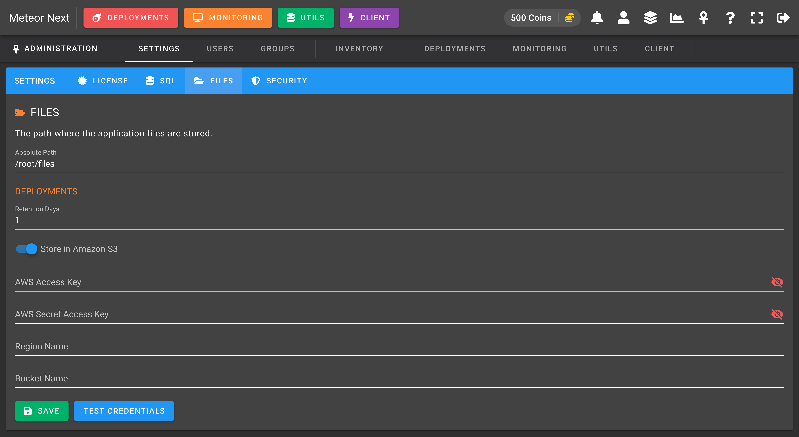

# Install

Before we start, you will need to install Docker. You can find guides for your platform on the [official documentation](https://docs.docker.com/get-docker/).

Once Docker is installed, you will need to pull the meteor2 image from Docker Hub and create a container. You can do both in one command using `docker run`:

```bash
docker run -itd --name meteor2 -p 1234:80 meteor2/meteor2
```

## Docker arguments

| Argument | Description |
| -------- | :---------- |
| `-it`    | Interactive process (allocate a tty for the container process) |
| `-d`     | Start the container in detached mode |
| `--name` | Assign a name to the container |
| `-p`     | Publish a container's port or a range of ports to the host |


After starting the meteor2 container, you can check the status using `docker ps`.

```bash title="Result"
CONTAINER ID        IMAGE               COMMAND                  CREATED             STATUS              PORTS                    NAMES
70bf3cd3ee3c        meteor2/meteor2     "/docker-entrypoint.…"   3 seconds ago       Up 2 seconds        0.0.0.0:1234->80/tcp     meteor2
```

You can now move to the next section: [SETUP](setup)

---

## Docker Environment variables

These are all the environment variables that meteor2 supports:

| Argument         | Description |
| ---------------- | :---------- |
| `LIC_ACCESS_KEY` | The license access key |
| `LIC_SECRET_KEY` | The license secret key |
| `SQL_ENGINE`     | The server's engine [MySQL \| Aurora MySQL] |
| `SQL_HOST`       | The server's hostname  |
| `SQL_USER`       | The server's username |
| `SQL_PASS`       | The server's password |
| `SQL_PORT`       | The server's port |
| `SQL_DB`         | The server's database where meteor2 will be stored |
| `SECURE=1`       | Force app to serve all requests over HTTPS (make sure you have previously configured a HTTPs Reverse Proxy pointing to the meteor2 container before enabling this flag) |

Examples:

```bash title="Enabling SECURE flag"
docker run -itd --name meteor2 -p 1234:80 -e SECURE=1 meteor2/meteor2
```

```bash title="Starting Meteor from environment variables instead of the INSTALL GUI"
docker run -itd --name meteor2 -p 1234:80 \
-e LIC_ACCESS_KEY="0000-0000-0000-0000" \
-e LIC_SECRET_KEY="ASuperSecretKey" \
-e SQL_ENGINE="MySQL" \
-e SQL_HOST="172.16.2.121" \
-e SQL_USER="meteor2" \
-e SQL_PASS="yourMySQLPassword" \
-e SQL_PORT="3306" \
-e SQL_DB="meteor2" \
meteor2/meteor
```

## Data persistence

Meteor Next stores all the deployment's execution results inside the Docker to later be consumed.

So, what would happen if we updated the app? Since the Docker storage is by default ephemeral, all the data stored inside the meteor2 container would be wiped. If we would like to make sure that all the past deployments results persists we should setup data persistence.

This application supports two file storage engines:

- **Local**: The files are stored inside the docker (into the `/root/files` folder).
- **Amazon S3 (preferred)**: The files are stored inside the Amazon S3.

:::tip
⭐ We strongly recommend using the Amazon S3 storage engine over Local
:::

### Local

To ensure the data persistence mount a volume to the meteor2 container using the `-v` flag in a Docker `run` command.

```bash title="Store all the deployments results in the present/current working directory"
docker run -itd --name meteor2 -p 1234:80 -v "$(pwd):/root/files/" meteor2/meteor2
```

In this way, in case of updating the meteor2 app all the deployment's results will be preserved.

### Amazon S3

This file storage is the easiest one to manage. You don't need to pass any extra arguments to the `docker run`.

This option is configured inside the application once the [`SETUP`](setup) steps are finished.

Head to the Admin section [`http://host-ip:1234/admin`](#) → SETTINGS → FILES.



Before going further, create an AWS IAM user with **Programmatic access**.

After that create a IAM policy that meets the following schema and attach it to the recent created user.

```json title="AWS IAM Policy"
{
    "Version": "2012-10-17",
    "Statement": [
        {
            "Sid": "VisualEditor0",
            "Effect": "Allow",
            "Action": [
                "s3:PutObject"
            ],
            "Resource": [
                "arn:aws:s3:::yourbucket",
                "arn:aws:s3:::yourbucket/*"
            ]
        }
    ]
}
```

> Replace `yourbucket` to the bucket's name you want to to give access.

Enable the `Store in Amazon S3` switch and enter all the required credentials and bucket's name to be used to store all the deployments.

Finally press `SAVE`.

🚀 Voilà! From now on new deployments will be stored in Amazon S3.