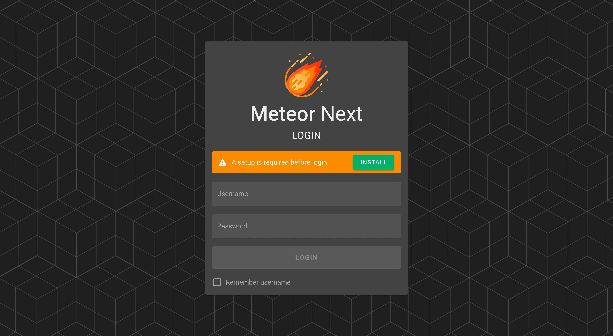
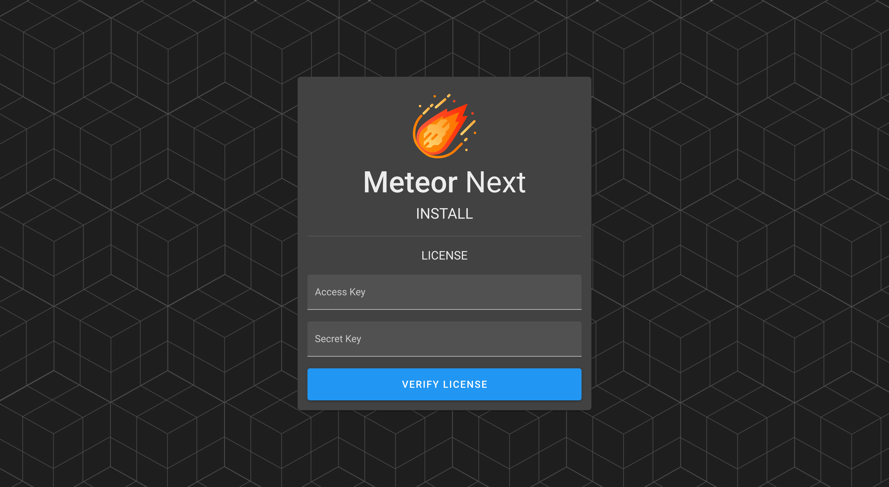

# Setup

After starting the meteor2 container it's now time to configure the application.

Open a web browser such as Firefox or Google Chrome and go to the following page:

```bash
http://host-ip:1234
```

> Change `host-ip` for the host ip where the meteor2 container is running.

After entering the URL the Login page will be shown. At this point click the `INSTALL` button.



## License

The first step is to enter a valid license (Access Key & Secret Key).



## MySQL Credentials

After entering a valid license, it's now time to enter the server credentials to store the app's database.


In case the database exists in the server a dialog will appear with two options:

- **Install Meteor Next**: Select this option if it's the first time that you install Meteor Next. This option will delete and recreate the database with a fresh installation of Meteor Next.

- **Update Meteor Next**: Select this option if you are performing a Meteor Next upgrade. This option will use the selected database that contains an existing Meteor Next installation.

")

## Amazon S3

After setting up the MySQL credentials, the next step we can decide if we want to use the Amazon S3 storage, so Meteor Next can use it to store all the generated ephemeral files like Deployments results.


:::tip
⭐ Meteor Next works better with Amazon S3.
:::

Althought Meteor can work without Amazon S3, we strongly recommend to choose this storage engine. You won't have to worry anymore about the storage left on your machine and all the ephemeral data will be preserved when you perform a [Meteor update](update).

The credentials needed to work are an AWS IAM user with Programmatic access with the following IAM Policy attached.

```json title="AWS IAM Policy"
{
    "Version": "2012-10-17",
    "Statement": [
        {
            "Sid": "VisualEditor0",
            "Effect": "Allow",
            "Action": [
                "s3:PutObject"
            ],
            "Resource": [
                "arn:aws:s3:::yourbucket",
                "arn:aws:s3:::yourbucket/*"
            ]
        }
    ]
}
```

> Replace `yourbucket` to the bucket's name you want to to give access.


## Admin Account

The last step is to create the admin account by entering the username and password.


After finishing the installation the Login page will be shown. Enter the admin account credentials.


ENJOY!


