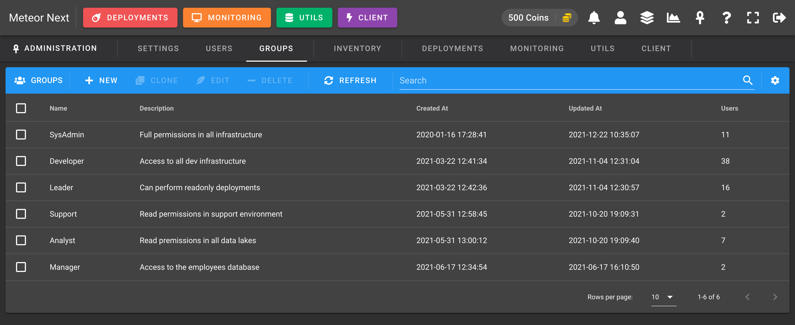
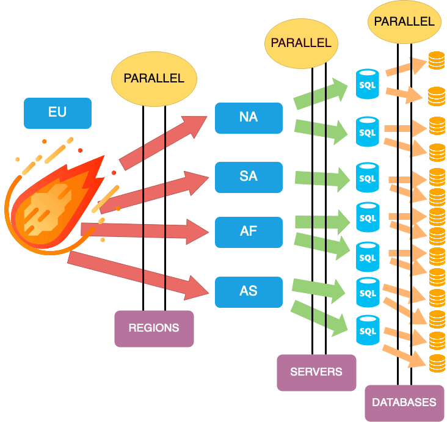
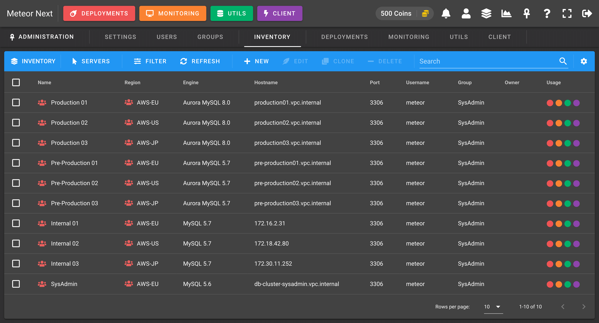
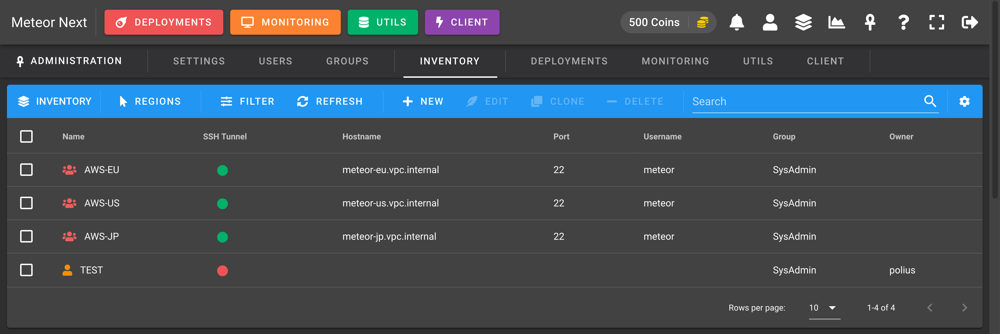
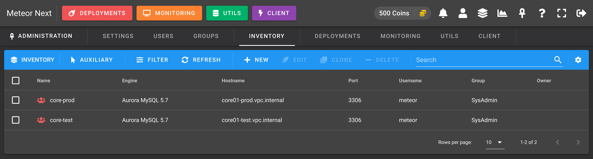
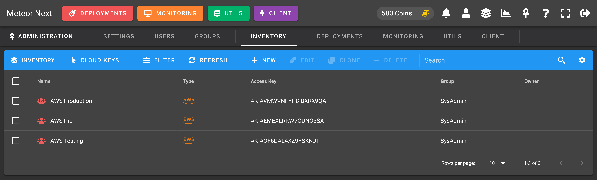
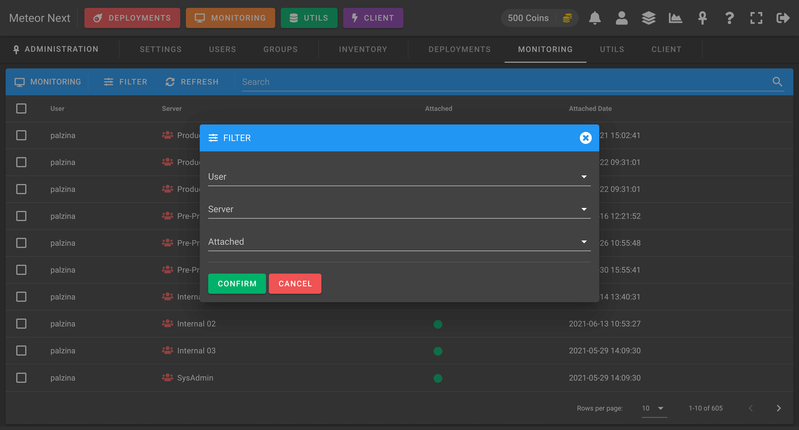
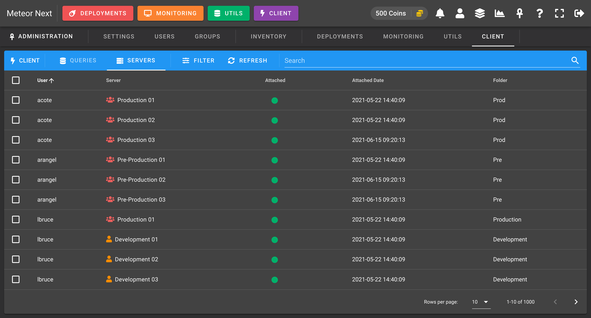
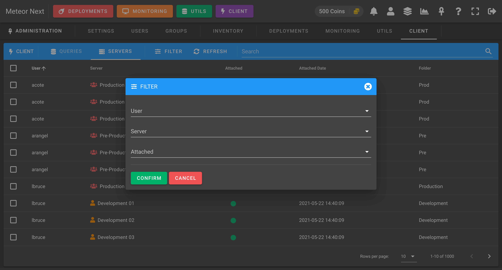

# Administration

The Administration section is used to manage all things related to all Meteor operations:

- **[Settings](#settings)**: Manage all settings such as file storage, Amazon S3 and security.
- **[Users](#users)**: Manage all users.
- **[Groups](#groups)**: Manage all groups.
- **[Inventory](#inventory-1)**: Manage all user's inventories.
- **[Deployments](#deployments-1)**: Manage all deployments.
- **[Monitoring](#monitoring-1)**: Manage all monitored servers.
- **[Utils](#utils-1)**: Manage all utils operations being done.
- **[Client](#client-1)**: Monitor all executed queries and manage all attached servers.

## Settings

The Settings view is used to manage some application global parameters:

- [License](#license)
- [SQL](#sql)
- [Amazon S3](#amazon-s3)
- [Security](#security)

### License

The License section shows information (in read-only) related of the license. We can see if the copy of the Meteor Next that we're using is activated and the amount of resources we currently have available.


### SQL

The SQL section shows the credentials (in read-only) where Meteor Next is stored.


### Amazon S3

The Amazon S3 section shows information about the credentials needed to connect the Meteor Next app to the Amazon S3 storage engine. 


Enable this option to store all generated files like deployment results into Amazon S3. Althought Meteor can work without Amazon S3, we strongly recommended to choose this storage engine. You won't have to worry anymore about the storage left on your machine and all the deployment results will be preserved when you perform a Meteor update.

The credentials needed to work are an AWS IAM user with Programmatic access with the following IAM Policy attached.

- AWS IAM Policy

```json
{
    "Version": "2012-10-17",
    "Statement": [
        {
            "Sid": "VisualEditor0",
            "Effect": "Allow",
            "Action": [
                "s3:PutObject"
            ],
            "Resource": [
                "arn:aws:s3:::yourbucket",
                "arn:aws:s3:::yourbucket/*"
            ]
        }
    ]
}
```

> Replace `yourbucket` to the bucket's name you want to to give access.

Make sure your credentials are valid by clicking the `TEST CREDENTIALS` button.

### Security

The Security section is used to ensure some security policies for all Meteor accounts.


**PASSWORD POLICY**

- **Maximum Password Age**: The days that have to pass before forcing the user to change their password. This value can be: `Never`, `3 Months`, `6 Months`, `1 Year`.
- **Minimum Password Length**: The minimum number of characters allowed (current passwords are exempt until their age expires).
- **Require lowercase character**: Enable this option to force new passwords to contain at least one lowercase character.
- **Require uppercase character**: Enable this option to force new passwords to contain at least one uppercase character.
- **Require number**: Enable this option to force new passwords to contain at least one number.
- **Require special character**: Enable this option to force new passwords to contain at least one special character. 

The following screenshot shows the behaviour when a user tries to login with an expired password. After proceeding to login a dialog is shown forcing the user to change their password.


**MFA**

- **Force Multi-Factor Authentication (MFA)**: Enable this option to force all users to have the MFA enabled.

The following screenshot shows the behaviour when the MFA is forced and a user tries to login into the application without having their MFA enabled. A new dialog is shown forcing him/her to enable it.


**SECURE ADMIN**

- **Administration URL**: Fill this option to restrict the access to the Administration panel only to a specific IP address or domain.

This option is useful to add an extra security layer to the Administration panel. Let's make an example to better understand it.

Imagine that in your company all users are accessing the Meteor app through `meteor.yourcompany.io`, admins included.
In this scenario if a non-admin user could guess the credentials of an admin user, he/she would be able to login as an admin.

To prevent this hypothetical situation you could setup another url such as `meteor-admin.yourcompany.io` pointing also to the Meteor application, and add this url to the `Administration URL` field.
Finally you could restrict by network (a VPN for example) that only a set of users (the admin ones) could have access to this new url.
In this way, although a non-admin user could know an admin account, he/she would not be able to access to the admin panel.

Mind that if a user accesses to a url different than the one set in `Administration URL`, he/she won't be able to access the admin panel (even if accesses with an admin account).

:::warning
If you set this field by mistake and therefore you lose access to the administration panel, keep in mind that this option can be reverted by changing a value in the database where Meteor resides.

Access the `settings` table and in the second row (the one with name: "SECURITY") edit the `value` column, that contains a JSON.

Look for the `restrict_url` key and leave its value empty.

- Before

```json
{"password_age": "0", "password_min": "5", "password_lowercase": false, "password_uppercase": false, "password_number": false, "password_special": false, "force_mfa": false, "restrict_url": "meteor.yourcompany.io"}
```

- After

```json
{"password_age": "0", "password_min": "5", "password_lowercase": false, "password_uppercase": false, "password_number": false, "password_special": false, "force_mfa": false, "restrict_url": ""}
```

The next time you login into the app, you will be able to access to the Administration panel.
:::

## Users

The users view is used to manage all the user accounts that have access to the Meteor application.


When creating a new user some fields are required:

- **Username**: A unique username that identifies the user.
- **Email**: The user's email.
- **Password**: The user's password.
- **Coins**: The amount of coins to have.
- **Group**: The group that the user will be part.
- **Administrator**: To access the administration panel and all the deployments & restores from other users.
- **Disable Account**: By locking an account will prevent the user from being able to login into the application. If the user is already logged in, the next action he does it will be automatically logged out.
- **Force user to change password at next login**: At next login the user will be forced to change their password. It's useful if you create a new user with a random generated password but you want to be sure that at next login the user changes the password. This option is useful also when editing an existing user and you want to force that the user will change their password at next login. After the user changes their password this flag will be automatically disabled.


The following screenshot shows all the columns that can be displayed.


## Groups

The Groups view is used to create groups to be assigned to your users. Here you can define all the required application permissions.



### Creating a group

To create a group there's some required fields to be filled:

- **Name**: The name of this group (must be unique).
- **Description**: The description to give this new group.
- **Coins per day**: The coins that every day at 00:00 UTC will be automatically given to the users contained in this group. 
- **Maximum coins**: The maximum coins that can reach. If a user currently has reached the maximum amount of coins, he won't be able to get more coins at the next coins delivery.

Next you need to setup all the permissions from the different Meteor apps.

### Inventory

Here you can manage the permissions of the Inventory.

")

**RIGHTS**

- **Access Inventory**: If this option is enabled all user's contained in this group will be able to access the inventory and the inventory icon will be shown at the top bar.

**OWNERS**

Owners are users that can manage Shared resources (servers, regions, environments, auxiliary connections, cloud keys).
A user that is not an owner of their group, will not be able to create shared resources. They will only be able to create Personal resources.

:::tip INFO
A resource can be either Personal or Shared.

- **Personal**: The resource is only usable by the user who create it.
- **Shared**: The resource is usable for all users whose group is the same as the user who create it.
:::

:::tip
Bear in mind that when you create a new group you won't be able to add owners, since you have not yet added users to this group (done in the [Users](#users) section). To add new owners, first add users to an existing group and then edit it. After that you will be able to select which users you want to be owners.
:::

### Deployments

Here you can set the permissions affecting the Deployments section.

")

**RIGHTS**

- **Perform Deployments**: If this option is enabled all user's contained in this group will be able to access the deployments section and the deployments button will be visible at the top bar.
    - **BASIC**: Enable this option to grant permissions to perform BASIC deployments.
    - **PRO**: Enable this option to grant permissions to perform PRO deployments.

**LIMITS**

Here we can set the limits of all the deployment executions.

- **Coins per Deployment**: How many coins will be consumed for every deployment. If a user does not have the required amount of coins to perform a deployment then it will have to wait for the next day or that some admin gives him/her more coins.

- **Concurrent Deployments**: This value is used to limit the amount of deployments that can be executed in the same time. It's useful to give stability to your infrastructure. In this way you will avoid unwanted peaks of large amount of deployments at the same time.

- **Execution Threads**: How many parallel connections will be spawned at database level. A value of 1 means that the execution will go database per database, one by one (sequentially). A value of 2 means that the execution will perform the deployment in two databases at the same time. And so on. So, the larger the value, the faster the execution will go and the less time it will take to finish. But keep in mind that also the larger the value, the more resources will consume.

The following screenshot shows a graphic example about having `Execution Threads = 2`. We can see that for each server, the execution will apply the deployment in two databases at the same time.



- **Execution Timeout**: This value (numeric) is optional and it's used to limit the execution time per query (in seconds). Queries that take more time to execute will be automatically terminated. It's useful if you want to limit the SQL queries that your users can execute avoiding unwanted slow/dangerous queries.

**RETENTION**

This value is used to determine how many days we would like to retain the deployment results. All deployments  done previously with the selected value will be automatically deleted.

:::warning
This setting does not apply if the [Amazon S3](#amazon-s3) storage engine it's been enabled.
:::

:::tip
To set retention for files stored into S3, create an [Amazon S3 lifecycle rule](https://docs.aws.amazon.com/AmazonS3/latest/userguide/object-lifecycle-mgmt.html).
:::

**SLACK**

- **Enable Notifications**: Enable this option to receive an Slack notification everytime a deployment finishes, showing some information about it. It's useful if you want to track all the deployments that are being done in real-time.
    - **Channel Name**: The Slack channel's name to send the notifications.
    - **Webhook URL**: The Slack's weebhook URL to sent all the notifications.

### Monitoring

Here you can set the permissions affecting the Monitoring section.

")

**RIGHTS**

- **Access Monitoring**: If this option is enabled all user's contained in this group will be able to access the monitoring section and the monitoring button will be visible at the top bar.

**LIMITS**

- **Data Collection Interval (seconds)**: The interval of seconds that have to pass to retrieve again all server's status. The value must be greater or equal than 10.

### Utils

Here you can set the permissions affecting the Utils section.

")

**RIGHTS**

- **Access Utils**: If this option is enabled all user's contained in this group will be able to access the utils section and the utils button will be visible at the top bar.

**LIMITS**

- **Maximum Size (MB)**: This value is optional and it's used to limit the maximum file size in MB allowed to perform File Imports.

- **Concurrent executions**: This value (numeric) is optional and it's used to limit the amount of Imports, Exports and Clones that can be executed in the same time. If this values is setup then an automated queue system will start and will only execute X operations every 10 seconds (using polling). It's useful to give stability to your infrastructure. In this way you will avoid unwanted peaks of large amount of data transfer at the same time.

**SLACK**

- **Enable Notifications**: Enable this option to receive an Slack notification everytime a restore finishes, showing some information about it. It's useful if you want to track all the restores that are being done in real-time.
    - **Channel Name**: The Slack channel's name to send the notifications.
    - **Webhook URL**: The Slack's weebhook URL to sent all the notifications.

### Client

Here you can set the permissions affecting the Client section.

")

**RIGHTS**

- **Access Client**: If this option is enabled all user's contained in this group will be able to access the client section and the client button will be visible at the top bar.

**LIMITS**

- **Apply Limits**: Enable this option to apply limits of all executed queries through Client section.
    - **Execution Timeout Mode**: This option can be either `All Queries` or `Only SELECTs`.
    - **Execution Timeout Value**: This value (measured in seconds) is used to limit the maximum execution time that queries can last (all queries or only selects, depending on the mode selected). If a query takes more time to be executed, it will be automatically stopped raising a timeout error.

**TRACKING**

- **Track Queries**: Enable this option to store all the queries that are being executed in the Client section. It's useful if you want to know which kind of queries your users are executing. Also it can be useful in case of someone executes a query and breaks something. In this way you will know exactly what queries the user executed and this information may come in handy in order to solve the issue.
    - **Tracking Mode**: This option can be either `All Queries` to track every query the users execute or `All Queries (exclude SELECTs)` to exclude SELECTs and EXPLAINs to be tracked.
    - **Tracking Filter**: This option is used to filter which queries are meant to be tracked. The available options are `All Queries`, `Succeeded` or `Failed`.
    - **Tracking Retention Days**: This value is used to determine how many days we would like to retain the queries tracked.

## Inventory

The Inventory view is used to manage all the resources ([Servers](#servers), [Regions](#regions), [Environments](#environments), [Auxiliary Connections](#auxiliary-connections), [Cloud Keys](#cloud-keys)) for all Meteor accounts.

To change from one resource to another click the `SERVERS` button and then choose another one.


### Servers

The default view when accessing the Inventoy is the Servers. Here you can manage all servers for all Meteor users.



### Regions

The Regions view is used to manage all regions for all Meteor users. 



### Environments

The Environments view is used to manage all environments for all Meteor users. 


### Auxiliary Connections

The Auxiliary view is used to manage all auxiliary connections for all Meteor users. 



### Cloud Keys

The Cloud Keys view is used to manage all cloud keys for all Meteor users. 



### Filter Resources

You can filter all resources by user or group, and also by scope and secured.


## Deployments

The Deployments view is used to manage all the deployments done by all users.


Note that this list shows the last execution of each deployment (like the [Deployments](./deployments) section). To filter and see all the past executions done in all deployments, enable the  `Filter all deployment executions` option in the Filter dialog.


You can also decide which columns you want to display or hide.


## Monitoring

The Monitoring view is used to know which servers are monitored by which users.


Also you can perform any filter by user or by server.



## Utils

The Utils view is used to manage all the restores done by all users.


You can also filter any restore by any parameter.


And decide which columns you want to show or hide.


## Client

The Client view has two main uses:

- [Queries](#queries)
- [Servers](#servers-1)

### Queries

Track all the queries being executed in the [Client](./client) section by all users.


:::tip
Mind that to start tracking all the executed queries you first have to enable de `Track Queries` option in the [Groups](#client) section
:::

You can also filter the queries by some fields.


### Servers

Manage the servers that your users have added in their [Client](./client). You can also attach/detach a server to a user.



Also you can perform any kind of filtering.

