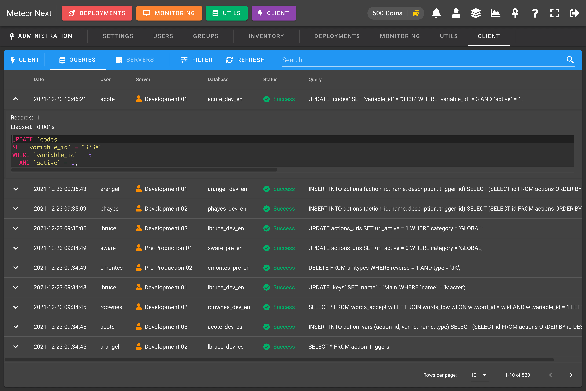

# Client

The Client view has two main uses:

- [Queries](#queries)
- [Servers](#servers)

## Queries

Track all the queries being executed in the [Client](../client/introduction) section by all users.

:::tip
Mind that to start tracking all the executed queries you first have to enable de `Track Queries` option in the [Groups](groups#client) section
:::

You can also filter the queries by some fields.

## Servers

Manage the servers that your users have added in their [Client](../client/introduction). You can also attach/detach a server to a user.

Also you can perform any kind of filtering.

