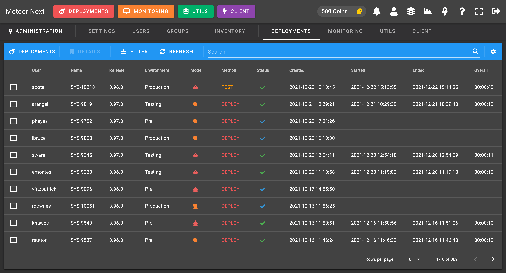
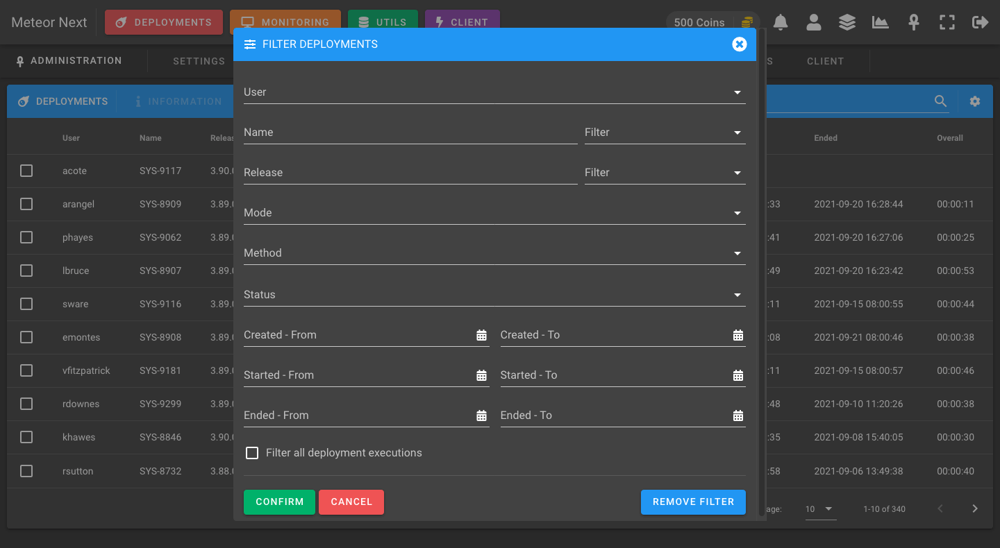
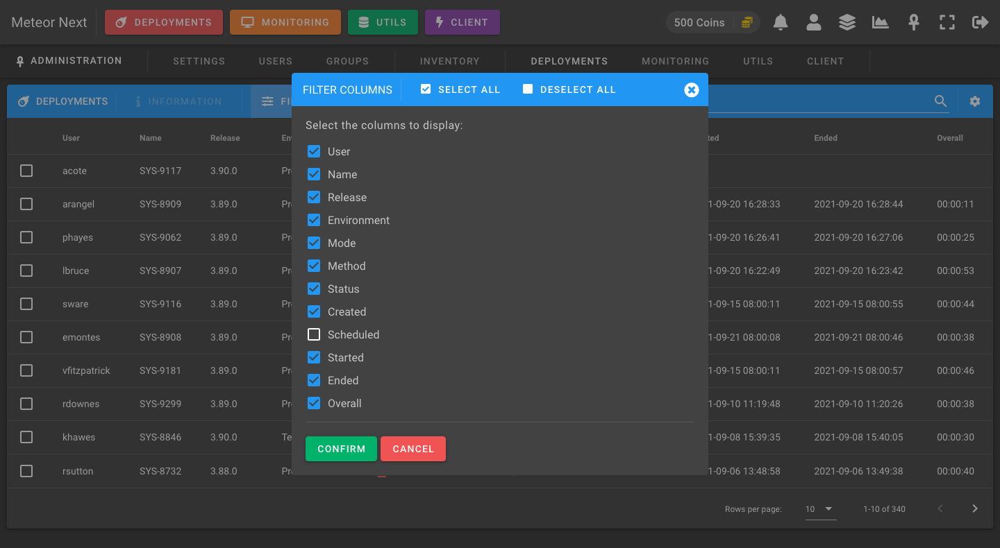

# Deployments

The Deployments view is used to manage all the deployments done by all users.

Note that this list shows the last execution of each deployment (like the [Deployments](../deployments/introduction) section). To filter and see all the past executions done in all deployments, enable the  `Filter all deployment executions` option in the Filter dialog.

You can also decide which columns you want to display or hide.

