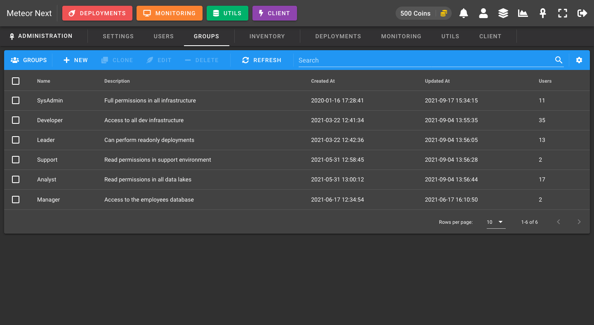

# Groups

The Groups view is used to create groups to be assigned to your users. Here you can define all the required application permissions.

## Creating a group

To create a group there's some required fields to be filled:

- **Name**: The name of this group (must be unique).
- **Description**: The description to give this new group.
- **Coins per day**: The coins that every day at 00:00 UTC will be automatically given to the users contained in this group. 
- **Maximum coins**: The maximum coins that can reach. If a user currently has reached the maximum amount of coins, he won't be able to get more coins at the next coins delivery.

Next you need to setup all the permissions from the different Meteor apps.

### Inventory

Here you can manage the permissions of the Inventory.

")

**RIGHTS**

- **Access Inventory**: If this option is enabled all user's contained in this group will be able to access the inventory and the inventory icon will be shown at the top bar.

**OWNERS**

Owners are users that can manage Shared resources (servers, regions, environments, auxiliary connections, cloud keys).
A user that is not an owner of their group, will not be able to create shared resources. They will only be able to create Personal resources.

:::info
A resource can be either Personal or Shared.

- **Personal**: The resource is only usable by the user who create it.
- **Shared**: The resource is usable for all users whose group is the same as the user who create it.
:::

:::tip
Bear in mind that when you create a new group you won't be able to add owners, since you have not yet added users to this group (done in the [Users](users) section). To add new owners, first add users to an existing group and then edit it. After that you will be able to select which users you want to be owners.
:::

### Deployments

Here you can set the permissions affecting the Deployments section.

")

**RIGHTS**

- **Perform Deployments**: If this option is enabled all user's contained in this group will be able to access the deployments section and the deployments button will be visible at the top bar.
    - **BASIC**: Enable this option to grant permissions to perform BASIC deployments.
    - **PRO**: Enable this option to grant permissions to perform PRO deployments.

**LIMITS**

Here we can set the limits of all the deployment executions.

- **Coins per execution**: How many coins will be consumed for every deployment. If a user does not have the required amount of coins to perform a deployment then it will have to wait for the next day or that some admin gives him/her more coins.
- **Execution threads**: How many parallel connections will be spawned at database level. A value of 1 means that the execution will go database per database, one by one (sequentially). A value of 2 means that the execution will perform the deployment in two databases at the same time. And so on. So, the larger the value, the faster the execution will go and the less time it will take to finish. But keep in mind that also the larger the value, the more resources will consume.

The following screenshot shows a graphic example about having `Execution threads = 2`. We can see that for each server, the execution will apply the deployment in two databases at the same time.

- **Execution timeout**: This value (numeric) is optional and it's used to limit the execution time per query (in seconds). Queries that take more time to execute will be automatically terminated. It's useful if you want to limit the SQL queries that your users can execute avoiding unwanted slow/dangerous queries.

- **Concurrent executions**: This value (numeric) is optional and it's used to limit the amount of deployments that can be executed in the same time. If this values is setup then an automated queue system will start and will only execute X deployments every 10 seconds (using polling). It's useful to give stability to your infrastructure. In this way you will avoid unwanted peaks of large amount of deployments at the same time.

**RETENTION**

This value is used to determine how many days we would like to retain the deployment results. All deployments  done previously with the selected value will be automatically deleted.

:::info
This setting does not apply if the [Amazon S3](settings#amazon-s3) storage engine it's been enabled.
:::

:::tip
To set retention for files stored into S3, create an [Amazon S3 lifecycle rule](https://docs.aws.amazon.com/AmazonS3/latest/userguide/object-lifecycle-mgmt.html).
:::

**SLACK**

- **Enable Notifications**: Enable this option to receive an Slack notification everytime a deployment finishes, showing some information about it. It's useful if you want to track all the deployments that are being done in real-time.
    - **Channel Name**: The Slack channel's name to send the notifications.
    - **Webhook URL**: The Slack's weebhook URL to sent all the notifications.

### Monitoring

Here you can set the permissions affecting the Monitoring section.

")

**RIGHTS**

- **Access Monitoring**: If this option is enabled all user's contained in this group will be able to access the monitoring section and the monitoring button will be visible at the top bar.

**LIMITS**

- **Data Collection Interval (seconds)**: The interval of seconds that have to pass to retrieve again all server's status. The value must be greater or equal than 10.

### Utils

Here you can set the permissions affecting the Utils section.

")

**RIGHTS**

- **Access Utils**: If this option is enabled all user's contained in this group will be able to access the utils section and the utils button will be visible at the top bar.

**LIMITS**

- **Maximum Size (MB)**: This value is optional and it's used to limit the maximum file size in MB allowed to perform Imports, Exports and Clones.

- **Concurrent executions**: This value (numeric) is optional and it's used to limit the amount of Imports, Exports and Clones that can be executed in the same time. If this values is setup then an automated queue system will start and will only execute X operations every 10 seconds (using polling). It's useful to give stability to your infrastructure. In this way you will avoid unwanted peaks of large amount of data transfer at the same time.

**SLACK**

- **Enable Notifications**: Enable this option to receive an Slack notification everytime a restore finishes, showing some information about it. It's useful if you want to track all the restores that are being done in real-time.
    - **Channel Name**: The Slack channel's name to send the notifications.
    - **Webhook URL**: The Slack's weebhook URL to sent all the notifications.

### Client

Here you can set the permissions affecting the Client section.

")

**RIGHTS**

- **Access Client**: If this option is enabled all user's contained in this group will be able to access the client section and the client button will be visible at the top bar.

**LIMITS**

- **Apply Limits**: Enable this option to apply limits of all executed queries through Client section.
    - **Execution Timeout Mode**: This option can be either `All Queries` or `Only SELECTs`.
    - **Execution Timeout Value**: This value (measured in seconds) is used to limit the maximum execution time that queries can last (all queries or only selects, depending on the mode selected). If a query takes more time to be executed, it will be automatically stopped raising a timeout error.

**TRACKING**

- **Track Queries**: Enable this option to store all the queries that are being executed in the Client section. It's useful if you want to know which kind of queries your users are executing. Also it can be useful in case of someone executes a query and breaks something. In this way you will know exactly what queries the user executed and this information may come in handy in order to solve the issue.
    - **Tracking Mode**: This option can be either `All Queries` to track every query the users execute or `All Queries (exclude SELECTs)` to exclude SELECTs and EXPLAINs to be tracked.
    - **Tracking Filter**: This option is used to filter which queries are meant to be tracked. The available options are `All Queries`, `Succeeded` or `Failed`.
    - **Tracking Retention Days**: This value is used to determine how many days we would like to retain the queries tracked.