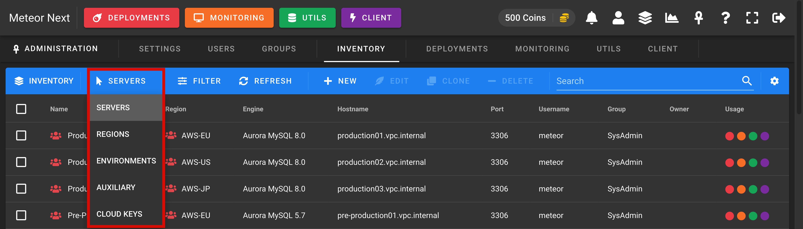
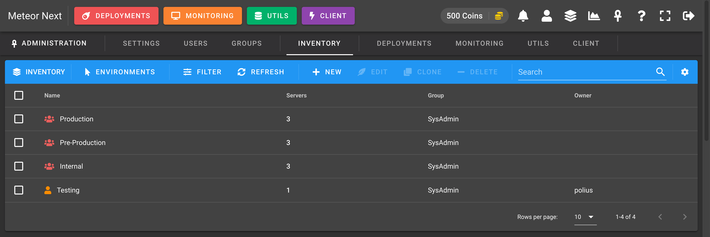

# Inventory

The Inventory view is used to manage all the resources ([Servers](#servers), [Regions](#regions), [Environments](#environments), [Auxiliary Connections](#auxiliary-connections), [Cloud Keys](#cloud-keys)) for all Meteor accounts.

## Resources

To change from one resource to another click the `SERVERS` button and then choose another one.

### Servers

The default view when accessing the Inventoy is the Servers. Here you can manage all servers for all Meteor users.

### Regions

The Regions view is used to manage all regions for all Meteor users. 

### Environments

The Environments view is used to manage all environments for all Meteor users. 

### Auxiliary Connections

The Auxiliary view is used to manage all auxiliary connections for all Meteor users. 

### Cloud Keys

The Cloud Keys view is used to manage all cloud keys for all Meteor users. 

## Filter Resources

You can filter all resources by user or group, and also by scope and secured.

