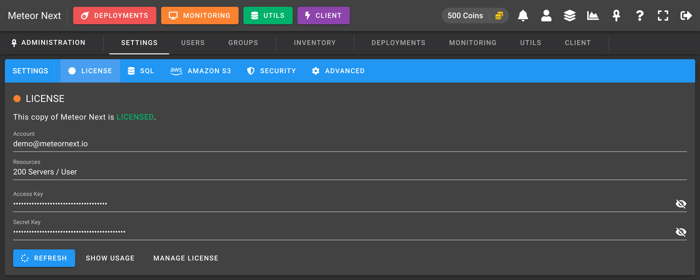
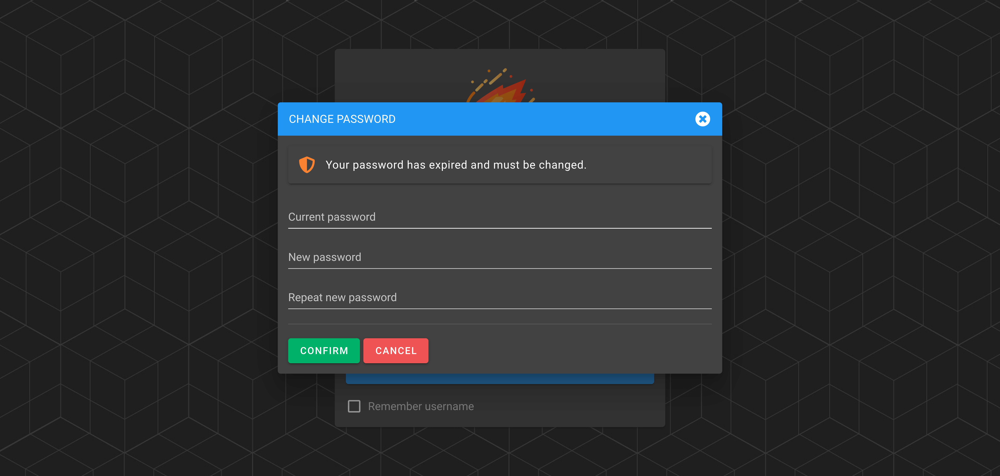
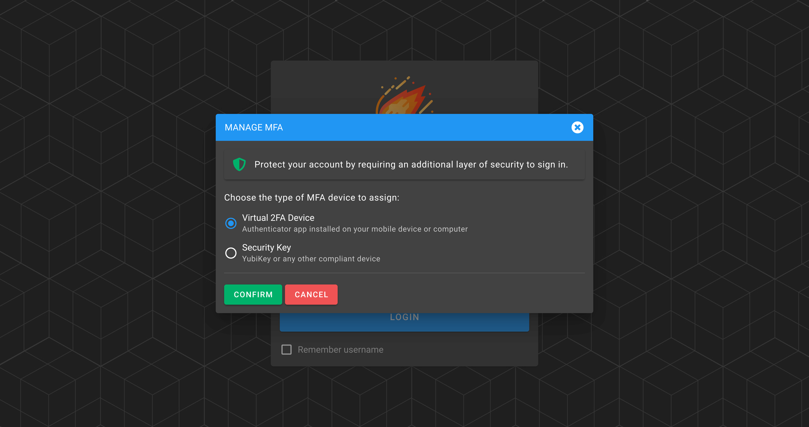

# Settings

The Settings view is used to manage some application global parameters:

- [License](#license)
- [SQL](#sql)
- [Files](#files)
- [Security](#security)

## License

The License section shows information (in read-only) related of the license. We can see if the copy of the Meteor Next that we're using is activated and the day that the license will expire.



## SQL

The SQL section shows the credentials (in read-only) where Meteor Next is stored.


## Files

The Files section shows information about the path where the application files are stored.


These are the fields that can be edited:

**Absolute Path**

This value defaults to `/root/files`. It's the path within the Meteor container that the app will use to store some data that is not stored in the DB (such as Deployments results).

This value does not need to be changed if you decide to store these resources into Amazon S3. If you would like to choose this storage engine you should enable the `Store in Amazon S3` option and fill the necessary fields.

On the other hand if you prefer to use the local disk storage over Amazon S3, then we recommend that you change this value for the [Docker's mounted volume](../../getting-started/install#local). By using the mounted volume path, you won't lose all the deployment results when you perform a Meteor update.

**Retention Days**

This value is used to determine how many days we would like to retain the deployment results.

All the deployments that have been done previously that this value will be deleted. Bear in mind that even you choose the Amazon S3 storage engine, Meteor will only delete the deployments in the Docker's container disk (not the files uploaded in S3).

If you would like to store all the values in Amazon S3, we recommend to set this value as 1. In this way you won't have to worry about the storage left in your machine since all the data will be stored in Amazon S3 and Meteor will only retain locally the deployments results of one day.

**Store in Amazon S3**

Enable this option to store the deployment results into Amazon S3. Althought Meteor can work without Amazon S3, we strongly recommended to choose this storage engine. You won't have to worry anymore about the storage left on your machine and all the deployment results will be preserved when you perform a Meteor update.

## Security

The Security section is used to ensure some security policies for all Meteor accounts.


**PASSWORD POLICY**

- **Maximum Password Age**: The days that have to pass before forcing the user to change their password. This value can be: `Never`, `3 Months`, `6 Months`, `1 Year`.
- **Minimum Password Length**: The minimum number of characters allowed (current passwords are exempt until their age expires).
- **Require lowercase character**: Enable this option to force new passwords to contain at least one lowercase character.
- **Require uppercase character**: Enable this option to force new passwords to contain at least one uppercase character.
- **Require number**: Enable this option to force new passwords to contain at least one number.
- **Require special character**: Enable this option to force new passwords to contain at least one special character. 

The following screenshot shows the behaviour when a user tries to login with an expired password. After proceeding to login a dialog is shown forcing the user to change their password.



**MFA**

- **Force Multi-Factor Authentication (MFA)**: Enable this option to force all users to have the MFA enabled.

The following screenshot shows the behaviour when the MFA is forced and a user tries to login into the application without having their MFA enabled. A new dialog is shown forcing him/her to enable it.



**SECURE ADMIN**

- **Administration URL**: Fill this option to restrict the access to the Administration panel only to a specific IP address or domain.

This option is useful to add an extra security layer to the Administration panel. Let's make an example to better understand it.

Imagine that in your company all users are accessing the Meteor app through `meteor.yourcompany.io`, admins included.
In this scenario if a non-admin user could guess the credentials of an admin user, he/she would be able to login as an admin.

To prevent this hypothetical situation you could setup another url such as `meteor-admin.yourcompany.io` pointing also to the Meteor application, and add this url to the `Administration URL` field.
Finally you could restrict by network (a VPN for example) that only a set of users (the admin ones) could have access to this new url.
In this way, although a non-admin user could know an admin account, he/she would not be able to access to the admin panel.

Mind that if a user accesses to a url different than the one set in `Administration URL`, he/she won't be able to access the admin panel (even if accesses with an admin account).

:::caution
If you set this field by mistake and therefore you lose access to the administration panel, keep in mind that this option can be reverted by changing a value in the database where Meteor resides.

Access the `settings` table and in the second row (the one with name: "SECURITY") edit the `value` column, that contains a JSON.

Look for the `restrict_url` key and leave its value empty.

**Old value**

```json
{"password_age": "0", "password_min": "5", "password_lowercase": false, "password_uppercase": false, "password_number": false, "password_special": false, "force_mfa": false, "restrict_url": "meteor.yourcompany.io"}
```

**New Value**

```json
{"password_age": "0", "password_min": "5", "password_lowercase": false, "password_uppercase": false, "password_number": false, "password_special": false, "force_mfa": false, "restrict_url": ""}
```

The next time you login into the app, you will be able to access to the Administration panel.
:::