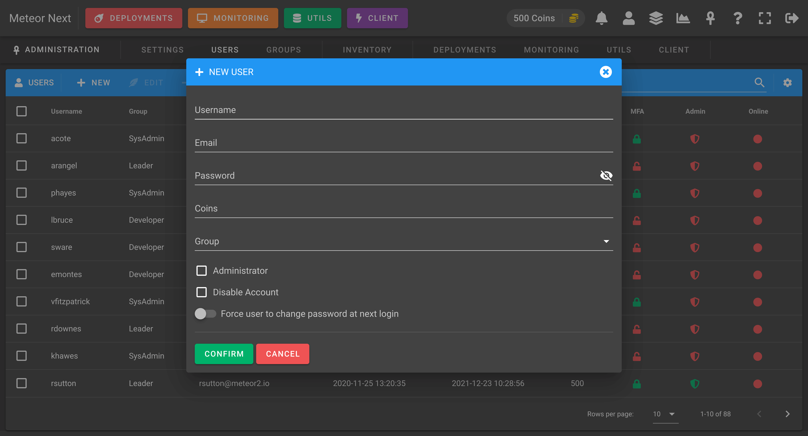
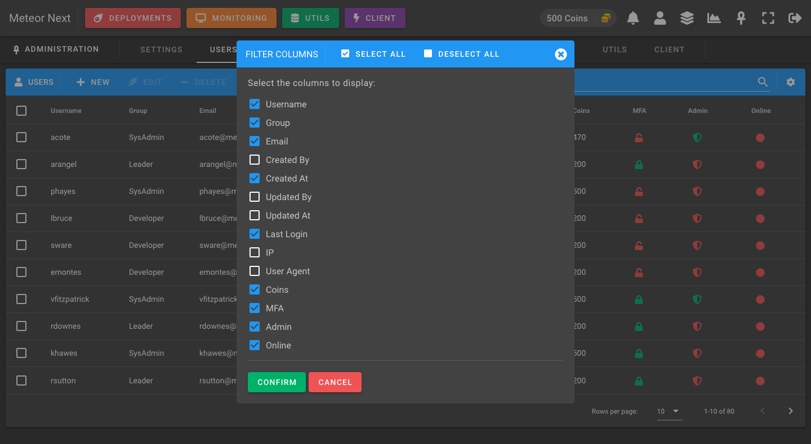

# Users

The users view is used to manage all the user accounts that have access to the Meteor application.

When creating a new user some fields are required:

- **Username**: A unique username that identifies the user.
- **Email**: The user's email.
- **Password**: The user's password.
- **Coins**: The amount of coins to have.
- **Group**: The group that the user will be part.
- **Administrator**: To access the administration panel and all the deployments & restores from other users.
- **Disable Account**: By locking an account will prevent the user from being able to login into the application. If the user is already logged in, the next action he does it will be automatically logged out.
- **Force user to change password at next login**: At next login the user will be forced to change their password. It's useful if you create a new user with a random generated password but you want to be sure that at next login the user changes the password. This option is useful also when editing an existing user and you want to force that the user will change their password at next login. After the user changes their password this flag will be automatically disabled.

The following screenshot shows all the columns that can be displayed.

