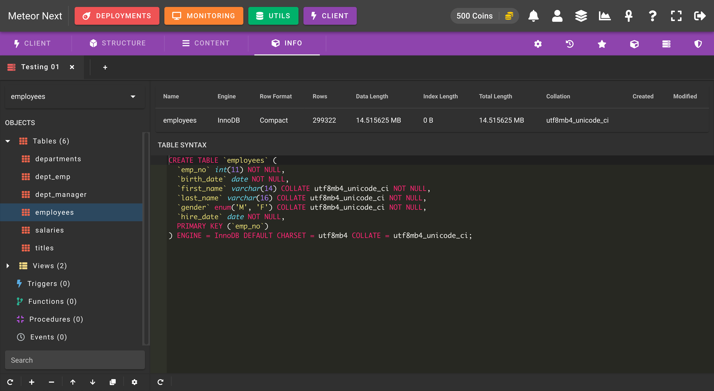
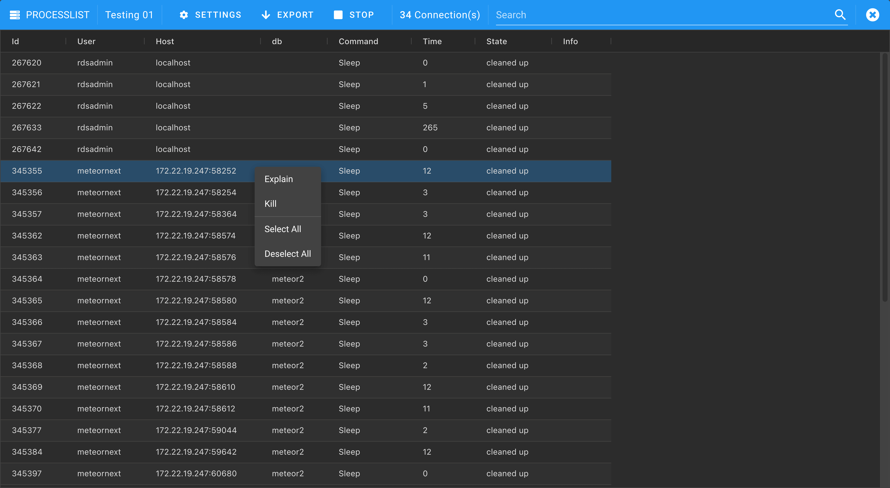
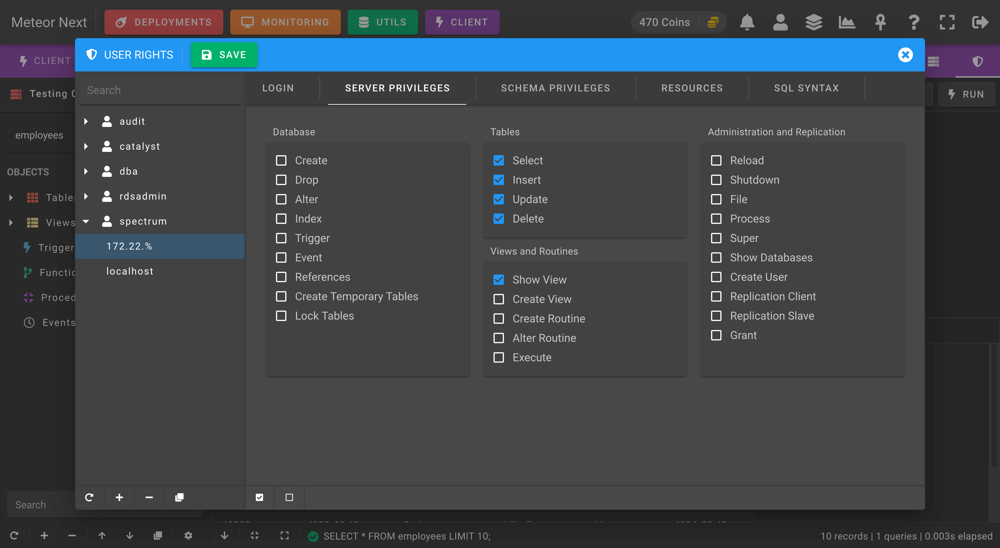
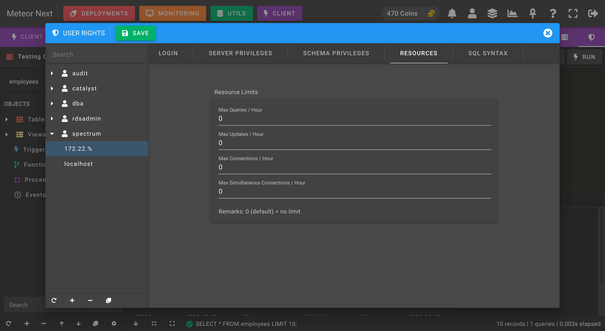

# Client

The Client section is a fast, easy-to-use web browser database management application for working with MySQL databases.

**ADDING NEW SERVERS**

To add new servers from your inventory to the list, click the `+` button at the bottom left and then select the desired servers to be added. 

After that, you can now connect to any server by double-clicking it or by searching it in the top search bar.

## Structure

In the structure tab, you can manage the schema of your tables: 

- Columns
- Indexes
- Foreign Keys
- Triggers

## Content

The content tab gives you direct editing access to all your tables. You can either create, edit or remove rows.

Furthermore, you can also export the data in different formats:

- SQL
- CSV
- JSON
- Meteor (this format is used in the [Viewer](../viewer) section)

## Info

The Info view gives you an overview of important information for the currently selected table, including the SQL table syntax.

## Settings

Into the Settings tab you can change the default editor font size and also see the different shortcuts that are available in Meteor Client. 

## Query History

Into the Query History, you can see a list of all queries executed in the current session.

## Saved Queries

Into the Saved Queries view, you can manage all your favorite queries.

You can then insert your saved queries directly to the editor by clicking the empty star icon.

## Schema Objects

The Schema Objects view gives you an overview of all the objects contained in your selected database.

- Tables
- Views
- Triggers
- Functions
- Procedures
- Events

## Processlist

The Processlist view shows a list of all the queries that are being currently executing in the server.

By right-clicking a row, you can either kill a query or to perform an EXPLAIN to analyze its performance.

The following screenshot shows an example of killing a query. If the "Terminate the connection" option is enabled, all other queries being executed into the same connection will also be terminated.

The following screenshot shows an example of explaining a query. Only SELECTs can be explained.

## User Rights

The User Rights section is used to manage all the MySQL users in the current server.

The `Login` tab shows a summary about the current user:

- **Username**: The user's username.
- **Hostname**: The DNS/IP from where the MySQL will accept the connection.
- **Password**. Can be either *Hash* or *String*. String is the plain-text password, and Hash is the password that MySQL stores using SHA1. You can find these passwords into the mysql.user table. 

The `Server` tab is used to manage the permissions in server's level.

The `Schema` tab is used to manage the permisions in schema level. Here you can give granular permissions at database, table and column level.

The following screenshot shows an example of giving the SELECT permission to the current user at column level. The user will be able to execute SELECTs into the `employees` database, into the `salary` table and only will be able to query the `value` column.

The `Resources` tab is used to manage some MySQL account resource limits:

- **Max Queries / Hour**: Maximum number of queries that can be executed per hour.
- **Max Updates / Hour**: Maximum number of statements that modify databases or tables executed per hour.
- **Max Connections / Hour**: Maximum number of connections per hour.
- **Max Simultaneous Connections / Hour**: Maximum number of simultaneous connections that can be made per hour.

The `Syntax` tab is used to retrieve the current user privileges in SQL syntax. 

## Import

In the Client, you can import SQL files to the current database.

:::tip
To import files larger than 10 MB it's recommended to use the [Utils - Imports](./utils#imports) section.
:::

## Export

The Exports view is used to export objects of the current database into SQL or CSV format.

:::tip
To export objects larger than 10 MB it's recommended to use the [Utils - Exports](./utils#exports) section.
:::

## Clone

The Clone view is used to copy objects from the current database to another one.

:::tip
To clone objects larger than 10 MB it's recommended to use the [Utils - Clones](./utils#clones) section.
:::

## Server Variables

The Server Variables dialog is used to manage the MySQL parameters from the current server.

By double-clicking a variable, you can change its value to another one.

