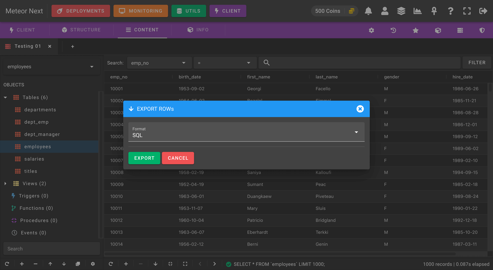

# Content

The content tab gives you direct editing access to all your tables. You can either create, edit or remove rows.

Furthermore, you can also export the data in different formats:

- SQL
- CSV
- JSON
- Meteor (this format is used in the [Viewer](../viewer) section)

