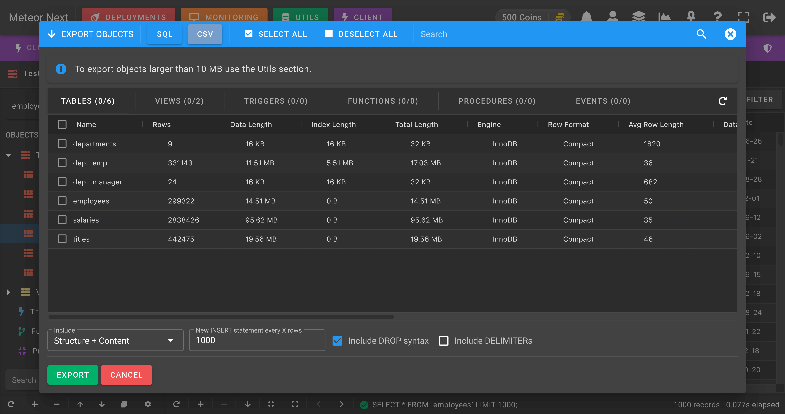

# Export

The Exports view is used to export objects of the current database into SQL or CSV format.

:::tip
To export objects larger than 10MB it's recommended to use the [Utils - Exports](../utils/exports) section.
:::