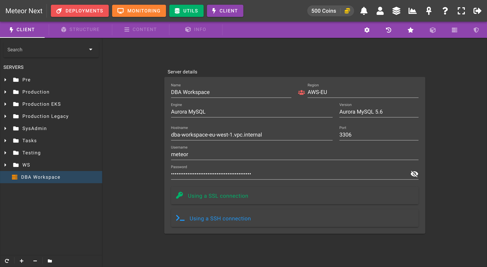

# Introduction

The Client section is a fast, easy-to-use web browser database management application for working with MySQL databases.

**Adding new servers**

To add new servers from your inventory to the list, click the `+` button at the bottom left and then select the desired servers to be added. 

After that you can now connect to any server by double clicking it or by searching it in the top search bar.