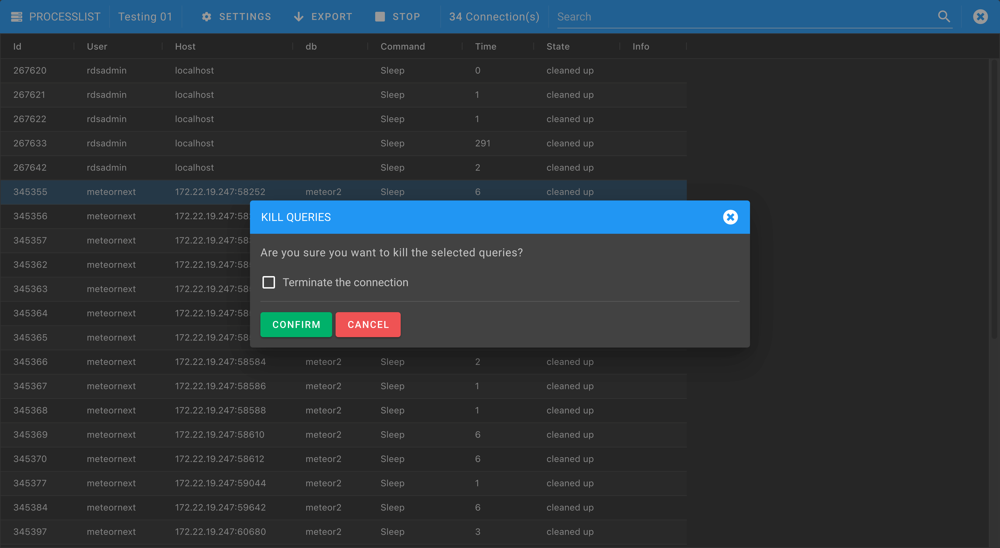

# Processlist

The Processlist view shows a list of all the queries that are being currently executing in the server.

By right clicking a row you can either kill a query or to perform an EXPLAIN to analyze its performance.

The following screenshot shows an example of killing a query. If the "Terminate the connection" option is enabled, all other queries being executed into the same connection will also be terminated.

The following screenshot shows an example of explaining a query. Only SELECTs can be explained.

