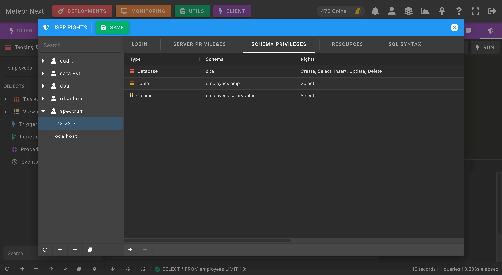
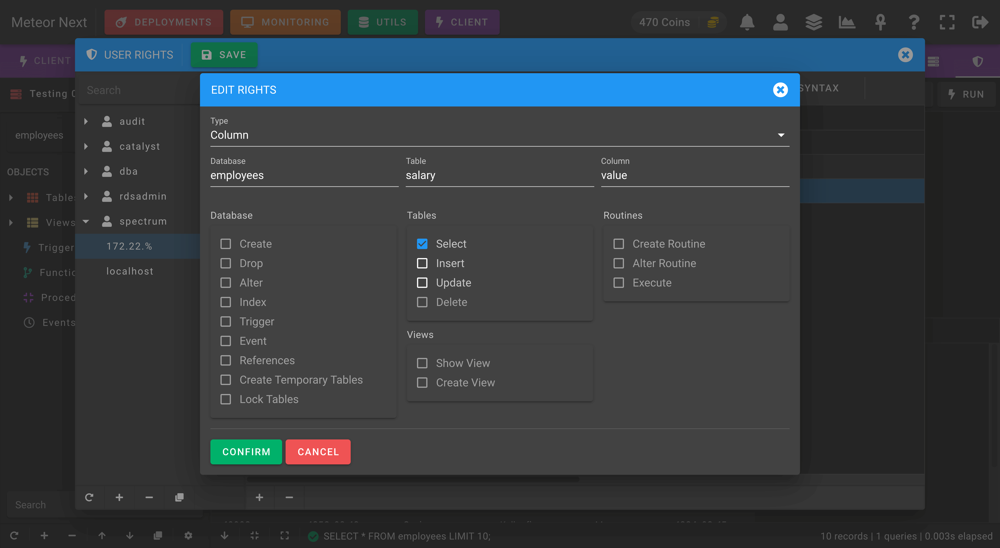
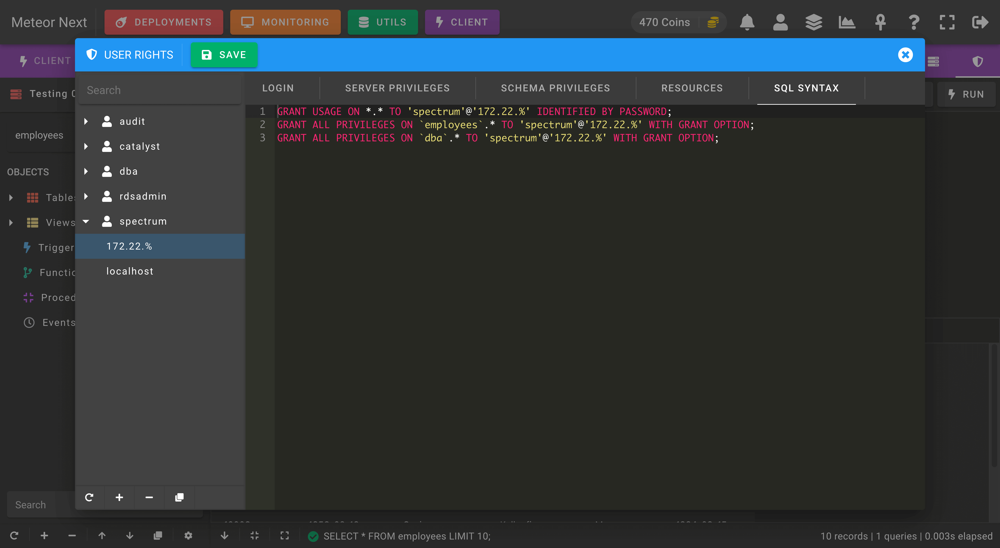

# User Rights

The User Rights section is used to manage all the MySQL users users in the current server.

The `Login` tab shows a summary about the current user:

- **Username**: The user's username.
- **Hostname**: The DNS/IP from where the MySQL will accept the connection.
- **Password**. Can be either *Hash* or *String*. String is the plain-text password and Hash is the password that MySQL stores using SHA1. You can find these passwords into the mysql.user table. 

The `Server` tab is used to manage the permisions in server's level.

The `Schema` tab is used to manage the permisions in schema level. Here you can give granular permisions at database, table and column level.

The following screenshot shows an example of giving the SELECT permision to the current user at column level. The user will be able to execute SELECTs into the `employees` database, into the `salary` table and only will be able to query the `value` column.

The `Resources` tab is used to manage some MySQL account resource limits:

- **Max Queries / Hour**: Maximum number of queries that can be executed per hour.
- **Max Updates / Hour**: Maximum number of statements that modify databases or tables executed per hour.
- **Max Connections / Hour**: Maximum number of connections per hour.
- **Max Simultaneous Connections / Hour**: Maximum number of simultaneous connections that can be made per hour.

The `Syntax` tab is used to retrieve the current user privileges in SQL syntax. 

