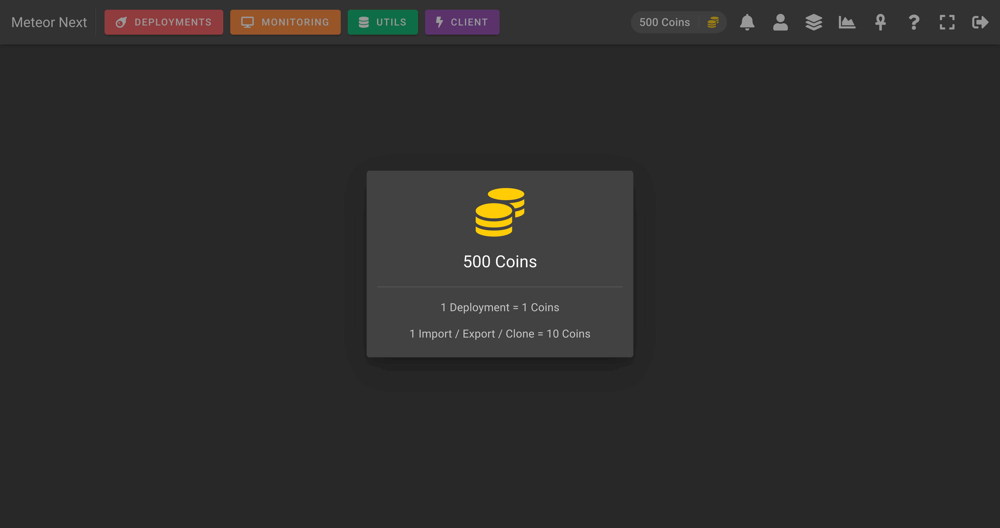

# Coins

The Coins view shows:

- The amount of coins you have.
- How many coins does it cost to make a Deployment.
- How many coins does it cost to make an Import, Export or a Clone.

Coins are consumed performing Deployments, Imports, Exports and Clones. And the amount of coins that are consumed depends on the user's group settings.

To change the amount of coins that are consumed, go to the [Groups](./administration#groups) section and edit a desired group. Look for the `Coins per execution` field found both in the [Deployments](./administration#deployments) tab and the [Utils](./administration#utils) tab.

