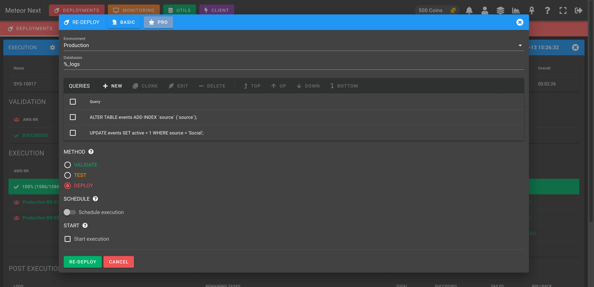
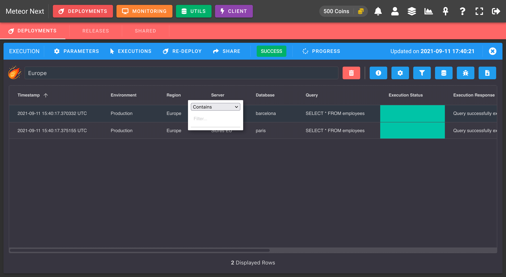
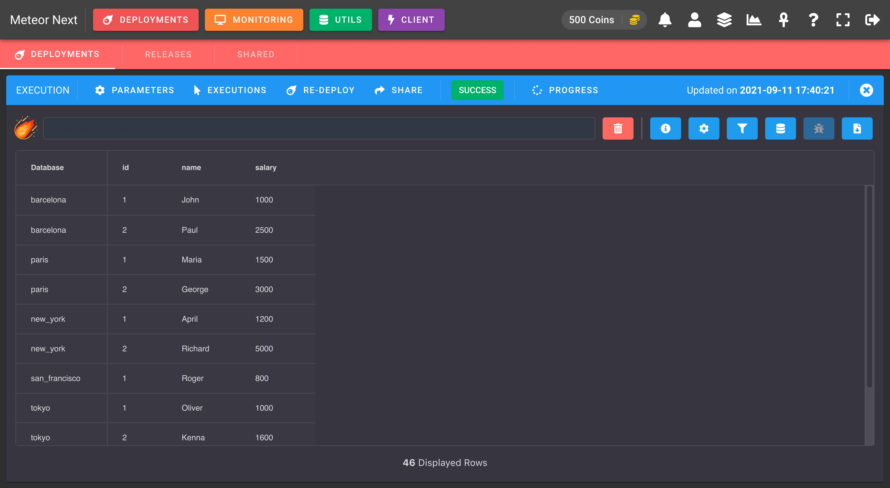
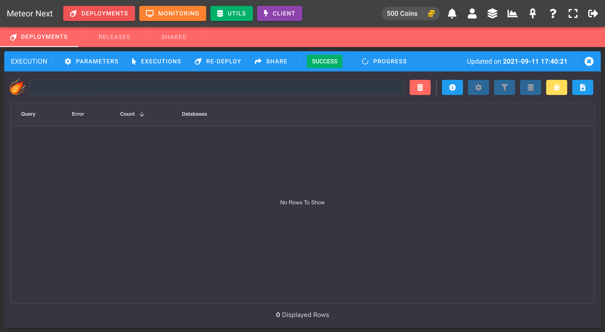

# Deployments

Deployments is one of the most interesting apps in Meteor Next. Gives you the ability to execute SQL queries (including logic) massively, in a controlled and safe way to multiple servers.

In a nutshell:

- 🚀 **Fast**: Executions make use of parallellism + cross-region to balance the workload to different servers and to maximize the throughput without affecting the current performance.
- 💪 **Resilient**: Executions have the capacity to recover quickly from difficulties (network and query errors).
- 🐍 **Python**: Add Python logic to deployments for complex executions.
- ✨ **Transform**: Perform searchs and data transformation with the execution results.
- ✉️ **Share**: Share a deployment results with other users.
- 🕒 **Schedule**: Decide when a deployment should start.
- 🔎 **Inspect**: Search and filter every deployment done in the past.
- 🔔 **Alerts**: Receive a notification whenever a deployment finishes (in-app notifications & Slack integration).


<p style="text-align:center; margin-top:-10px">Deployments - List</p>


<p style="text-align:center; margin-top:-10px">Deployments - Execution</p>


<p style="text-align:center; margin-top:-10px">Deployments - Results</p>

## Architecture

***How Meteor Next works under the hood to achieve fast and secured deployments?***

There are two factors to take into account:

- 🚀 **Parallelism**: The deployment is performed at the same time in multiple database servers.
- 🌎 **Cross-Region**: The deployment is executed in each Region using SSH Tunnel reducing drastically the delay between queries.

---

To put a little of context before going further remember that a **Region** is a resource that is assigned to one or more servers and is identified by a name and with the option to enable SSH Tunnel.


<p style="text-align:center; margin-top:-10px">List of regions</p>

So when we're talking to Regions that have the SSH Tunnel enabled (Cross-Region) think about Linux machines that Meteor uses to balance the deployment workload and therefore to speed-up the execution.

---

Here's an example of a deployment being executed in four different regions: North America (NA), South America (SA), Africa (AF), Asia (AS).


As we can see Meteor Next uses a 3-Level of parallelism. Firstly the parallelisation is performed at region level. Subsequently, for each region a new depth level of concurrency is started for each server, and finally a new level of parallelism is performed for databases.

To better understand how all this works let's make two possible scenarios:

### Not using Cross Region

To start a deployment is required to choose an Environment. Remember that an environment is a resource that contains servers (nothing more, nothing less). It's a way to organize servers.

Let's say that we choose the environment **Production** that contains 7 servers:

| Server Name   | Region Name  | Region SSH Tunnel   |
| ------------- | :----------: | :-----------------: |
| Server 01     | NA           | ❌                  |
| Server 02     | NA           | ❌                  |
| Server 03     | SA           | ❌                  |
| Server 04     | AF           | ❌                  |
| Server 05     | AF           | ❌                  |
| Server 06     | AS           | ❌                  |
| Server 07     | AS           | ❌                  |

As we can see there's a total of four regions and each region contains two servers except SA (South America) which contains only one.

Here's a image representing this example:


<p style="text-align:center; margin-top:-10px">Without Cross Region</p>

All the SQL queries will be executed from the Docker container meteor2 (located in Europe) to all seven servers.

By using this scenario, the execution will be affected by high latency, since all servers are located in different geographical regions than the meteor2 container.

### Using Cross Region

We should start using Cross Region when we have several servers in different geographical regions (eg: Europe, North America, Asia).

Imagine that we have Meteor Next installed in a machine located in Europe. What would happen if we would like to execute SQL queries to a server located in another region? Well, we will have to face a lot of delay, since we would have to execute queries from a long distance (eg: Europe <--> Asia).

By using Cross Region, all the executions are done in each region. In this way the latency is reduced drastically and furthermore all the computing workload is balanced in different machines.

Here's an example of a Cross-Region deployment:

| Server Name   | Region Name  | Region SSH Tunnel   |
| ------------- | :----------: | :-----------------: |
| Server 01     | NA           | ✅                  |
| Server 02     | NA           | ✅                  |
| Server 03     | SA           | ✅                  |
| Server 04     | AF           | ✅                  |
| Server 05     | AF           | ✅                  |
| Server 06     | AS           | ✅                  |
| Server 07     | AS           | ✅                  |


<p style="text-align:center; margin-top:-10px">Using Cross Region</p>

By using Cross-Regions (SSH Tunnel enabled), Meteor Next goes an step further. Aside from providing a tunnel to connect to a server using an intermediary machine, Meteor also deploys a binary to each SSH Tunnel machine (in ~/.meteor2).

This binary is in charge of executing the deployment for the servers that are located in their region. When the execution finishes, all the execution details are sent to the Docker container where Meteor Next resides.

After that Meteor merges all the logs from the different regions and leaves it ready for the user to be viewed.

In this scenario the execution goes much faster to finish. There is no longer latency between SQL queries and the computing process is balanced between different regions.

:::tip
It's recommended to use Cross-Region deployments when you have different servers that are located in different geographic regions.
:::

## Releases

A release is an resource that helps us to organize deployments. It's like a folder that contains deployments.


<p style="text-align:center; margin-top:-10px">Releases - List</p>

A Release is identified by a name and a flag called `Active` that can be either enabled or disabled.

A release marked as active means that all their deployments will be visible (in the Deployments section).
Accordingly, a release marked as non active means that all their deployments will be hidden (in the Deployments section).

**Why is this Active flag needed?**

Imagine that we are Database Engineers and we are in charge to make database deployments for daily needs (bug fixes, new features or data retrieval).

Every month the company releases a new version of their product. We have a Release created "3.1.0" with several deployments already done.

Today the company releases in Production the 3.1.0 Release for all their customers containing all the deployments we made.

At this point we are not still interested of seeing all the past deployments. We just want to have a new release to contain all the future deployments for the next monthly company's release.

What we do is to create a new active Release with the name "3.2.0" and update the previous one (3.1.0) setting the active flag disabled.

## Basic

Basic deployments are used to execute SQL queries through several servers.


<p style="text-align:center; margin-top:-10px">Basic Deployment</p>

These are the fields needed to be filled before starting an execution:

**Name**

The desired name to identify the current deployment (can be changed afterwards).

**Release**

The [release](#releases) to be associated (can be changed afterwards). Only the active Releases will appear.

**Environment**

The [environment](./inventory#environments) to be applied.

**Databases**

The target databases to apply the execution (accepts a list of databases separated by commas and the wildcards "%", "_").

Some examples:

- One database

```sql
mydatabase1
```

- Some databases

```sql
mydatabase1, mydatabase2, mydatabase3
```

- All databases that its name starts with 'mydatabase'

```sql
mydatabase%
```

**Queries**

The list of SQL queries to be executed.

**Method**

The deployment method to be used:
- **Validate**: Tests all server connections (no queries are executed). This method just checks that Meteor Next can reach all the servers with the credentials configured in the Inventory.

- **Test**: A simulation is performed (only SELECTs and SHOWs are executed). For other sentences (apart from selects and shows) the deployment just checks if these sentences would either work or fail if they were executed.

- **Deploy**: All queries are executed.

Note that both `TEST` and `DEPLOY` options also performs the VALIDATE method under the hood.

**Scheduled**

Turn on this option to [schedule](#scheduled) the execution.

**Start execution**

Turn on this option to start the execution just after creating the deploy. If you want to create the deploy but to execute it later, do not toggle this checkbox.

## Pro

Pro deployments are used to execute SQL queries with logic through several servers.


<p style="text-align:center; margin-top:-10px">Pro Deployment</p>

These are the fields needed to be filled before starting an execution:

**Name**

The desired name to identify the current deployment (can be changed afterwards).

**Release**

The [release](#releases) to be associated (can be changed afterwards). Only the active Releases will appear.

**Environment**

The [environment](./inventory#environments) to be applied.

**Code**

A Python template to write the deployment.

```python
#########################################################
# Usage: https://docs.meteor2.io/guides/deployments#pro #
#########################################################
import json
from collections import OrderedDict

class blueprint:
    def __init__(self):
        self.queries = {
            # '1': "<query>"
        }

    #######################################################
    # Executed once per Server before all main executions #
    #######################################################
    def before(self, meteor, environment, region, server):
        pass

    ##############################
    # Executed once per Database #
    ##############################
    def main(self, meteor, environment, region, server, database):
        pass

    ######################################################
    # Executed once per Server after all main executions #
    ######################################################
    def after(self, meteor, environment, region, server):
        pass

    ########################
    # User Defined Methods #
    ########################
    def search(self, items, key, value):
        # Search a key value in a list of dictionaries
        return [i for i in items if i[key] == value]

    def str2dict(self, data):
        # Convert a string representation of a dictionary to a dictionary
        return json.loads(data, object_pairs_hook=OrderedDict)

    def dict2str(self, data):
        # Convert a dictionary to a string
        return json.dumps(data, separators=(',', ':'))
```

**Method**

The deployment method to be used:
- **Validate**: Tests all server connections (no queries are executed). This method just checks that Meteor Next can reach all the servers with the credentials configured in the Inventory.

- **Test**: A simulation is performed (only SELECTs and SHOWs are executed). For other sentences (apart from selects and shows) the deployment just checks if these sentences would either work or fail if they were executed.

- **Deploy**: All queries are executed.

Note that both `TEST` and `DEPLOY` options also performs the VALIDATE method under the hood.

**Scheduled**

Turn on this option to [schedule](#scheduled) the execution.

**Start execution**

Turn on this option to start the execution just after creating the deploy. If you want to create the deploy but to execute it later, do not toggle this checkbox.

### Mastering Pro Deployments

Pro Deployments are extremely useful if you want to add some application logic in your execution.

Before showing some examples to better undestand how this all works, let's start explaining the parts of the blueprint:

**CORE COMPONENTS**

The following components are needed to be filled in order to perform a deployment.

`self.queries`: This variable stores all the queries to be executed.

```python
def __init__(self):
    self.queries = {
        # '1': "<query>"
    }
```

`main(...)` This method is executed once per database. Inside this method is where the app's logic will be written.

```python
def main(self, meteor, environment, region, server, database):
    pass
```

`meteor.execute(...)` This method is used to execute SQL queries.

```python
meteor.execute(query=self.queries['1'], args=None, database=None, auxiliary=None, alias=None, output=True)
```

Arguments:

- **query** (Required): The query to be executed.
- **args** (Optional): To pass some escaped query parameters.
- **database** (Optional): The database name.
- **auxiliary** (Optional): To use an auxiliary connection.
- **alias** (Optional): To add a query alias.
- **output** (Optional): To suppress the execution output from a query.

**ADDITIONAL COMPONENTS**

Here are some additional components that may be useful in some deployments.

`before(...)`: This method is executed once per Server before all main() executions.

```python
def before(self, meteor, environment, region, server):
    pass
```

`after(...)`: This method is executed once per Server after all main() executions.

```python
def after(self, meteor, environment, region, server):
    pass
```

`meteor.begin()` This method is used to start a transaction.

```python
meteor.begin()
```

`meteor.commit()` This method is used to commit a transaction.

```python
meteor.commit()
```

`meteor.rollback()` This method is used to rollback a transaction.

```python
meteor.rollback()
```

`meteor.is_error()` This method is used to check if a query in the current transaction has either succeed or failed. It returns a bool data type (true | false).

```python
meteor.is_error()
```

**USER DEFINED METHODS**

In the last part of the blueprint there's some methods that may be used in some deployments. Here, if you wish, you could add more methods:

`search(...)`: This method searches a key value in a list of dictionaries.

```python
def search(self, items, key, value):
    return [i for i in items if i[key] == value]
```

`str2dict(...)`: This method converts a string representation of a dictionary to a dictionary.

```python
def str2dict(self, data):
    return json.loads(data, object_pairs_hook=OrderedDict)
```

`dict2str(...)`: This method converts a dictionary to a string.

```python
def dict2str(self, data):
    return json.dumps(data, separators=(',', ':'))
```

Let's see some examples to better understand how all of this works together.

### Example 1: Execute a query to a database

**DESCRIPTION**

This example shows how to execute a query to the emp database.

**BLUEPRINT**

```python
def __init__(self):
    self.queries = {
        '1': "SELECT * FROM employees"
    }

def main(self, meteor, environment, region, server, database):
    if database == 'emp':
        meteor.execute(query=self.queries['1'], database=database)
```

### Example 2: Working with parameters

**DESCRIPTION**

This example shows how to pass escaped parameters to a query using two different methods.

**BLUEPRINT**

```python
def __init__(self):
    self.queries = {
        '1': "INSERT INTO employees (name, salary) VALUES (%s, %s)",
        '2': "INSERT INTO employees (name, salary) VALUES (%(name)s, %(salary)s)"
    }

def main(self, meteor, environment, region, server, database):
    if database == 'emp':
        meteor.execute(query=self.queries['1'], args=('John', 1200), database=database)
        meteor.execute(query=self.queries['2'], args={"name":'Jeanna',"salary":1500}, database=database)
```

:::tip
If you want to execute a query that contains an argument and you also want to add the character `%` in some part of the query, since Python detects the `%` value as another parameter, to prevent this behaviour add two `%` instead of one.

The following example is getting all the employees with a salary of 1000 that their name starts with the letter a.

```python
def __init__(self):
    self.queries = {
        '1': "SELECT * FROM employees WHERE salary = %s AND name LIKE 'a%%'",
    }

def main(self, meteor, environment, region, server, database):
    if database == 'emp':
        meteor.execute(query=self.queries['1'], args=(1000), database=database)
```

Note that we doubled the character `%` in `LIKE 'a%%'`.
:::

### Example 3: Handling query results

**DESCRIPTION**

This example shows how to get the result of an executed query and how to insert it into another table.

**BLUEPRINT**

```python
def __init__(self):
    self.queries = {
        '1': "SELECT id, name, salary FROM employees LIMIT 2",
        '2': "INSERT INTO employees_test VALUES (id, name) (%s, %s)" 
    }

def main(self, meteor, environment, region, server, database):
    if database == 'emp':
        result = meteor.execute(query=self.queries['1'], database=database)
        # result = [{"id": 1, "name": "John", "salary": 1200},{"id": 2, "name": "Jeanna, "salary": 1500}]
        for i in result:
            meteor.execute(query=self.queries['2'], args=(i['id'], i['name']), database=database)
```

As you may think all this use case could have been reduced by executing a single query:

```sql
INSERT INTO employees_test (id, name)
SELECT id, name
FROM employees
LIMIT 2
```

Mind that the goal of these examples is to familiarize yourself working with this template.

### Example 4: Working with JSONs

**DESCRIPTION**

This example shows how to handle JSON values stored in a string (eg: VARCHAR) field type.

**USE CASE**

Update the city of the employee with "id = 1". Change their city to "Paris" if their city is "Barcelona".

**BLUEPRINT**

```python
def __init__(self):
    self.queries = {
        '1': "SELECT extra_info FROM employees WHERE id = 1",
        '2': "UPDATE employees SET extra_info = %s WHERE id = 1"
    }

def main(self, meteor, environment, region, server, database):
    if database == 'emp':
        result = meteor.execute(query=self.queries['1'], database=database)
        # result = [{"extra_info": '{"city": "Barcelona", "department": "A10"}'}]
        # 1. Convert the JSON string to a true JSON.
        parsed_json = self.str2dict(result[0]['extra_info'])
        # parsed_json = {"city": "Barcelona", "department": "A10"}
        # 2. Update the city value to Paris if city = 'Barcelona'
        if parsed_json['city'] == 'Barcelona':
            # 3. Update the city value to Paris
            parsed_json['city'] = 'Paris'
            # 4. Convert the JSON to a JSON string to insert it again in the table
            value = self.dict2str(parsed_json)
            # value = '{"city": "Paris", "department": "A10"}'
            # 4. Insert the value to the database
            meteor.execute(query=self.queries['2'], args=(value), database=database)
```

### Example 5: Working with Auxiliary Connections

**DESCRIPION**

An auxiliary connection is a server that is used in Pro Deployments. It's used when we want to execute a query to a server that is not included in the selected environment.


<p style="text-align:center; margin-top:-10px">Inventory - Auxiliary Connections</p>

**USE CASE**

Get all languages that our company support. Iterate all databases that their name ends with '_logs' in all the servers that are included in the selected environment. For all these databases insert the languages retrieved to the 'customer_languages' table. 

**BLUEPRINT**

```python
def __init__(self):
    self.queries = {
        '1': "SELECT id, name FROM languages",
        '2': "INSERT INTO customer_languages (id, name) VALUES (%s, %s)"
    }

def before(self, meteor, environment, region, server):
    # By executing this query inside this method, all databases into the main() method will be able to access this variable. Doing it this way we avoid that this query is executed by each database.
    self.languages = meteor.execute(query=self.queries['1'], database='core', auxiliary='core01-prod')
    # self.languages = [{"id": 1, "name": 'english'},{"id": 2, "inc": 'spanish'}]

def main(self, meteor, environment, region, server, database):
    if database.endswith('_logs'):
        for l in self.languages:
            meteor.execute(query=self.queries['2'], args=(l['id'], l['name']) database=database)
```

### Example 6: Debugging variables

**DESCRIPTION**

This example shows how to retrieve variable values.

**BLUEPRINT**

```python
def main(self, meteor, environment, region, server, database):
    # Example 1: Debugging a string (this example works for all kind of variables).
    data = 'hello world'
    meteor.execute(query="SELECT %s AS 'data'", args=str(data), database=database, alias='DEBUG1')
    # Example 2: Debugging a dictionary.
    data = {'a': 1, 'b': 2}
    meteor.execute(query="SELECT %s AS 'data'", args=str(data), database=database, alias='DEBUG2')
    # Example 3: Debugging a dictionary (+ extending its values in the Transformation section).
    data = {'a': 1, 'b': 2}
    meteor.execute(query="SELECT " + ','.join([f"%s AS '{k}'" for k in data.keys()]), args=list(data.values()), database=database, alias='DEBUG3')
    # Example 4: Debugging a list of dictionaries (+ extending its values in the Transformation section).
    data = [{'a': 1, 'b': 2}, {'a': 3, 'b': 4}]
    for i in data:
        meteor.execute(query="SELECT " + ','.join([f"%s AS '{k}'" for k in i.keys()]), args=list(i.values()), database=database, alias='DEBUG4')
```

The following screenshot shows the result by executing the above code. 


To better see its values, click the Transformation icon and choose the query to display.


Here's the transformation of the first query named 'DEBUG1'.


Here's the transformation of the second query named 'DEBUG2'.


Here's the transformation of the third query named 'DEBUG3'.


Here's the transformation of the fourth query named 'DEBUG4'.


### Example 7: Using alias

**DESCRIPTION**

This example shows how to assign alias to a query.

**BLUEPRINT**

```python
def __init__(self):
    self.queries = {
        '1': "SELECT * FROM tbl WHERE db_name = %s",
    }

def main(self, meteor, environment, region, server, database):
    meteor.execute(query=self.queries['1'], args=(database), database=database, alias='myalias')
```

**Which is the purpose of adding alias to queries?**

Alias are used to group several queries. It's a way of telling the Meteor that some queries are the same and that they should be treated together as one.

Let's make an example to understand it better.

Imagine that we selected the `TEST` environment and this one contains two servers: SERVER1 and SERVER2. The SERVER1 contains two databases (hello1, hello2) and the SERVER2 contains just one database (hello3).

- **SERVER1**: hello1, hello2
- **SERVER2**: hello3

Following the above blueprint, when we start the deployment these are the queries that will be executed (once per database).

**SERVER1**

- SELECT * FROM tbl WHERE db_name = 'hello1';
- SELECT * FROM tbl WHERE db_name = 'hello2';

**SERVER2**

- SELECT * FROM tbl WHERE db_name = 'hello3';

Despite we've written just one query, as we added a parameter to the query, it has caused that in the end we have three different queries.

By adding an alias to the query, we tell Meteor to treat all these queries as one. What will happen is that when the Deployment finishes we will see all these queries results together. We won't have to select each query one by one to get the results.

So, query alias will mostly be needed when executing queries that have arguments that their value can differ.

### Example 8: Using transactions

**DESCRIPTION**

This example shows how to create transactions and how to commit/rollback them.

**BLUEPRINT**

```python
def main(self, meteor, environment, region, server, database):
    # Start a transaction
    meteor.begin()
    # Execute a DML query
    meteor.execute(query="INSERT INTO tbl VALUES ('hello')", database=database)
    # Rollback the transaction
    meteor.rollback()
    # Start another transaction
    meteor.begin()
    # Execute a DML query
    meteor.execute(query="INSERT INTO tbl VALUES ('hello')", database=database)
    # Commit the transaction
    meteor.commit()
```

Deploying the previous blueprint will actually execute the INSERT query only once. The first one will be rollbacked and the second one will be commited.

:::tip INFO
Bear in mind that if we start a transaction into an already started one, all the queries executed in the previous transaction will be rollbacked and then a new transaction will start.
:::

### Example 9: Suppressing a query output

**DESCRIPTION**

This example shows how to use the optional `output` parameter and why it can come in handy.

**BLUEPRINT**

```python
def main(self, meteor, environment, region, server, database):
    result = meteor.execute(query="SELECT 'hello' AS query1", database=database, output=False)
    # result = [{"query1": "hello"}]
    meteor.execute(query="SELECT %s AS query2", args=(result[0]['query1']), database=database)
```


The output parameter is used to suppress the execution output of a query.

**Why can it come in handy?**

Imagine you need to execute millions of queries and some of them are big SELECTs, just needed to perform some logic and not for data retrieval.

By disabling the output of these SELECT queries, the deployment execution will take less time to finish and the execution log will take less space.

:::tip
If you need to execute thousands of queries, disable the output for all SELECTs just needed to perform some logic and not for data retrieval.
:::

### Example 10: Generate multiple parameters from a list of values

**DESCRIPTION**

This example shows how to execute an INSERT passing multiple values at once from a list.

**BLUEPRINT**

```python
from itertools import repeat

def __init__(self):
    self.queries = {
        '1': "INSERT INTO tbl VALUES {}",
    }

def main(self, meteor, environment, region, server, database):
    values = [1,2,3]
    params = ','.join(repeat('(%s)', len(values)))
    # params = '(%s),(%s),(%s)'
    meteor.execute(query=self.queries['1'].format(params), args=(values), database=database)
    # INSERT INTO tbl VALUES (1),(2),(3)
```

### Example 11: Generate multiple parameters from a list of dictionaries

**DESCRIPTION**

This example shows how to execute an INSERT passing multiple values at once from a list of dictionaries.

**BLUEPRINT**

```python
from itertools import repeat

def __init__(self):
    self.queries = {
        '1': "INSERT INTO tbl VALUES {}",
    }

def main(self, meteor, environment, region, server, database):
    values = [{'col1': 1, 'col2': 2, 'col3': 3}, {'col1': 4, 'col2': 5, 'col3': 6}]
    inner_params = '(' + ','.join(repeat('%s', len(values[0].keys()))) + ')'
    # inner_params = '(%s,%s,%s)'
    params = ','.join(repeat(inner_params, len(values)))
    # params = '(%s,%s,%s),(%s,%s,%s)'
    meteor.execute(query=self.queries['1'].format(params), args=(values), database=database)
    # INSERT INTO tbl VALUES (1,2,3),(4,5,6)
```

## Scheduled

Scheduled deployments are used to program a deployment to be executed automatically in a given time.

This feature comes in four flavors:

- **[One-Time execution](#one-time-execution)**: Execute a deployment once in a given datetime.
- **[Daily execution](#daily-execution)**: Execute a deployment each day at the same time.
- **[Weekly execution](#weekly-execution)**: Execute a deployment in a specific time on the desired week days.
- **[Monthly execution](#monthly-execution)**: Execute a deployment in a specific time on the desired months.

### One-Time execution

One-Time executions are used to execute a deployment in a specific datetime.

The following image shows an example of a one-time execution.


### Daily execution

Daily executions are used to execute a deployment each day at the same time.

The following image shows an example of a daily execution.


### Weekly execution

Weekly executions are used to execute a deployment in a specific time on the desired week days.

The following image shows an example of a weekly execution.


### Monthly execution

Monthly executions are used to execute a deployment in a specific time on the desired months.

The following image shows an example of a monthly execution.


## Execution

When a deployment starts, the execution goes through different steps: Validation, Execution, Post Execution and Queries.


**VALIDATION**

A network reachability is performed among the different servers that belong to the selected environment. Also checks if the server credentials (hostname, port, username, password, ssl, ssh) are valid.

**EXECUTION**

This step is performed for methods `TEST` and `DEPLOY`. Bear in mind that this step is only executed if the validation succeeds.

- **TEST**: A simulation is performed. Only SELECTs and SHOWs are executed.

:::tip EXAMPLE
Imagine a deployment executing `DROP TABLE tbl`. The execution will check if the current database contains the table named "tbl". And depending on the outcome, at the results we will see what would have happened if we had actually executed it.
:::

- **DEPLOY**: All queries are executed.

**POST EXECUTION**

Here we can track the status of all the tasks that are performed after the execution.

1. The execution results are retrieved from all regions.
2. The execution results are merged and ordered accordingly.
3. A single compressed file is generated containing all the execution information (status and results).
4. (Optional) The execution details are uploaded to Amazon S3.
5. All regions are cleaned. Basically all non compressed logs from the execution are removed.
6. (Optional) A Slack message is sent to notify that the deployment has finished.

**QUERIES**

A summary of the total queries that have been executed, how many succeeded, failed or rollbacked.

### Actions

On the top menu bar there are some actions to perform:

**PARAMETERS**

Shows the deployment details about the current execution (in read-only).


**EXECUTIONS**

Shows all the executions done in the current deployment. In this dialog we can see a previous execution by clicking the right arrow in the last column of the table.


**RE-DEPLOY**

It's used to perform another execution from the current deployment. It's useful if we want to execute the same deployment but changing some fields (environment, queries, ...).



Imagine that we deployed some queries for all servers that are part of the `Development` environment, and now it's time to deploy it into `Production`. At this point we have two options, to create a new deployment from scratch or to re-deploy the existing one changing the environment field from "Development" to "Production".

:::tip
It's recommended to always perform a Re-Deploy if the deployment we want to perform is related to an existing one.
:::

**SHARE**

This option is used to share the current deployment make it visible for other users that have a Meteor account.

There are two URLs available. The first one it's to access the execution details and the second one is to see the execution results.


:::tip INFO
If a deployment is not shared, the owner will be the only one allowed to access it.

Otherwise any user with a Meteor account will have access to see the deployment execution (in ReadOnly) and also will be able to see the execution results.
:::

## Results

When a deployment finishes, we can see a detailed log in table format of all queries that have been executed.

Every row is an executed query and the table is sorted in ascending order by the datetime it was run.


Every row contains 11 columns:

- **Timestamp**: The datetime when the query was executed.
- **Environment**: The selected environment.
- **Region**: The server's region.
- **Server**: The server used to execute the query.
- **Database**: The database used to execute the query. 
- **Query**: The query that has been executed.
- **Execution Status**: the execution's outcome. Can be either green (success), yellow (rollbacked), red (error).
- **Execution Response**: The engine response after executing the query. When a query fails it shows the execution error.
- **Execution Time**: The query's elapsed time.
- **Execution Rows**: How many rows were affected by executing the query. Executing a SELECT will show the amount of rows returned and executing an INSERT/UPDATE/DELETE will show the amount of rows affected.
- **Execution Output**: The result of executing the query. This column will show the SELECT's results formatted in JSON.

### Features

There's some useful actions that can be done into the results section:


**SEARCH**

Perform searches across all rows and columns.

The following screenshot shows an example of a search. The table shows all rows which one of their columns contain the `Europe` string.

Furthermore as It can be seen in the screenshot, there's one additional way to filter results. By clicking the icon placed in the right of a column name we can filter the results by that column.
The available modes are: `Contains`, `Not contains`, `Equals`, `Not equal`, `Starts with` and `Ends with`.



**REMOVE ROW/s**

Click the red thrash icon to remove rows from the table. This option is useful if we want to remove some rows before exporting the data from the table.

Bear in mind that the action of removing rows is not permanent. If we close the results and open it again, all previous deleted rows will appear again.

**INFORMATION**

This option is useful to get a summary of the amount of queries succeeded or failed. 


**SETTINGS**

This option is used to show/hide columns or to pin/unpin them.


**FILTER**

This option is used to filter the results by some existing values.


**TRANSFORMATION**

This is one of the most used and interesting tools in this section. It's used to transform the execution output of a query (mostly SELECTs) stored in JSON format to a visual table representation.

It's useful if we want to work with the results returned by a SELECT query or to perform some filtering / sorting actions with that results.

Let's make an example to better understand it.

As we can see in the first screenshot of this section, the results table shows the execution of a `SELECT * FROM employees` query in different servers and databases.

Imagine that after executing this query we would like to get the employee that earns more money. Having all the SELECTs results in JSON format would be a bit unfortable to perform any sorting by a column name.

- Execution Outputs

```json
// DB: barcelona
[{"id":"1","name":"John","salary":1000},{"id":"2","name":"Paul","salary":2500}]
// DB: paris
[{"id":"1","name":"Maria","salary":1500},{"id":"2","name":"George","salary":3000}]
// DB: new_york
[{"id":"1","name":"April","salary":1200},{"id":"2","name":"Richard","salary":5000}]
// DB: san_francisco
[{"id":"1","name":"Roger","salary":800}]
// DB: tokyo
[{"id":"1","name":"Oliver","salary":1000},{"id":"2","name":"Kenna","salary":1600}]
// DB: osaka
[{"id":"1","name":"Lindsey","salary":2300},{"id":"2","name":"Harry","salary":1900}]
```

What we can do is to perform a Data Transformation.


After proceeding, we will get a new table with the results of all the executed SELECTs. 



Now we can perform any sorting / searching / filtering operation with the SELECT results.

So, to get which is the employee that earns more, just sort the `salary` column by clicking the column name and voilà!

**ERRORS**

This option is used to group all queries that have failed. Here we will see:

- **Query**: The query that has failed.
- **Error**: The error that the engine returned when executing the query (eg: The table does not exist).
- **Count**: The amount of times a query failed (eg: If we execute the same query in several databases, this value will be equal of the times this query failed in some of them).
- **Databases**: The list of databases (separated by commas) that the query has failed.



**EXPORT**

This option is used to export the data in the table. There are three available formats:

- **Meteor**: A Meteor representation of the data table. This mode is useful as you can share a Meteor file format to another user and they will able to import this file in the [Meteor Results](./results) section to see exactly the data you exported, and then perform any sorting/filtering/search operation.
- **JSON**: A JSON representation of the table data.
- **CSV**: A CSV representation of the table data.


**SHARE**

This option is used to share a deployment result to a user or many.

Click the `SHARE` button located in the `EXECUTION` bar. After that click the `SHARE DEPLOYMENT` button to make it accessible from everyone having a Meteor account.


If we shared the Results URL to another user, it would see the execution results in full screen.


For more information, head to the [Meteor Results](./results) section.