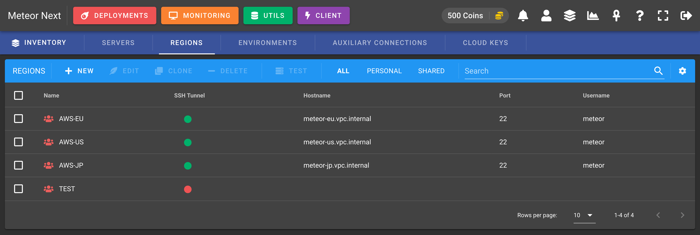
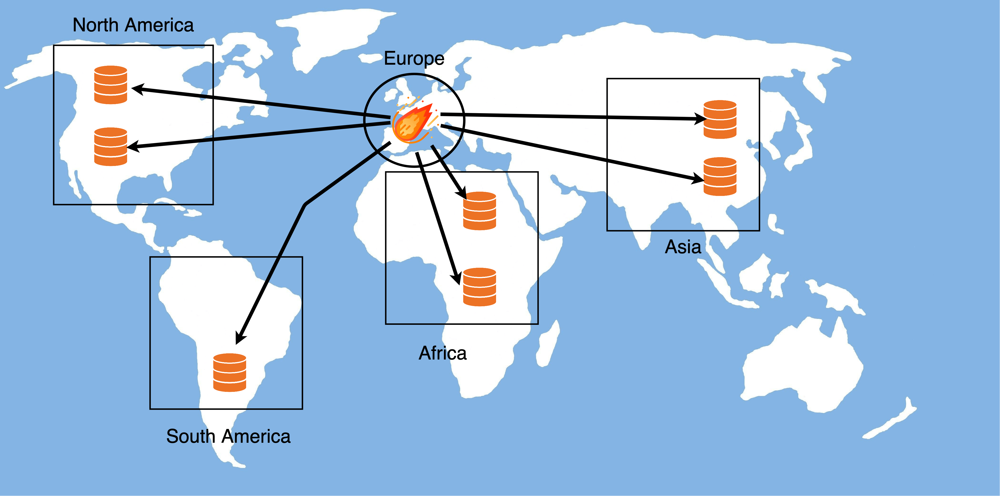

# Architecture

***How Meteor Next works under the hood to achieve fast and secured deployments?***

There are two factors to take into account:

- 🚀 **Parallelism**: The deployment is performed at the same time in multiple database servers.
- 🌎 **Cross-Region**: The deployment is executed in each Region using SSH Tunnel reducing drastically the delay between queries.

---

To put a little of context before going further remember that a **Region** is a resource that is assigned to one or more servers and is identified by a name and with the option to enable SSH Tunnel.

List of regions

So when we're talking to Regions that have the SSH Tunnel enabled (Cross-Region) think about Linux machines that Meteor uses to balance the deployment workload and therefore to speed-up the execution.

---

Here's an example of a deployment being executed in four different regions: North America (NA), South America (SA), Africa (AF), Asia (AS).

As we can see Meteor Next uses a 3-Level of parallelism. Firstly the parallelisation is performed at region level. Subsequently, for each region a new depth level of concurrency is started for each server, and finally a new level of parallelism is performed for databases.

To better understand how all this works let's make two possible scenarios:

## Not using Cross Region

To start a deployment is required to choose an Environment. Remember that an environment is a resource that contains servers (nothing more, nothing less). It's a way to organize servers.

Let's say that we choose the environment **Production** that contains 7 servers:

| Server Name   | Region Name  | Region SSH Tunnel   |
| ------------- | :----------: | :-----------------: |
| Server 01     | NA           | ❌                  |
| Server 02     | NA           | ❌                  |
| Server 03     | SA           | ❌                  |
| Server 04     | AF           | ❌                  |
| Server 05     | AF           | ❌                  |
| Server 06     | AS           | ❌                  |
| Server 07     | AS           | ❌                  |

As we can see there's a total of four regions and each region contains two servers except SA (South America) which contains only one.

Here's a image representing this example:

Without Cross Region

All the SQL queries will be executed from the Docker container meteor2 (located in Europe) to all seven servers.

By using this scenario, the execution will be affected by high latency, since all servers are located in different geographical regions than the meteor2 container.

## Using Cross Region

We should start using Cross Region when we have several servers in different geographical regions (eg: Europe, North America, Asia).

Imagine that we have Meteor Next installed in a machine located in Europe. What would happen if we would like to execute SQL queries to a server located in another region? Well, we will have to face a lot of delay, since we would have to execute queries from a long distance (eg: Europe <--> Asia).

By using Cross Region, all the executions are done in each region. In this way the latency is reduced drastically and furthermore all the computing workload is balanced in different machines.

Here's an example of a Cross-Region deployment:

| Server Name   | Region Name  | Region SSH Tunnel   |
| ------------- | :----------: | :-----------------: |
| Server 01     | NA           | ✅                  |
| Server 02     | NA           | ✅                  |
| Server 03     | SA           | ✅                  |
| Server 04     | AF           | ✅                  |
| Server 05     | AF           | ✅                  |
| Server 06     | AS           | ✅                  |
| Server 07     | AS           | ✅                  |

Using Cross Region

By using Cross-Regions (SSH Tunnel enabled), Meteor Next goes an step further. Aside from providing a tunnel to connect to a server using an intermediary machine, Meteor also deploys a binary to each SSH Tunnel machine (in ~/.meteor2).

This binary is in charge of executing the deployment for the servers that are located in their region. When the execution finishes, all the execution details are sent to the Docker container where Meteor Next resides.

After that Meteor merges all the logs from the different regions and leaves it ready for the user to be viewed.

In this scenario the execution goes much faster to finish. There is no longer latency between SQL queries and the computing process is balanced between different regions.

:::tip
It's recommended to use Cross-Region deployments when you have different servers that are located in different geographic regions.
:::