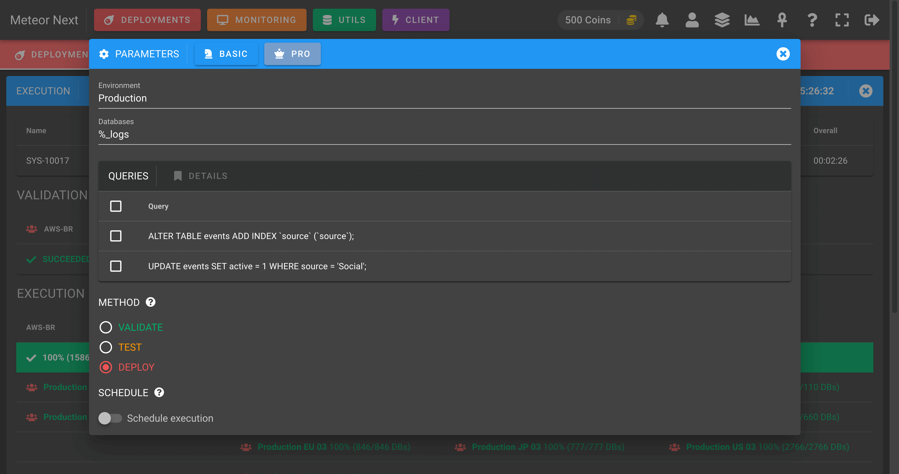
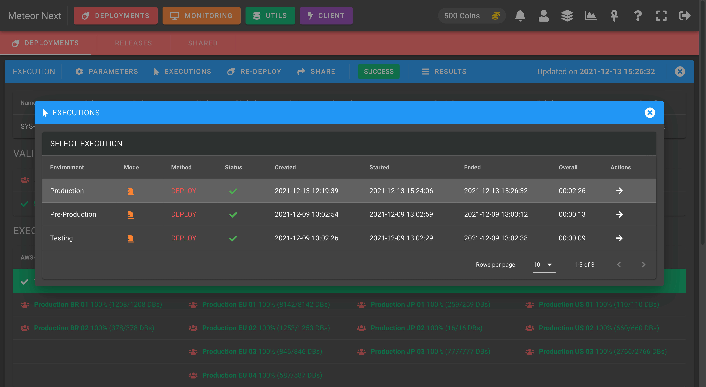

# Execution

When a deployment starts, the execution goes through different steps: Validation, Execution, Post Execution and Queries.

**VALIDATION**

A network reachability is performed among the different servers that belong to the selected environment. Also checks if the server credentials (hostname, port, username, password, ssl, ssh) are valid.

**EXECUTION**

This step is performed for methods `TEST` and `DEPLOY`. Bear in mind that this step is only executed if the validation succeeds.

- **TEST**: A simulation is performed. Only SELECTs and SHOWs are executed.

:::info Example
Imagine a deployment executing `DROP TABLE tbl`. The execution will check if the current database contains the table named "tbl". And depending on the outcome, at the results we will see what would have happened if we had actually executed it.
:::

- **DEPLOY**: All queries are executed.

**POST EXECUTION**

Here we can track the status of all the tasks that are performed after the execution.

1. The execution results are retrieved from all regions.
2. The execution results are merged and ordered accordingly.
3. A single compressed file is generated containing all the execution information (status and results).
4. (Optional) The execution details are uploaded to Amazon S3.
5. All regions are cleaned. Basically all non compressed logs from the execution are removed.
6. (Optional) A Slack message is sent to notify that the deployment has finished.

**QUERIES**

A summary of the total queries that have been executed, how many succeeded, failed or rollbacked.

## Actions

On the top menu bar there are some actions to perform:

**PARAMETERS**

Shows the deployment details about the current execution (in read-only).

**EXECUTIONS**

Shows all the executions done in the current deployment. In this dialog we can see a previous execution by clicking the right arrow in the last column of the table.

**RE-DEPLOY**

It's used to perform another execution from the current deployment. It's useful if we want to execute the same deployment but changing some fields (environment, queries, ...).

Imagine that we deployed some queries for all servers that are part of the `Development` environment, and now it's time to deploy it into `Production`. At this point we have two options, to create a new deployment from scratch or to re-deploy the existing one changing the environment field from "Development" to "Production".

:::tip
It's recommended to always perform a Re-Deploy if the deployment we want to perform is related to an existing one.
:::