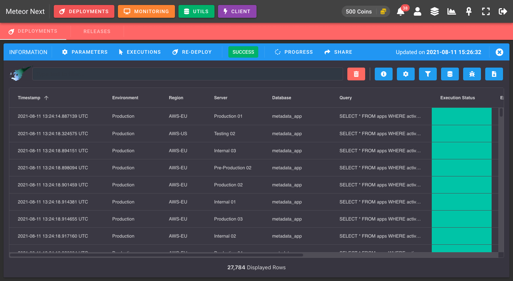

# Introduction

Deployments is one of the most interesting apps in Meteor Next. Gives you the ability to execute SQL queries (including logic) massively, in a controlled and safe way to multiple servers.

In a nutshell:

- 🚀 **Fast**: Executions make use of parallellism + cross-region to balance the workload to different servers and to maximize the throughput without affecting the current performance.
- 💪 **Resilience**: Executions have the capacity to recover quickly from difficulties (network and query errors).
- 🐍 **Python**: Add Python logic to deployments for complex executions.
- ✨ **Transform**: Perform searchs and data transformation with the execution results.
- ✉️ **Share**: Share a deployment results with other users.
- 🕒 **Schedule**: Decide when a deployment should start.
- 🔎 **Inspect**: Search and filter every deployment done in the past.
- 🔔 **Alerts**: Receive a notification whenever a deployment finishes (in-app notifications & Slack integration).

Deployments - List

Deployments - Execution

Deployments - Results

