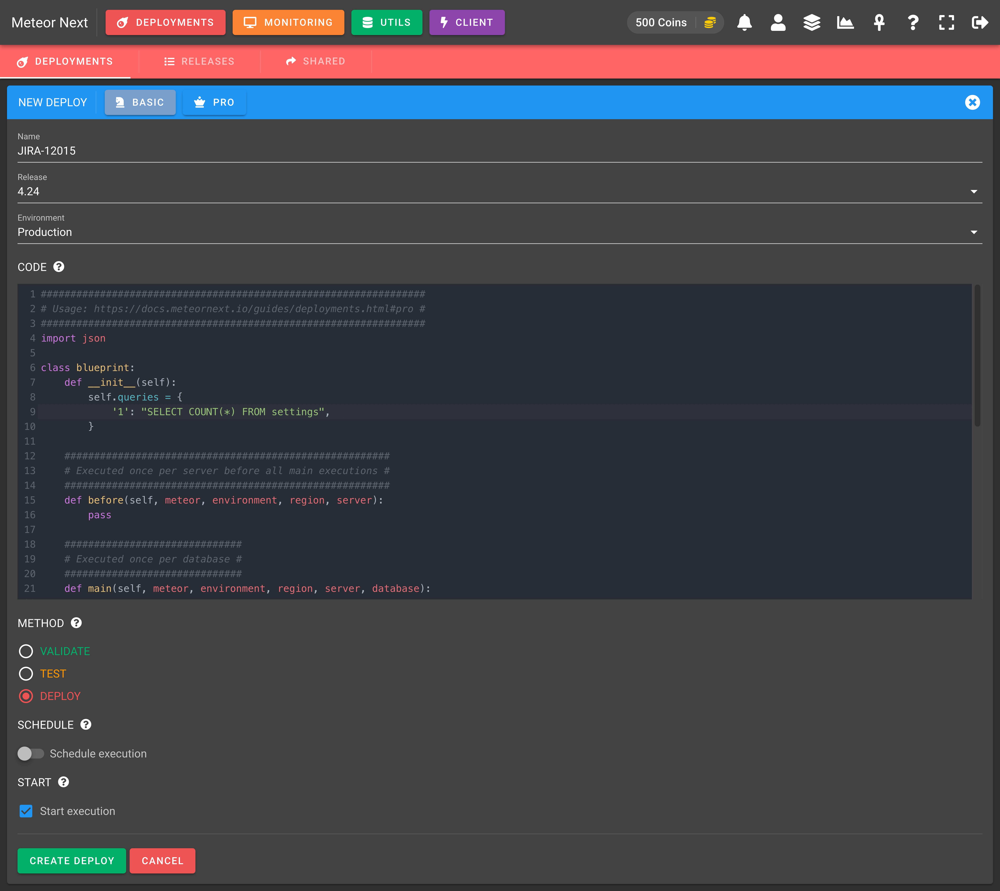

# Pro

Pro deployments are used to execute SQL queries with logic through several servers.



<p style={{textAlign:"center", marginTop:"-10px"}}>Pro Deployment</p>

These are the fields needed to be filled before starting an execution:

#### Name

The desired name to identify the current deployment (can be changed afterwards).

#### Release

The [release](releases) to be associated (can be changed afterwards). Only the active Releases will appear.

#### Environment

The [environment](../inventory/environments) to be applied.

#### Code

A Python template to write the deployment.

```python
import json
from collections import OrderedDict

class blueprint:
    def __init__(self):
        ########################################################################################################
        # Usage: meteor.execute(query=self.queries['1'], args=None, database=None, auxiliary=None, alias=None) #
        ########################################################################################################
        self.queries = {
            # '1': "<query>"
        }

    #######################################################
    # Executed once per Region before all main executions #
    #######################################################
    def before(self, meteor, environment, region):
        pass

    ##############################
    # Executed once per Database #
    ##############################
    def main(self, meteor, environment, region, server, database):
        pass

    ######################################################
    # Executed once per Region after all main executions #
    ######################################################
    def after(self, meteor, environment, region):
        pass

    ########################
    # User Defined Methods #
    ########################
    def search(self, items, key, value):
        # Search a key value in a list of dictionaries
        return [i for i in items if i[key] == value]

    def str2dict(self, data):
        # Convert a string representation of a dictionary to a dictionary
        return json.loads(data, object_pairs_hook=OrderedDict)

    def dict2str(self, data):
        # Convert a dictionary to a string
        return json.dumps(data, separators=(',', ':'))
```

#### Method

The deployment method to be used:
- **Validate**: Tests all server connections (no queries are executed). This method just checks that Meteor Next can reach all the servers with the credentials configured in the Inventory.

- **Test**: A simulation is performed (only SELECTs and SHOWs are executed). For other sentences (apart from selects and shows) the deployment just checks if these sentences would either work or fail if they were executed.

- **Deploy**: All queries are executed.

Note that both `TEST` and `DEPLOY` options also performs the VALIDATE method under the hood.

#### Scheduled

Turn on this option to schedule the execution on a specific date and time.

#### Start execution

Turn on this option to start the execution just after creating the deploy. If you want to create the deploy but to execute it later, do not toggle this checkbox.

## Mastering Pro Deployments

Pro Deployments are extremely useful if you want to add some application logic in your execution.

Before showing some examples to better undestand how this all works, let's start explaining the parts of the blueprint:

**CORE COMPONENTS**

The following components are needed to be filled in order to perform a deployment.

`self.queries`: This variable stores all the queries to be executed.

```python
def __init__(self):
    self.queries = {
        # '1': "<query>"
    }
```

`main(...)` This method is executed once per database. Inside this method is where the app's logic will be written.

```python
def main(self, meteor, environment, region, server, database):
    pass
```

`meteor.execute(...)` This method is used to execute SQL queries. Can be used within methods: before(), main() and after().

```python
meteor.execute(query=self.queries['1'], args=None, database=None, auxiliary=None, alias=None)
```

Arguments:

- **query** (Required): The query to be executed.
- **args** (Optional): To pass some escaped query parameters.
- **database** (Optional): The database name.
- **auxiliary** (Optional): To use an auxiliary connection.
- **alias** (Optional): To add a query alias.

**ADDITIONAL COMPONENTS**

Here are some additional components that may be useful in some deployments. In the [Examples](examples) section we're gonna show some uses to better understand it. 

`before(...)`: This method is executed once per Region before all main() executions.

```python
def before(self, meteor, environment, region):
    pass
```

`after(...)`: This method is executed once per Region after all main() executions.

```python
def after(self, meteor, environment, region):
    pass
```

`meteor.begin()` This method is used to start a transaction. Can be used within methods: before(), main() and after().

```python
meteor.begin()
```

`meteor.commit()` This method is used to commit a transaction. Can be used within methods: before(), main() and after().

```python
meteor.commit()
```

`meteor.rollback()` This method is used to rollback a transaction. Can be used within methods: before(), main() and after().

```python
meteor.rollback()
```

`meteor.is_error()` This method is used to check if a query in the current transaction has either succeed or failed. It returns a bool data type (true | false). Can be used within methods: before(), main() and after().

```python
meteor.is_error()
```

**USER DEFINED METHODS**

In the last part of the blueprint there's some methods that may be used in some deployments. Here, if you wish, you could add more methods:

`search(...)`: This method searches a key value in a list of dictionaries.

```python
def search(self, items, key, value):
    return [i for i in items if i[key] == value]
```

`str2dict(...)`: This method converts a string representation of a dictionary to a dictionary.

```python
def str2dict(self, data):
    return json.loads(data, object_pairs_hook=OrderedDict)
```

`dict2str(...)`: This method converts a dictionary to a string.

```python
def dict2str(self, data):
    return json.dumps(data, separators=(',', ':'))
```

---

Let's see some examples to better understand how all of this works together:

### Example 1: Execute a query to a database

**DESCRIPTION**

This example shows how to execute a query to the emp database.

**BLUEPRINT**

```python
def __init__(self):
    self.queries = {
        '1': "SELECT * FROM employees"
    }

def main(self, meteor, environment, region, server, database):
    if database == 'emp':
        meteor.execute(query=self.queries['1'], database=database)
```

### Example 2: Working with parameters

**DESCRIPTION**

This example shows how to pass escaped parameters to a query using two different methods.

**BLUEPRINT**

```python
def __init__(self):
    self.queries = {
        '1': "INSERT INTO employees (name, salary) VALUES (%s, %s)",
        '2': "INSERT INTO employees (name, salary) VALUES (%(name)s, %(salary)s)"
    }

def main(self, meteor, environment, region, server, database):
    if database == 'emp':
        meteor.execute(query=self.queries['1'], args=('John', 1200), database=database)
        meteor.execute(query=self.queries['2'], args={"name":'Jeanna',"salary":1500}, database=database)
```

### Example 3: Handling query results

**DESCRIPTION**

This example shows how to get the result of an executed query and how to insert it into another table.

**BLUEPRINT**

```python
def __init__(self):
    self.queries = {
        '1': "SELECT id, name FROM employees LIMIT 2",
        '2': "INSERT INTO employees_test VALUES (id, name) (%s, %s)" 
    }

def main(self, meteor, environment, region, server, database):
    if database == 'emp':
        result = meteor.execute(query=self.queries['1'], database=database)
        # result = [{"id": 1, "name": "John", "salary": 1200},{"id": 2, "name": "Jeanna, "salary": 1500}]
        for i in result:
            meteor.execute(query=self.queries['2'], args=(i['id'], i['name']), database=database)
```

As you may think all this use case could have been reduced by executing a single query:

```sql
INSERT INTO employees_test (id, name)
SELECT id, name
FROM employees
LIMIT 2
```

Mind that the goal of these examples is to familiarize yourself working with this template.

### Example 4: Working with JSONs

**DESCRIPTION**

This example shows how to handle JSON values stored in a string (eg: VARCHAR) field type.

**USE CASE**

Update the city of the employee with "id = 1". Change their city to "Paris" if their city is "Barcelona".

**BLUEPRINT**

```python
def __init__(self):
    self.queries = {
        '1': "SELECT extra_info FROM employees WHERE id = 1",
        '2': "UPDATE employees SET extra_info = %s WHERE id = 1"
    }

def main(self, meteor, environment, region, server, database):
    if database == 'emp':
        result = meteor.execute(query=self.queries['1'], database=database)
        # result = [{"extra_info": '{"city": "Barcelona", "department": "A10"}'}]
        # 1. Convert the JSON string to a true JSON.
        parsed_json = self.str2dict(result[0]['extra_info'])
        # parsed_json = {"city": "Barcelona", "department": "A10"}
        # 2. Update the city value to Paris if city = 'Barcelona'
        if parsed_json['city'] == 'Barcelona':
            # 3. Update the city value to Paris
            parsed_json['city'] = 'Paris'
            # 4. Convert the JSON to a JSON string to insert it again in the table
            value = self.dict2str(parsed_json)
            # value = '{"city": "Paris", "department": "A10"}'
            # 4. Insert the value to the database
            meteor.execute(query=self.queries['2'], args=(value), database=database)
```

### Example 5: Working with Auxiliary Connections

**DESCRIPION**

An auxiliary connection is a server that is used in Pro Deployments. It's used when we want to execute a query to a server that is not included in the selected environment.


<p style={{textAlign:"center", marginTop:"-10px"}}>Inventory - Auxiliary Connections</p>

**USE CASE**

Get all languages that our company support. Iterate all databases that their name ends with '_logs' in all the servers that are included in the selected environment. For all these databases insert the languages retrieved to the 'customer_languages' table. 

**BLUEPRINT**

```python
def __init__(self):
    self.queries = {
        '1': "SELECT id, name FROM languages",
        '2': "INSERT INTO customer_languages (id, name) VALUES (%s, %s)"
    }

def before(self, meteor, environment, region):
    # By executing this query inside this method, all databases into the main() method will be able to access this variable. Doing it this way we avoid that this query is executed by each database.
    self.languages = meteor.execute(query=self.queries['1'], database='core', auxiliary='core01-prod')
    # self.languages = [{"id": 1, "name": 'english'},{"id": 2, "inc": 'spanish'}]

def main(self, meteor, environment, region, server, database):
    if database.endswith('_logs'):
        for l in self.languages:
            meteor.execute(query=self.queries['2'], args=(l['id'], l['name']) database=database)
```

### Example 6: Debugging variables

**DESCRIPTION**

This example shows how to retrieve a var's value in some point of the template for all databases.

**BLUEPRINT**

```python
def main(self, meteor, environment, region, server, database):
    # ... some lines of code
    data = # some calculation
    # To retrieve the data value for debugging, execute the following line:
    meteor.execute(query="SELECT %s AS 'myvar'", args=(data), database=database)
    # ... some lines of code
```

After executing the deployment, in the Results table you are going to see this var's name for all environment databases.

### Example 7: Using alias

**DESCRIPTION**

This example shows how to assign alias to a query.

**BLUEPRINT**

```python
def __init__(self):
    self.queries = {
        '1': "SELECT * FROM tbl WHERE db_name = %s",
    }

def main(self, meteor, environment, region, server, database):
    meteor.execute(query=self.queries['1'], args=(database), database=database, alias='myalias')
```

***Which is the purpose of adding alias to queries?***

Alias are used to group several queries. It's a way of telling the Meteor that some queries are the same and that they should be treated together as one.

Let's make an example to understand it better.

Imagine that we selected the `TEST` environment and this one contains two servers: Test01 and Test02. The Test01 contains two databases (hello1, hello2) and the Test02 contains just one database (hello3).

- **Test01**: hello1, hello2
- **Test02**: hello3

Following the above blueprint, when we start the deployment these are the queries that will be executed (once per database).

**Test01**

- SELECT * FROM tbl WHERE db_name = 'hello1';
- SELECT * FROM tbl WHERE db_name = 'hello2';

**Test02**

- SELECT * FROM tbl WHERE db_name = 'hello3';

Despite we've written just one query, as we added a parameter to the query, it has caused that in the end we have three different queries.

By adding an alias to the query, we tell Meteor to treat all these queries as one. What will happen is that when the Deployment finishes we will see all these queries results together. We won't have to select each query one by one to get the results.

So, query alias will mostly be needed when executing queries that have arguments that their value can differ.

For more information, please see the [Results](results) section.

### Example 8: Using transactions

**DESCRIPTION**

This example shows how to create transactions and how to commit/rollback them.

**BLUEPRINT**

```python
def main(self, meteor, environment, region, server, database):
    # Start a transaction
    meteor.begin()
    # Execute a DML query
    meteor.execute(query="INSERT INTO tbl VALUES ('hello')", database=database)
    # Rollback the transaction
    meteor.rollback()
    # Start another transaction
    meteor.begin()
    # Execute a DML query
    meteor.execute(query="INSERT INTO tbl VALUES ('hello')", database=database)
    # Commit the transaction
    meteor.commit()
```

Deploying the previous blueprint will actually execute the INSERT query only once. The first one will be rollbacked and the second one will be commited.

:::info

Bear in mind that if we start a transaction into an already started one, all the queries executed in the previous transaction will be rollbacked and then a new transaction will start.

:::