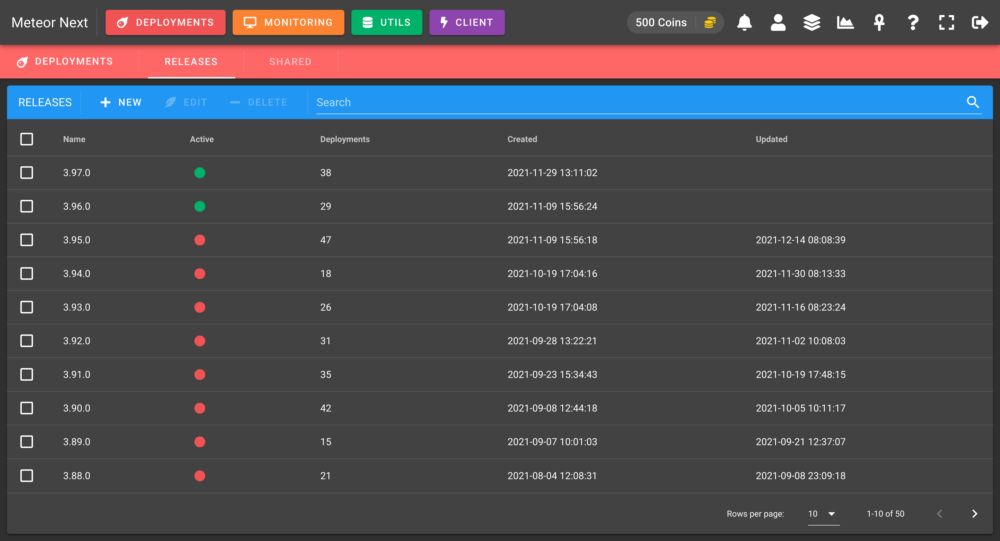

# Releases

A release is an resource that helps us to organize deployments. It's like a folder that contains deployments.

Releases - List

A Release is identified by a name and a flag called `Active` that can be either enabled or disabled.

A release marked as active means that all their deployments will be visible (in the Deployments section).
Accordingly, a release marked as non active means that all their deployments will be hidden (in the Deployments section).

***Why is this Active flag needed?***

Imagine that we are Database Engineers and we are in charge to make database deployments for daily needs (bug fixes, new features or data retrieval).

Every month the company releases a new version of their product. We have a Release created "3.1.0" with several deployments already done.

Today the company releases in Production the 3.1.0 Release for all their customers containing all the deployments we made.

At this point we are not still interested of seeing all the past deployments. We just want to have a new release to contain all the future deployments for the next monthly company's release.

What we do is to create a new active Release with the name "3.2.0" and update the previous one (3.1.0) setting the active flag disabled.