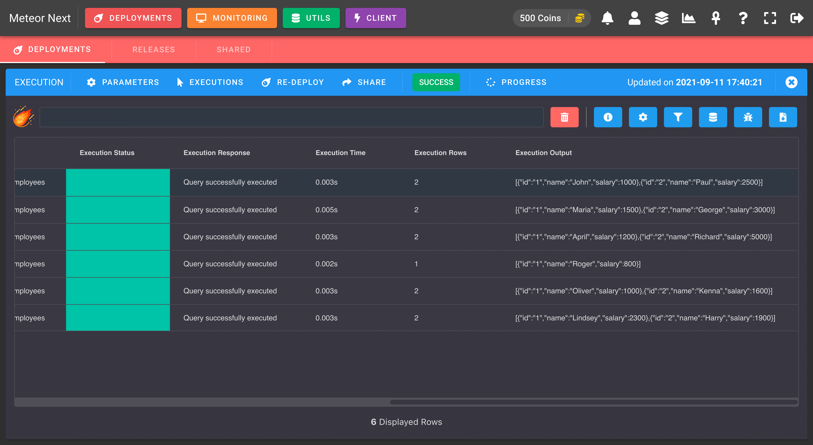
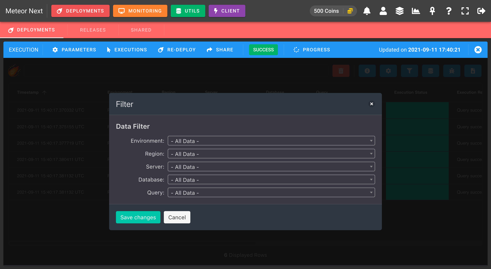
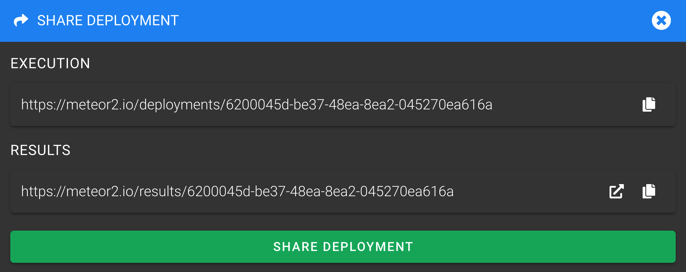
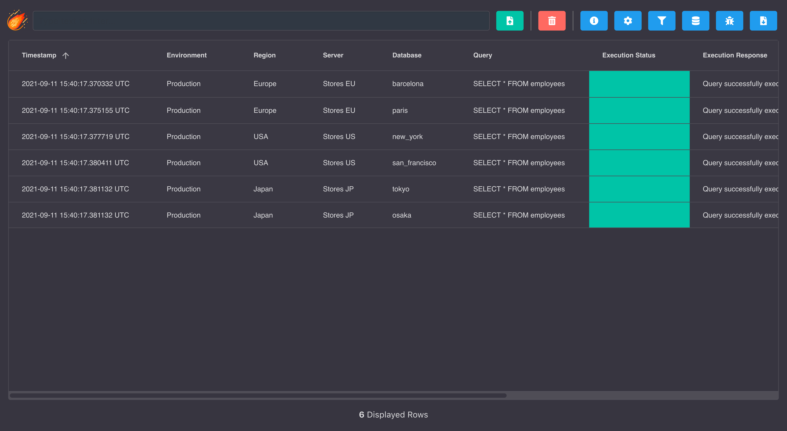

# Results




```
# barcelona
[{"id":"1","name":"John","salary":1000},{"id":"2","name":"Paul","salary":2500}]
# paris
[{"id":"1","name":"Maria","salary":1500},{"id":"2","name":"George","salary":3000}]
# new york
[{"id":"1","name":"April","salary":1200},{"id":"2","name":"Richard","salary":5000}]
# san_francisco
[{"id":"1","name":"Roger","salary":800}]
# tokyo
[{"id":"1","name":"Oliver","salary":1000},{"id":"2","name":"Kenna","salary":1600}]
# osaka
[{"id":"1","name":"Lindsey","salary":2300},{"id":"2","name":"Harry","salary":1900}]
```







