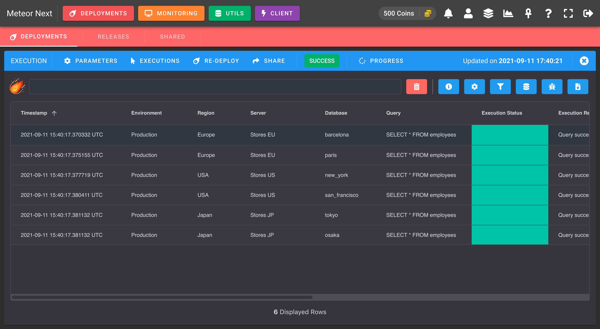
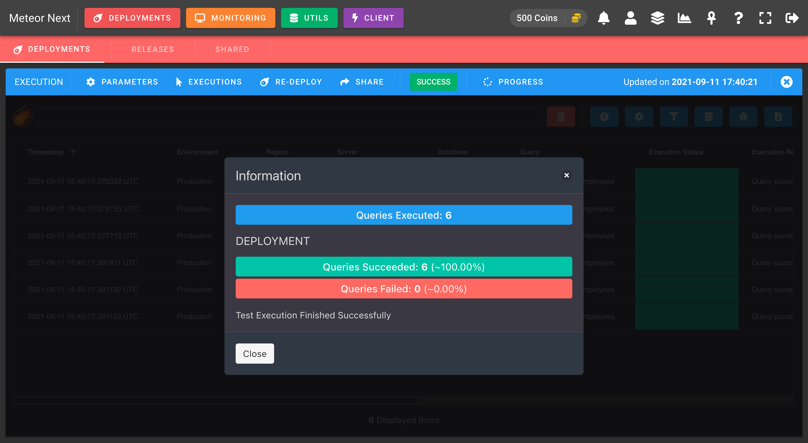
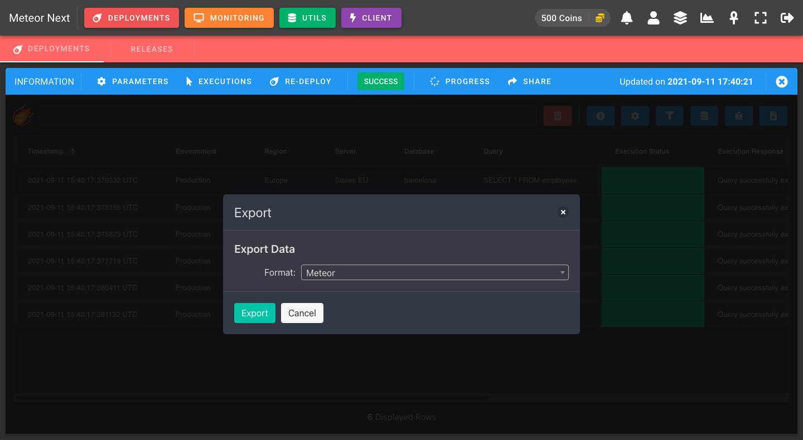

# Results

When a deployment finishes, we can see a detailed log in table format of all queries that have been executed.

Every row is an executed query and the table is sorted in ascending order by the datetime it was run.




Every row contains 11 columns:

- **Timestamp**: The datetime when the query was executed.
- **Environment**: The selected environment.
- **Region**: The server's region.
- **Server**: The server used to execute the query.
- **Database**: The database used to execute the query. 
- **Query**: The query that has been executed.
- **Execution Status**: the execution's outcome. Can be either green (success), yellow (rollbacked), red (error).
- **Execution Response**: The engine response after executing the query. When a query fails it shows the execution error.
- **Execution Time**: The query's elapsed time.
- **Execution Rows**: How many rows were affected by executing the query. Executing a SELECT will show the amount of rows returned and executing an INSERT/UPDATE/DELETE will show the amount of rows affected.
- **Execution Output**: The result of executing the query. This column will show the SELECT's results formatted in JSON.

## Features

There's some useful actions that can be done into the results section:


### Search

Perform searches across all rows and columns.

The following screenshot shows an example of a search. The table shows all rows which one of their columns contain the `Europe` string.

Furthermore as It can be seen in the screenshot, there's one additional way to filter results. By clicking the icon placed in the right of a column name we can filter the results by that column.
The available modes are: `Contains`, `Not contains`, `Equals`, `Not equal`, `Starts with` and `Ends with`.


### Remove Row/s

Click the red thrash icon to remove rows from the table. This option is useful if we want to remove some rows before exporting the data from the table.

Bear in mind that the action of removing rows is not permanent. If we close the results and open it again, all previous deleted rows will appear again.

### Information

This option is useful to get a summary of the amount of queries succeeded or failed. 



### Settings

This option is used to show/hide columns or to pin/unpin them.


### Filter

This option is used to filter the results by some existing values.


### Transformation

This is one of the most used and interesting tools in this section. It's used to transform the execution output of a query (mostly SELECTs) stored in JSON format to a visual table representation.

It's useful if we want to work with the results returned by a SELECT query or to perform some filtering / sorting actions with that results.

Let's make an example to better understand it.

As we can see in the first screenshot of this section, the results table shows the execution of a `SELECT * FROM employees` query in different servers and databases.

Imagine that after executing this query we would like to get the employee that earns more money. Having all the SELECTs results in JSON format would be a bit unfortable to perform any sorting by a column name.

```json title="Execution Outputs"
// DB: barcelona
[{"id":"1","name":"John","salary":1000},{"id":"2","name":"Paul","salary":2500}]
// DB: paris
[{"id":"1","name":"Maria","salary":1500},{"id":"2","name":"George","salary":3000}]
// DB: new_york
[{"id":"1","name":"April","salary":1200},{"id":"2","name":"Richard","salary":5000}]
// DB: san_francisco
[{"id":"1","name":"Roger","salary":800}]
// DB: tokyo
[{"id":"1","name":"Oliver","salary":1000},{"id":"2","name":"Kenna","salary":1600}]
// DB: osaka
[{"id":"1","name":"Lindsey","salary":2300},{"id":"2","name":"Harry","salary":1900}]
```

What we can do is to perform a Data Transformation.


After proceeding, we will get a new table with the results of all the executed SELECTs. 


Now we can perform any sorting / searching / filtering operation with the SELECT results.

So, to get which is the employee that earns more, just sort the `salary` column by clicking the column name and voilà!

### Errors

This option is used to group all queries that have failed. Here we will see:

- **Query**: The query that has failed.
- **Error**: The error that the engine returned when executing the query (eg: The table does not exist).
- **Count**: The amount of times a query failed (eg: If we execute the same query in several databases, this value will be equal of the times this query failed in some of them).
- **Databases**: The list of databases (separated by commas) that the query has failed.


### Export

This option is used to export the data in the table. There are three available formats:

- **Meteor**: A Meteor representation of the data table. This mode is useful as you can share a Meteor file format to another user and they will able to import this file in the [Meteor Viewer](../viewer) to see exactly the data you exported, and then perform any sorting/filtering/search operation.
- **JSON**: A JSON representation of the table data.
- **CSV**: A CSV representation of the table data.



### Share

This option is used to share a deployment result to a user or many.

Click the `SHARE` button located in the `INFORMATION` bar. After that a dialog will appear with some options:

- **Private**: This button is used to change the visibility of a deployment result. By default all deployment results are private, meaning that only the user that made the deployment has the rights to access it. If we would like to share the results of a deployment to another user we should click this button. After clicking it this results will be "Public", meaning that any user that has an account in Meteor Next will be able to access it.
- **Copy Link**: To copy the link to the clipboard.


After clicking the link, a new web browser tab will open showing the results in full screen.


For more information, head to the [Meteor Viewer](../viewer) section.