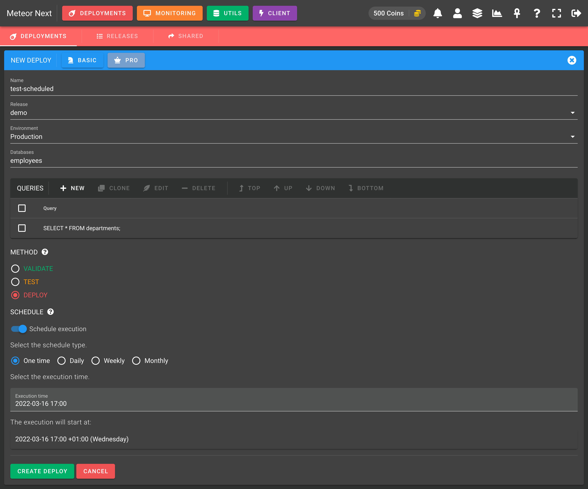
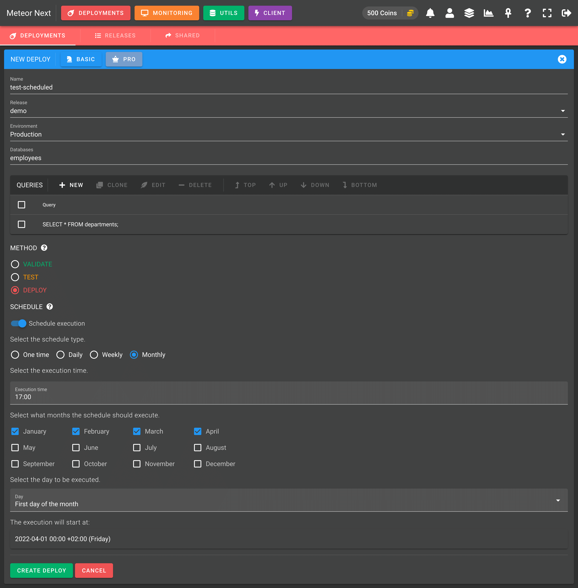

# Scheduled

Scheduled deployments are used to program a deployment to be executed automatically in a given time.

This feature comes in four flavors:

- **[One-Time execution](#one-time-execution)**: Execute a deployment once in a given datetime.
- **[Daily execution](#daily-execution)**: Execute a deployment each day at the same time.
- **[Weekly execution](#weekly-execution)**: Execute a deployment in a specific time on the desired week days.
- **[Monthly execution](#monthly-execution)**: Execute a deployment in a specific time on the desired months.

### One-Time execution

One-Time executions are used to execute a deployment in a specific datetime.

The following image shows an example of a one-time execution.

### Daily execution

Daily executions are used to execute a deployment each day at the same time.

The following image shows an example of a daily execution.

### Weekly execution

Weekly executions are used to execute a deployment in a specific time on the desired week days.

The following image shows an example of a weekly execution.

### Monthly execution

Monthly executions are used to execute a deployment in a specific time on the desired months.

The following image shows an example of a monthly execution.

