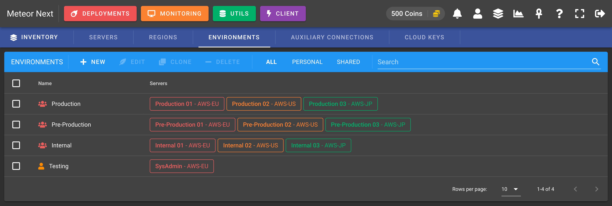
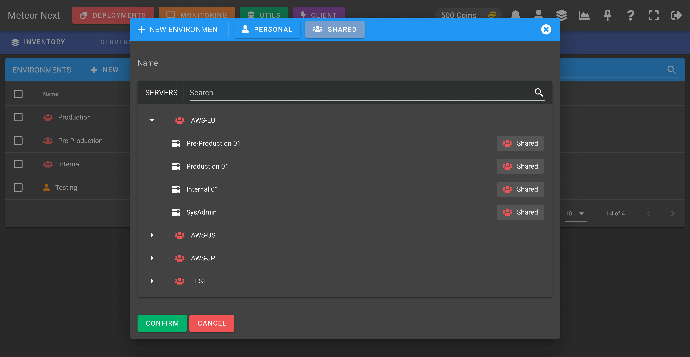

# Inventory


Inventory is one of the most important sections in the app. Here we can setup all the database related resources existing in our company. Once we have created some resources, we will be able to use them in Deployments, Monitoring, Utils and Client.

These are the different resources we can manage:

- **[Servers](#servers)**: All the database servers (engine, hostname, port, username, password, ssl).
- **[Regions](#regions)**: All servers are contained in one or more regions. Here we can choose to enable SSH Tunnel.
- **[Environments](#environments)**: A way of organizing our servers (e.g: Production, Pre-Production, Development).
- **[Auxiliary Connections](#auxiliary-connections)**: A list of database servers to be used to perform cross-region deployments.
- **[Cloud Keys](#cloud-keys)**: A list of credentials from cloud services such as AWS.

A resource can be either **Personal** or **Shared**.

- **Personal**: The resource is only usable by the user who create it.
- **Shared**: The resource is usable for all users whose group is the same as the user who create it.


<p style="text-align:center; margin-top:-10px">Inventory - New Server</p>

Besides of the scope (Personal or Shared), a resource can be either **Non-Secured** or **Secured**.

- **Non-Secured**: The resource has all sensible fields shown (hostname, username, password, port, ...).
- **Secured**: The resource has all sensible fields hidden (hostname, username, password, port, ...).


<p style="text-align:center; margin-top:-10px">Admin Inventory - New Server</p>

:::tip INFO
To set a resource secured it must be done in the [Admin Inventory](./administration#inventory-1) (/admin/inventory) section.
All resources created in the User's Inventory (/inventory) are by default non-secured.
:::

## Servers

Contains all the database servers to be used in Deployments, Monitoring, Utils and Client sections.


To create a new server there are some fields that need to be filled. 

One field to take into account is the `Usage`. This field is used to decide in which sections (Deployments, Monitoring, Client, Utils) this server will be available. It can be useful to limit servers to be used in only few sections.


:::tip
If you don't find an already created server in some sections, head back to the Inventory to check the server's **Usage** field.
:::

## Regions

A region is a resource identified by a **name** and **ssh tunnel** settings. This resource is needed in order to create servers. A server always is attached to a region. In this way we can share a ssh tunnel config across multiple servers without needing to fill all the ssh tunnel configuration for every new server.

This section contains all the regions we have created in our account.


To create a new Region, there's some fields that must be filled: **Name** and **SSH Tunnel** (disabled by default).


## Environments

An environment is a resource that contains a group of servers and is identified by a name. Some common environments are: Production, Pre-Production and Development.

This section contains all the environments to be used in the `DEPLOYMENTS` section.



To create a new environment enter a name and select the servers you want it to have.



## Auxiliary Connections

Contains all the auxiliary connections to be used in the `DEPLOYMENTS` section using the `PRO` mode.


An auxiliary connection is in essential a server that will be used doing a Pro Deployment.


In terms of networking, these servers will be reached from all server's regions contained in the deployed environment. 

So, before performing a Pro Deployment that uses an Auxiliary Connection, first test the connection making sure that this server is reachable from all server's regions contained in the deployed environment.


## Cloud Keys

Contains all the cloud keys (such as AWS) to be used in the **[Utils - Imports](./utils#imports)** section.

This resource is needed to perform SQL restores from Amazon S3 to a database server.


### Creating a Cloud Key

To create a Cloud Key, click the `+ NEW` button.


Before creating a Cloud Key, make sure you have previosly created an AWS IAM user with **Programmatic access**.

After that create a IAM policy that meets the following schema and attach it to the recent created user.

:::: code-group
::: code-group-item AWS IAM Policy
```json
{
    "Version": "2012-10-17",
    "Statement": [
        {
            "Sid": "VisualEditor0",
            "Effect": "Allow",
            "Action": [
                "s3:GetObject",
                "s3:ListBucket",
                "s3:GetBucketLocation"
            ],
            "Resource": [
                "arn:aws:s3:::yourbucket",
                "arn:aws:s3:::yourbucket/*"
            ]
        }
    ]
}
```
:::
::::

> Replace `yourbucket` to the bucket's name you want to to give access.

🚀 Your Cloud Key is now ready to be used in the **[Utils - Imports](./utils#imports)** section.