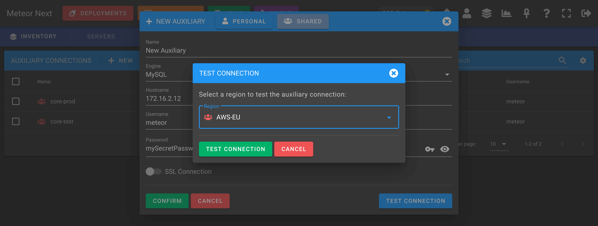

# Auxiliary Connections

Contains all the auxiliary connections to be used in the `DEPLOYMENTS` section using the `PRO` mode.

An auxiliary connection is in essential a server that will be used doing a Pro Deployment.

In terms of networking, these servers will be reached from all server's regions contained in the deployed environment. 

So, before performing a Pro Deployment that uses an Auxiliary Connection, first test the connection making sure that this server is reachable from all server's regions contained in the deployed environment.

