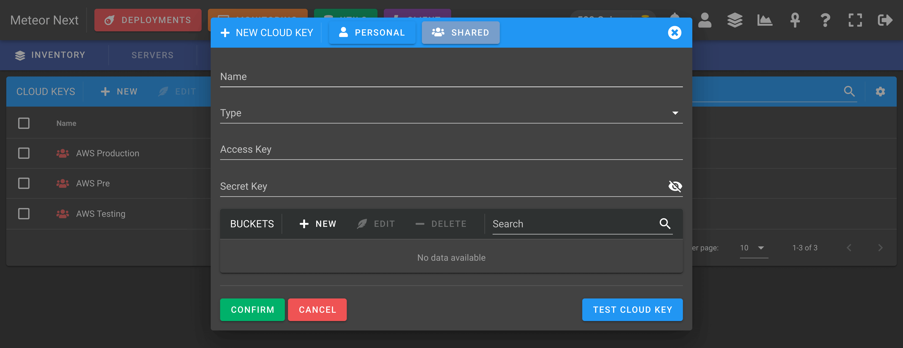

# Cloud Keys

Contains all the cloud keys (such as AWS) to be used in the **[Utils - Imports](../utils/imports)** section.

This resource is needed to perform SQL restores from Amazon S3 to a database server.


## Creating a Cloud Key

To create a Cloud Key, click the `+ NEW` button.



Before creating a Cloud Key, make sure you have previosly created an AWS IAM user with **Programmatic access**.

After that create a IAM policy that meets the following schema and attach it to the recent created user.

```json title="AWS IAM Policy"
{
    "Version": "2012-10-17",
    "Statement": [
        {
            "Sid": "VisualEditor0",
            "Effect": "Allow",
            "Action": [
                "s3:GetObject",
                "s3:ListBucket",
                "s3:GetBucketLocation"
            ],
            "Resource": [
                "arn:aws:s3:::yourbucket",
                "arn:aws:s3:::yourbucket/*"
            ]
        }
    ]
}
```

> Replace `yourbucket` to the bucket's name you want to to give access.

🚀 Your Cloud Key is now ready to be used in the **[Utils - Imports](../utils/imports)** section.