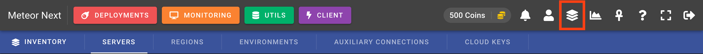

# Introduction

Inventory is one of the most important sections in the app. Here we can setup all the database related resources existing in our company. Once we have created some resources, we will be able to use them in Deployments, Monitoring, Utils and Client.

These are the different resources we can manage:

- **Servers**: All the database servers (engine, hostname, port, username, password, ssl).
- **Regions**: All servers are contained in one or more regions. Here we can choose to enable SSH Tunnel.
- **Environments**: A way of organizing our servers (e.g: Production, Pre-Production, Development).
- **Auxiliary Connections**: A list of database servers to be used to perform cross-region deployments.
- **Cloud Keys**: A list of credentials from cloud services such as AWS.

A resource can be either **Personal** or **Shared**.

- **Personal**: The resource is only usable by the user who create it.
- **Shared**: The resource is usable for all users whose group is the same as the user who create it.

Inventory - New Server

Besides of the scope (Personal or Shared), a resource can be either **Non-Secured** or **Secured**.

- **Non-Secured**: The resource has all sensible fields shown (hostname, username, password, port, ...).
- **Secured**: The resource has all sensible fields hidden (hostname, username, password, port, ...).

Admin Inventory - New Server

:::info
To set a resource secured it must be done in the [Admin Inventory](../administration/inventory) (/admin/inventory) section.
All resources created in the User's Inventory (/inventory) are by default non-secured.
:::