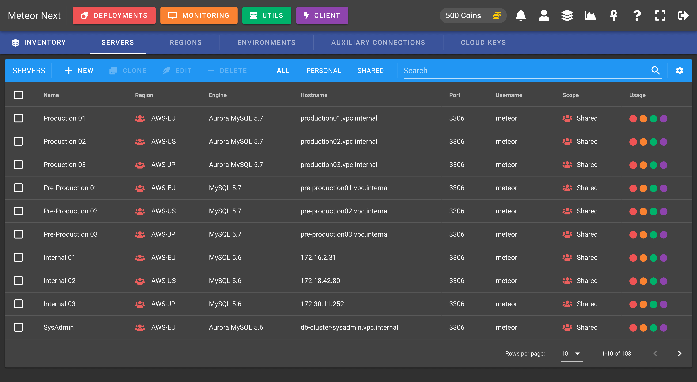
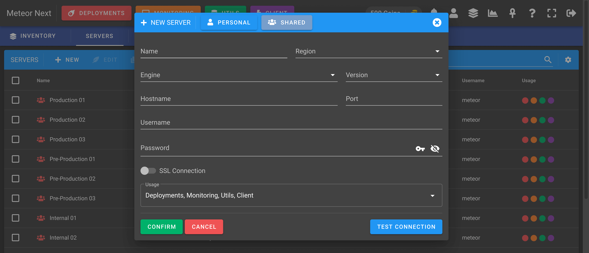

# Servers

Contains all the database servers to be used in Deployments, Monitoring, Utils and Client sections.

To create a new server there are some fields that need to be filled. 

One field to take into account is the `Usage`. This field is used to decide in which sections (Deployments, Monitoring, Client, Utils) this server will be available. It can be useful to limit servers to be used in only few sections.

:::tip
If you don't find an already created server in some sections, head back to the Inventory to check the server's **Usage** field.
:::