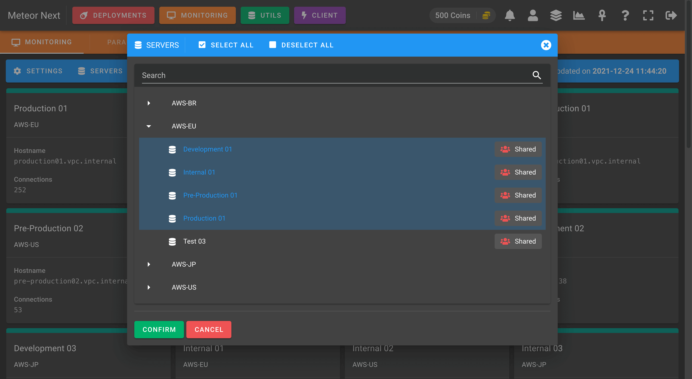
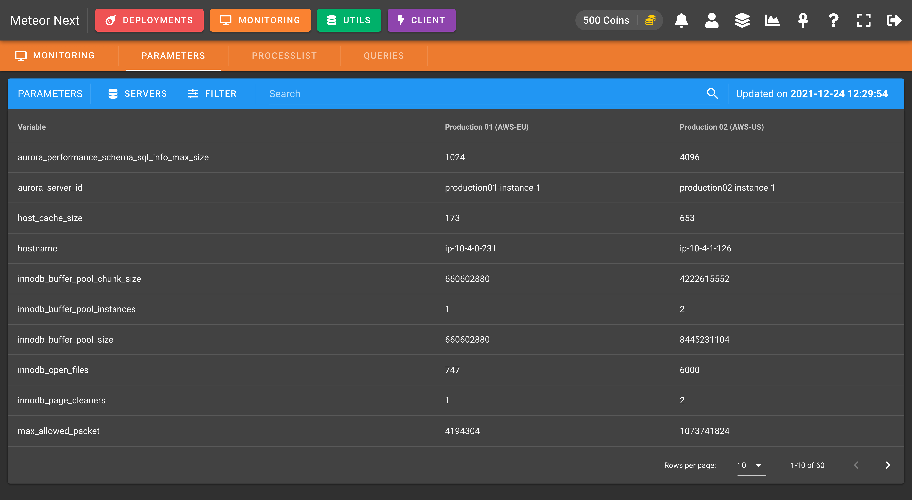
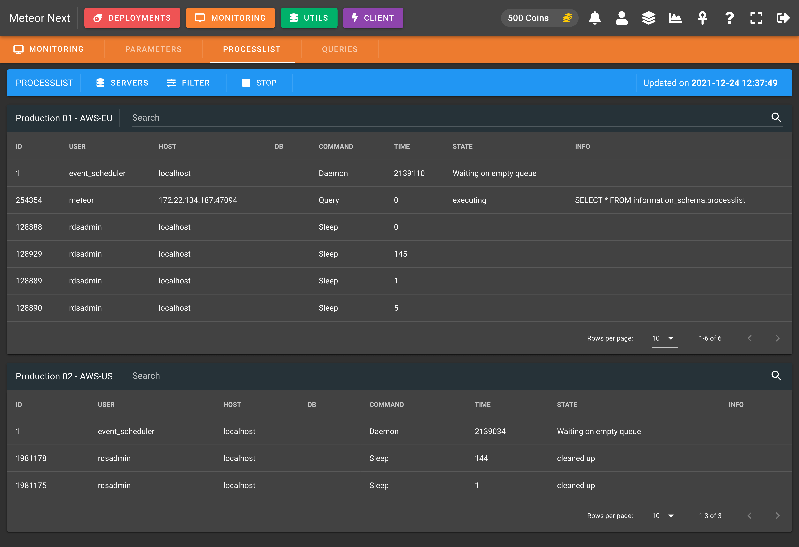
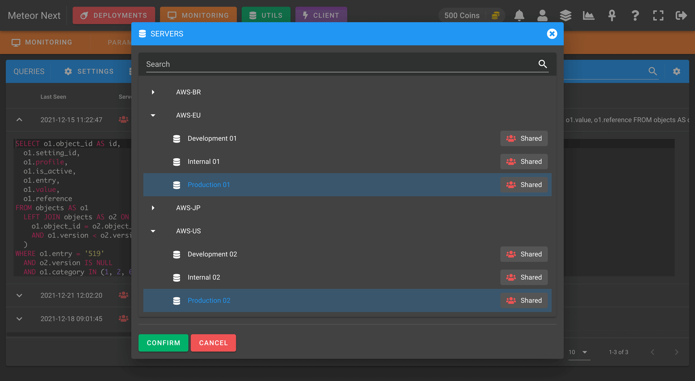
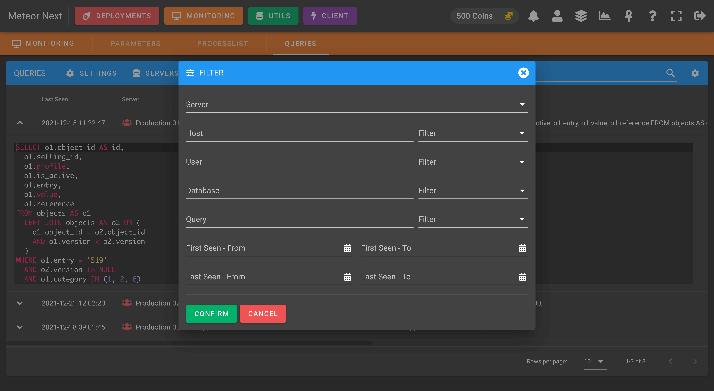

# Monitoring

The Monitoring section allows to monitor database servers in real-time.

These are the different resources that can be monitored:

- **[Dashboard](#dashboard)**: Monitor server's health and all the events that happened in the past.
- **[Parameters](#parameters)**: Monitor server's parameters and compare it with other servers.
- **[Processlist](#processlist)**: Monitor in real-time all queries that are being executed in a server.
- **[Queries](#queries)**: Track slow queries to be later analyzed.

## Dashboard

This section has been developed with a proactive notification system. Everytime a server changes its status (available, unavailable, restarted, parameters changed) a notification will be sent to the users that have this server added in their monitoring list.

You can also click a server to get further details.

**SETTINGS**

There are some settings that can be defined:

- **Servers per line**: The amount of servers to be displayed per line.
- **Slack Notifications**: Enable to receive an Slack message everytime a server changes its status (available, unavailable, parameters changed, restart).

**SERVERS**

Here we can select which servers of our inventory have to be monitored.

**FILTER**

This option is used to filter the servers in the list. The available options are:

- **All**: Show all monitored servers.
- **Available**: Show all monitored servers that are available.
- **Unavailable**: Show all monitored servers that are unavailable.
- **Loading**: Show all monitored servers that are being loaded (this status happens the first time we choose a server to be monitored).

**EVENTS**

This option shows a dialog with all the events happened in the last 15 days for all servers selected to be monitored.

## Parameters

This section is used to get the values of MySQL system variables and to compare them with other servers.

**SERVERS**

Here we can select which servers of our inventory we want to monitor their parameters.

**FILTER**

This option is used to filter the parameters in the list. The available options are:

- **All**: Show all parameters.
- **Matching**: Show all parameters matching with all selected servers.
- **Not matching**: Show all parameters not matching with all selected servers.

In the following screenshot we can see an example of filtering with the `Not matching` option.

## Processlist

This section is used to monitor in real-time all the queries that are being executed in the selected servers.

**SERVERS**

Here we can select which servers of our inventory we want to monitor their queries.

**FILTER**

This option is used to filter the queries in the list. The available options are:

- **All**: Show all queries and sessions.
- **Query**: Show queries being executed.
- **Sleep**: Show iddle sessions.

## Queries

This section is used to track slow queries to be later analyzed.

**SETTINGS**

There are some settings that can be defined:

- **Minimum Execution Time (seconds)**: Meteor will track all queries that their execution time is equal or greater than this value.
- **Data Retention (days)**: The maximum number of days to retain the data. All queries that have been executed X days ago, will be deleted from the list.

**SERVERS**

Here we can select which servers of our inventory we want to track their slow queries.

**FILTER**

This option is used to filter the slow queries in the list.

**COLUMNS**

Here we can choose which columns we want to display or hide.

