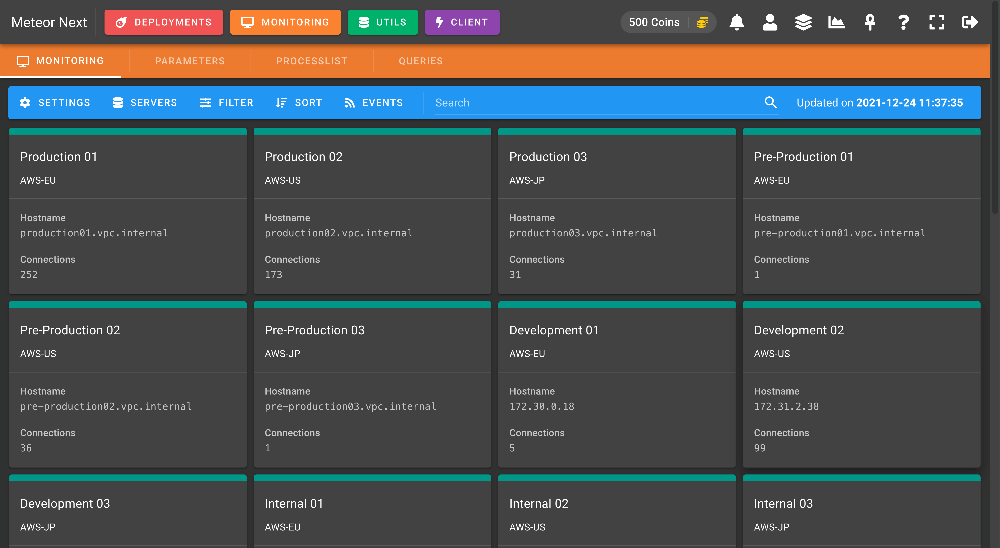
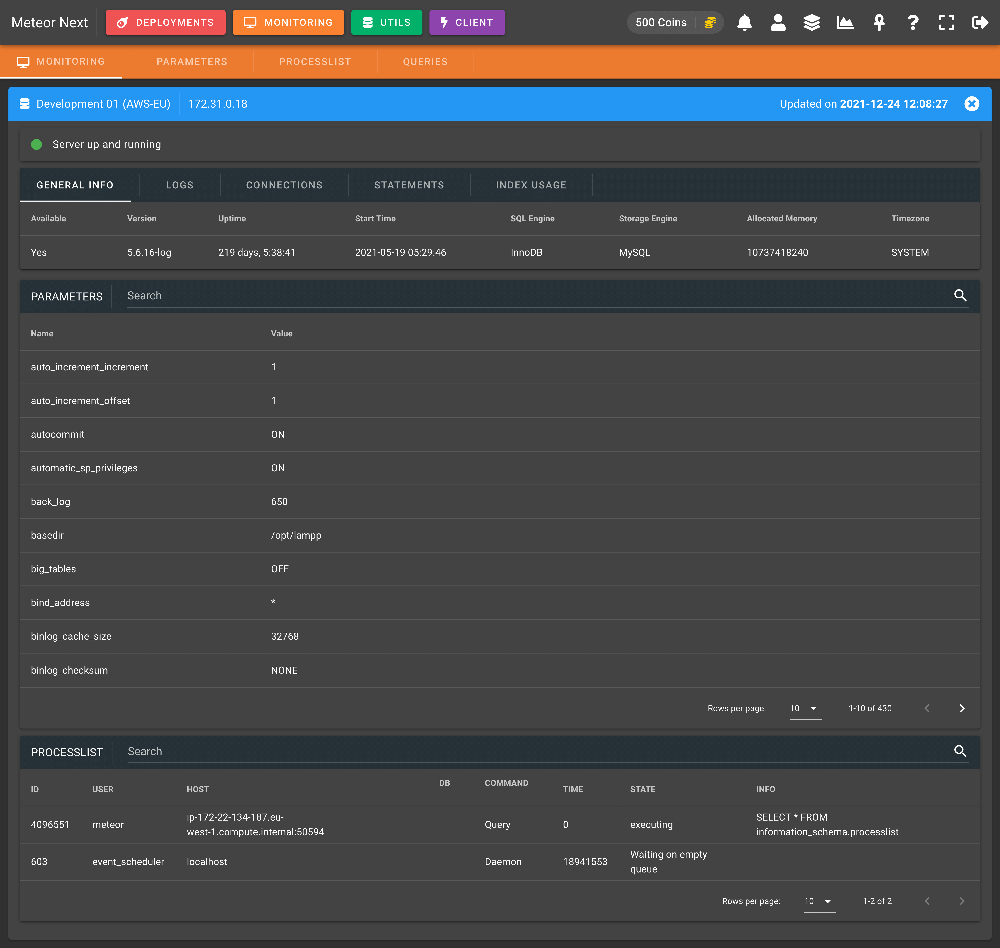
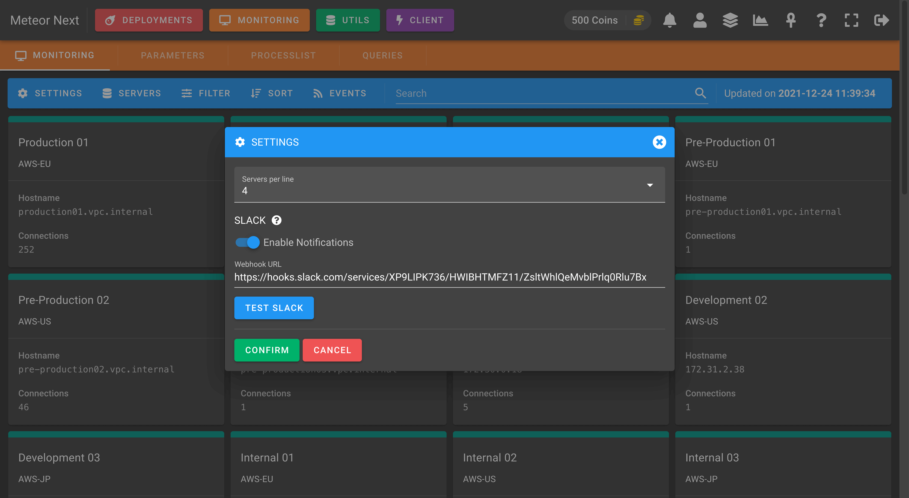
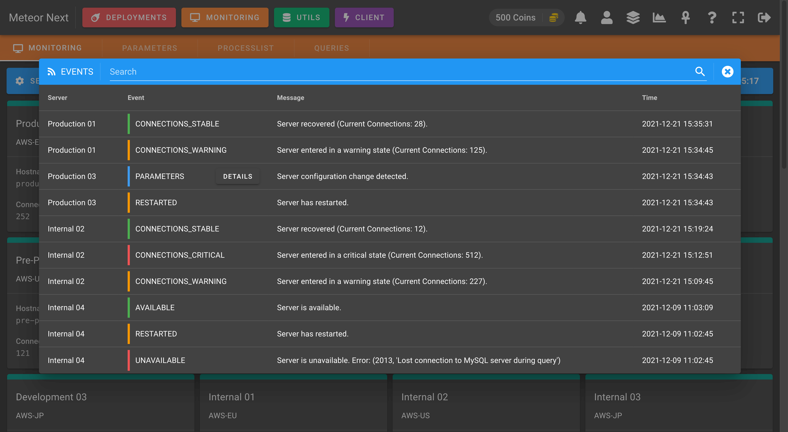

# Introduction

The Monitoring section allows to monitor database servers in real-time.

These are the different resources that can be monitored:

- **Status**: Monitor server's status (available / unavailable) and all the events that happened in the past.
- **Parameters**: Monitor server's parameters and compare it with other servers.
- **Processlist**: Monitor in real-time all queries that are being executed in a server.
- **Queries**: Track slow queries to be later analyzed.

This section has been developed with a proactive notification system. Everytime a server changes its status (available, unavailable, restarted, parameters changed) a notification will be sent to the users that have this server added in their monitoring list.

You can also click a server to get further details.

**SETTINGS**

There are some settings that can be defined:

- **Data Collection Interval (seconds)**: The seconds that have to pass to retrieve again the server's status. The value must be greater or equal than 9.
- **Servers per line**: The amount of servers to be displayed per line.
- **Slack Notifications**: Enable to receive an Slack message everytime a server changes its status (available, unavailable, parameters changed, restart).

**SERVERS**

Here we can select which servers of our inventory have to be monitored.

**FILTER**

This option is used to filter the servers in the list. The available options are:

- **All**: Show all monitored servers.
- **Available**: Show all monitored servers that are available.
- **Unavailable**: Show all monitored servers that are unavailable.
- **Loading**: Show all monitored servers that are being loaded (this status happens the first time we choose a server to be monitored).

**EVENTS**

This option shows a dialog with all the events happened in the last 15 days for all servers selected to be monitored.

