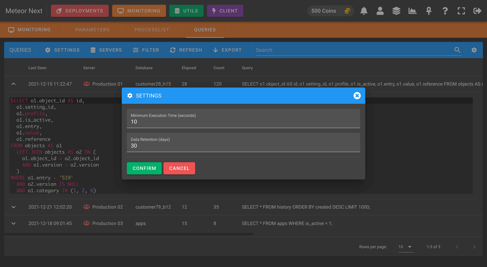

# Queries

This section is used to track slow queries to be later analyzed.

**SETTINGS**

There are some settings that can be defined:

- **Minimum Execution Time (seconds)**: Meteor will track all queries that their execution time is equal or greater than this value.
- **Data Retention (days)**: The maximum number of days to retain the data. All queries that have been executed X days ago, will be deleted from the list.

**SERVERS**

Here we can select which servers of our inventory we want to track their slow queries.

**FILTER**

This option is used to filter the slow queries in the list.

**COLUMNS**

Here we can choose which columns we want to display or hide.

