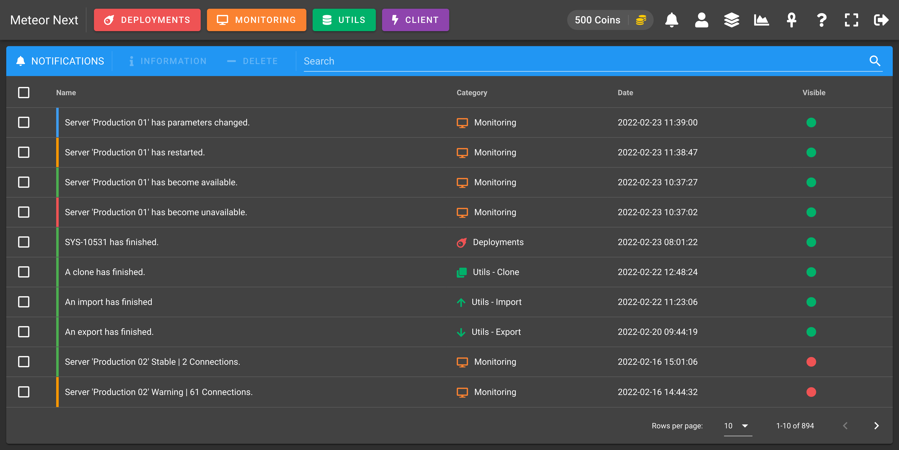

# Notifications

The Notification section is used to keep track of all the events that happened in the past in your user's account.

## Sources

There are three sources of notifications:

- [Deployments](#deployments)
- [Monitoring](#monitoring)
- [Utils-Restore](#utils-restore)

### Deployments

A notification is sent every time a scheduled deploymend ends.

### Monitoring

A notification is sent everytime a selected monitored server changes it's state.

:::tip
To add servers to be monitored head to the [Monitoring](monitoring/introduction#servers) section. 
:::

These are all the different states:

- **Unavailable**: The server is unreachable.
- **Available**: The server is back online and can be reached.
- **Restarted**: The server has been restarted.
- **Parameters Changed**: Some MySQL parameters have been changed.
- **Connections - Critical**: The server entered in a critical state. There are some dangerous/non optimized queries that causes an important bottleneck and therefore affecting considerably the server's stability.
- **Connections - Warning**: The server entered in a warning state. There are some non optimized queries that are taking more than expected.
- **Connections - Stable**: The server entered in a stable state. This event is fired after the server has been recovered of a critical/warning state.

### Utils-Restore

A notification is sent every time a restore ends.

## Notification Center

In the notification center you can manage all the past notifications that you have received.

