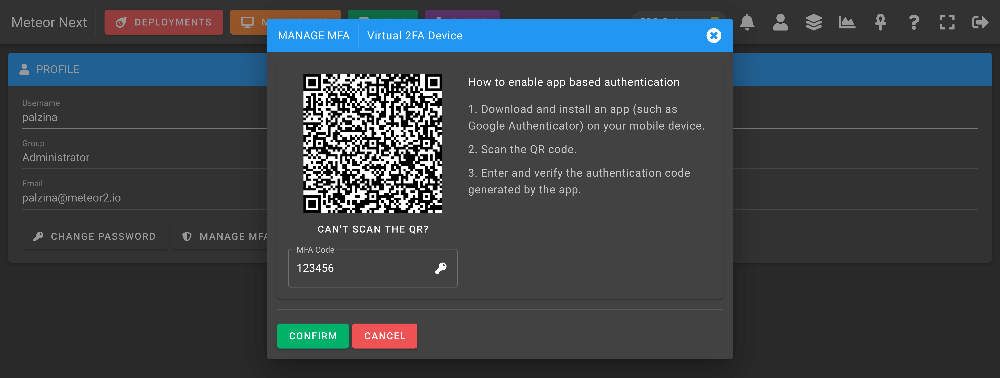
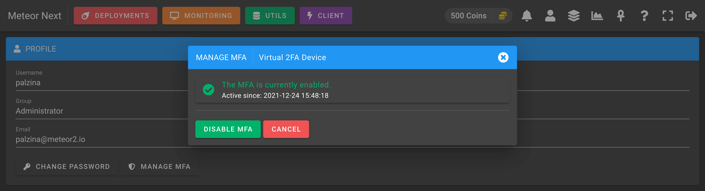

# Profile

The Profile section is used to manage some security parameters to the user's account.

- [Change Password](#change-password)
- [Manage MFA](#manage-mfa)

## Change Password

To change the password of the current account click the `Change Password` button and fill all the required fields.

## Manage MFA

To manage the MFA of the current account click the `Manage MFA` button. There's two available methods:

- [Virtual 2FA Device](#virtual-2fa-device)
- [Security Key](#security-key)

### Virtual 2FA Device

Scan the QR code with an app such as Google Authenticator and enter the code generated by the app.

If the code was successful, you will see a message telling that `The MFA is currently enabled`. At this point you can close the dialog or click the `Disable MFA` to disable this multifactor authentication.

The following screenshot shows the login page once the username and password credentials have been filled and submitted. Another view is shown asking for the 2FA Code.

### Security Key

After choosing the Security Key as a MFA method you will have to touch your security key sensor.

Once the sensor is detected the view will change showing that the fingerprint has been recognized. Click the `Confirm` button and you will have your MFA successfully enabled.

After that, you will see a message telling that `The MFA is currently enabled`. You can now close the dialog or click the `Disable MFA` to disable this multifactor authentication.

The following screenshot shows the login page once the username and password credentials have been filled and submitted. Another view is shown asking to verify the identify by pressing the security key sensor.

After detecting your security key, the login process will check if the fingerprint matches with the key that you added into your profile. And finally you will be logged in.

