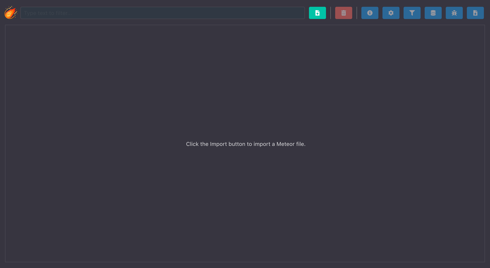
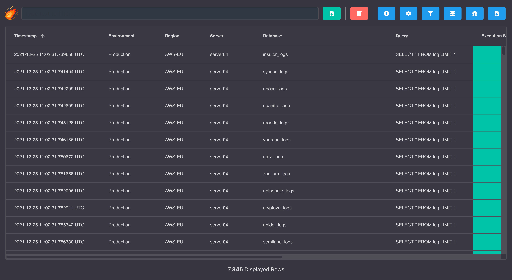
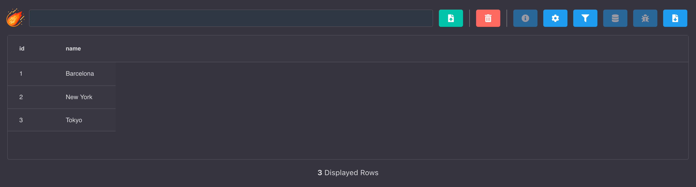

# Results


The Results section is used to import `Meteor` file formats from any Deployment or any Client export.



:::tip
To better understand how this tool works and all features that contains please read first the **[Deployment Results](deployments/results)** section.
:::

## Example

The following screenshot shows an example of a Meteor file exported from the result of a deployment.



## Building a Meteor file

A Meteor file is written in JSON. Contains two keys:

- **DATA**: An array of objects (each one will be transformed into a row).
- **COLUMNS**: An array of strings containing the order of the columns to be displayed. 

Here's an example of a valid Meteor file.

```json
{
    "DATA": [{"id":"1","name":"Barcelona"},{"id":"2","name":"New York"},{"id":"3","name":"Tokyo"}],
    "COLUMNS": ["id","name"]
}
```

The following screenshot shows how this file would be displayed if it was imported into the Results.



So, yes, you could build your custom Meteor files and use this tool to better display your data and also to perform any kind of search or filter.