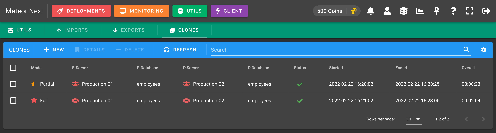
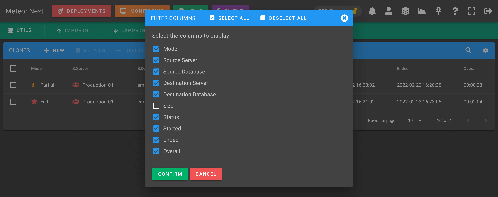
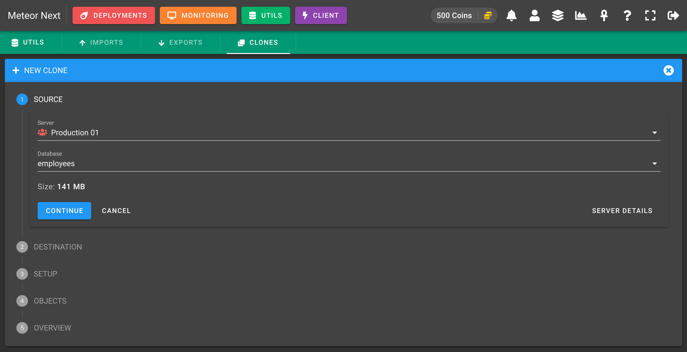
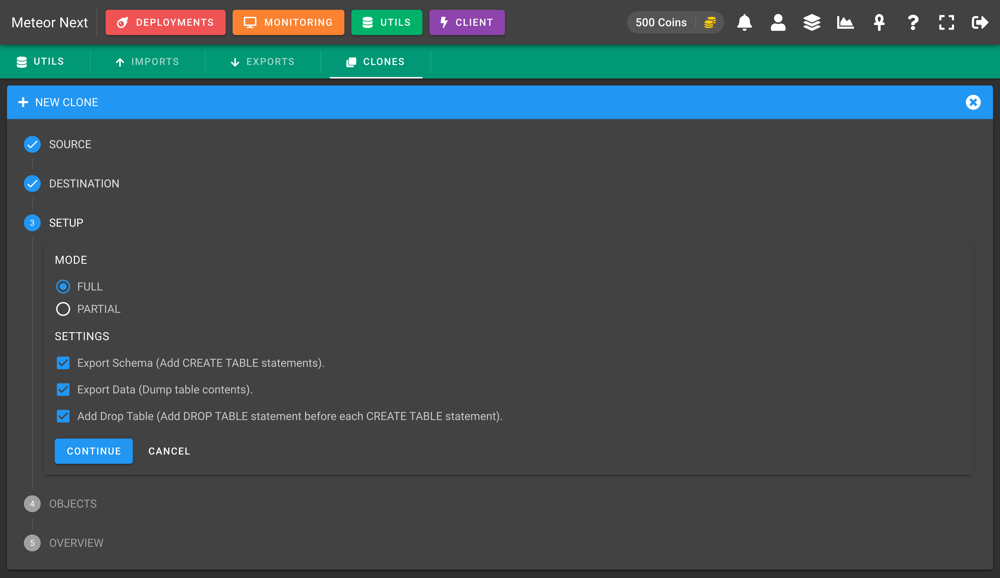
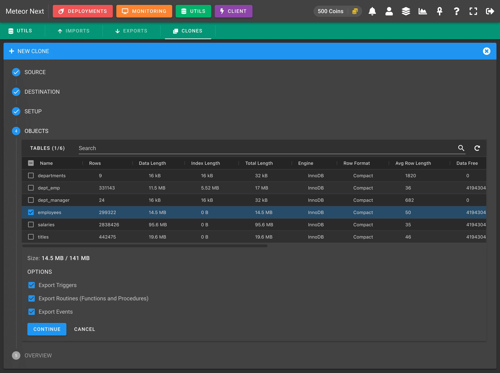
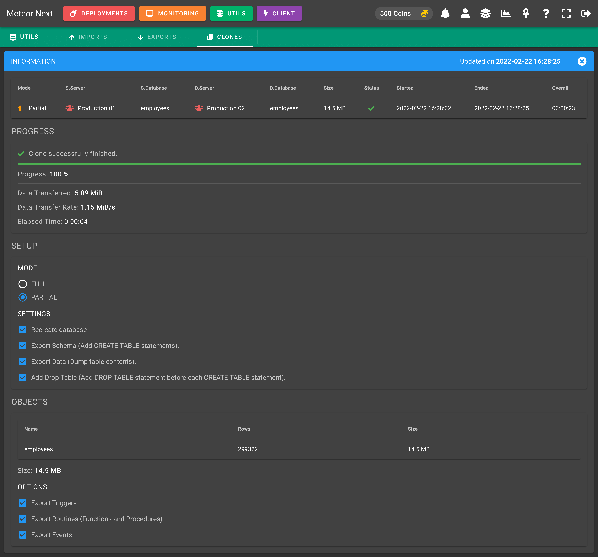

# Clones

This section is used to copy databases and tables from any server to any other server.



These are all the different columns we can choose to show or hide.



## Modes

Meteor Next accepts two cloning modes:

- **Full**: To clone entirely a database with all their objects (tables, views, triggers, functions, procedures).
- **Partial**: To clone only some tables of a database.

### Full Clones

This mode it's used to clone entirely a database with all their objects (tables, views, triggers, functions, procedures).

First choose the source server and database to be cloned.



Here choose the destination server and database to be cloned.


In the next step you can choose some settings. You can leave it as it is. Click CONTINUE.



Notice that the **OBJECTS** step will be skipped since this one it's only used with the mode = Partial. After reviewing all fields click **CLONE** and the process will start.


You will be redirected to another window showing the cloning process.


### Partial Clones

This mode it's used to clone only some tables of a database.

First choose the server and the database to be cloned.


Here choose the destination server and database to be cloned.


In the next step you can choose some settings. Choose the Partial mode.


Here you will been able to select which tables you want to clone. Also you will be able to choose some optional settings to also clone the triggers, routines and events. 



The last step will appear an overview. After reviewing all fields click **CLONE** and the process will start.


You will be redirected to another window showing the cloning process.



## Infrastructure

The underlying process of the Clone is similar of how the Deployments work. The clone process is performed at the regions where source server and the destination server are located. In this way the delay between regions is avoided.

First of all, Meteor exports all the selected data of the source database directly into Amazon S3. This process is performed at the region where the server is located.
After that, Meteor imports the imported file (located in Amazon S3) into the destination server's database. This process is performed at the region where the destination server is located. 


Also, no files are stored into the hard drive so we don't have to worry about to not to run out of disk space.

## Requirements

There are some requirements that have to be fullfilled in order to perform clones.

First of all and the most important is that a valid Amazon S3 account must be setup into the Administration Panel --> Amazon S3.

Also we need to have installed some binaries in all regions that we have enabled the `SSH Tunnel` option. All these machines will need the following binaries:

- **Pipeviewer**: A terminal-based tool for monitoring the progress of data through a pipeline.
- **MySQL Client**: The MySQL Command-Line Client (version >= 5.6).
- **AWS CLI version 2**: The AWS Command Line Interface (CLI) is a unified tool to manage AWS services. 

These are the commands to install these components depending on your Linux distribution.

```bash
# Debian / Ubuntu
apt install pv
apt install mariadb
# Centos / AWS Linux
yum install pv
yum install mariadb
```

Here is the official documentation to install the AWS CLI version 2.

https://docs.aws.amazon.com/cli/latest/userguide/getting-started-install.html