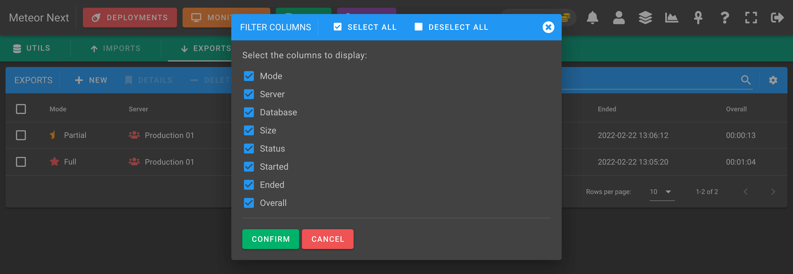
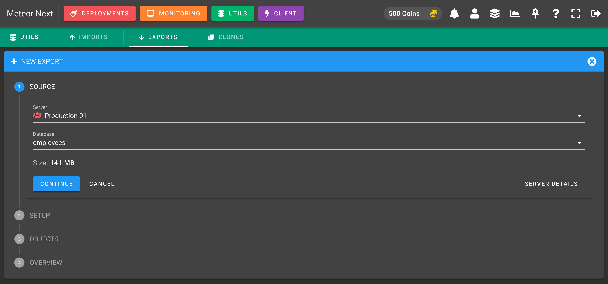
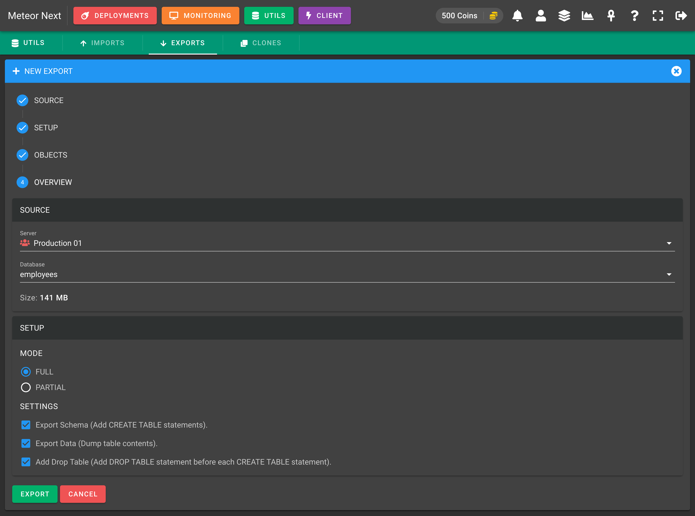
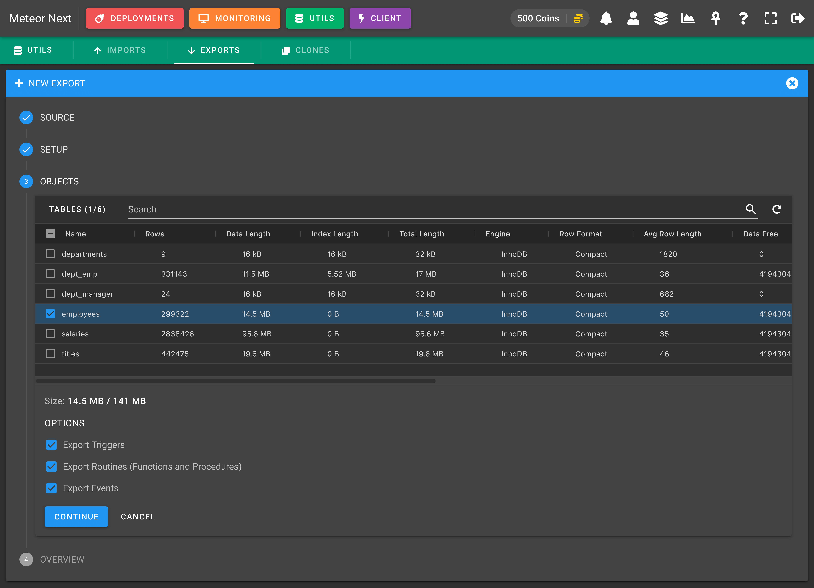
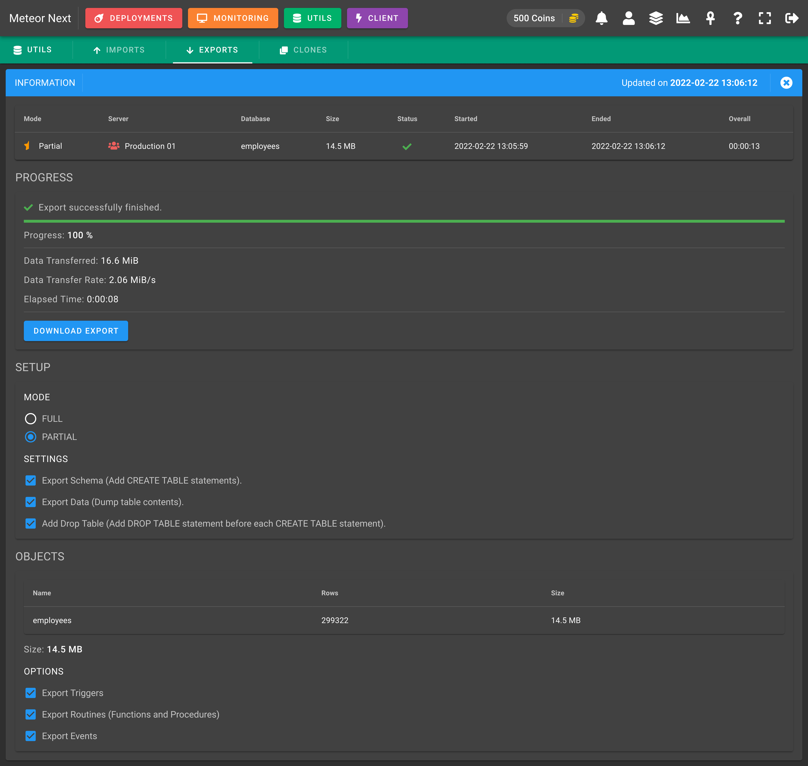

# Exports

This section is used to export databases and tables from any server.


These are all the different columns we can choose to show or hide.



## Modes

Meteor Next accepts two exporting modes:

- **Full**: To export entirely a database with all their objects (tables, views, triggers, functions, procedures).
- **Partial**: To export only some tables of a database.

### Full Exports

This mode it's used to export entirely a database with all their objects (tables, views, triggers, functions, procedures).

First choose the server and the database to be exported.



In the next step you can choose some settings. You can leave it as it is. Click CONTINUE.


Notice that the **OBJECTS** step will be skipped since this one it's only used with the mode = Partial. After reviewing all fields click **EXPORT** and the process will start.



You will be redirected to another window showing the exporting process. When the process finishes the `DOWNLOAD EXPORT` button will appear. Click this button and you will be able to download it.


### Partial Exports

This mode it's used to export only some tables of a database.

First choose the server and the database to be exported.


In the next step you can choose some settings. Choose the Partial mode.


Here you will been able to select which tables you want to export. Also you will be able to choose some optional settings to also export the triggers, routines and events. 



The last step will appear an overview. After reviewing all fields click **EXPORT** and the process will start.


You will be redirected to another window showing the exporting process. When the process finishes the `DOWNLOAD EXPORT` button will appear. Click this button and you will be able to download it.



## Infrastructure

The underlying process of the Export is similar of how the Deployments work. Basically the export process is performed at the region where the destination server is located. In this way the delay between regions is avoided.


To also reduce drastically the execution time needed to finish an export, all the process is performed in a single pipe and the file is automatically uploaded into Amazon S3. In this way the file to be exported is never downloaded to the disk.

When the exporting process finishes a presigned URL is generated which we can use to download the file directly from Amazon S3.

## Requirements

There are some requirements that have to be fullfilled in order to perform exports.

First of all and the most important is that a valid Amazon S3 account must be setup into the Administration Panel --> Amazon S3.

Also we need to have installed some binaries in all regions that we have enabled the `SSH Tunnel` option. All these machines will need the following binaries:

- **Pipeviewer**: A terminal-based tool for monitoring the progress of data through a pipeline.
- **MySQL Client**: The MySQL Command-Line Client (version >= 5.6).
- **AWS CLI version 2**: The AWS Command Line Interface (CLI) is a unified tool to manage AWS services. 

These are the commands to install these components depending on your Linux distribution.

```bash
# Debian / Ubuntu
apt install pv
apt install mariadb
# Centos / AWS Linux
yum install pv
yum install mariadb
```

Here is the official documentation to install the AWS CLI version 2.

https://docs.aws.amazon.com/cli/latest/userguide/getting-started-install.html