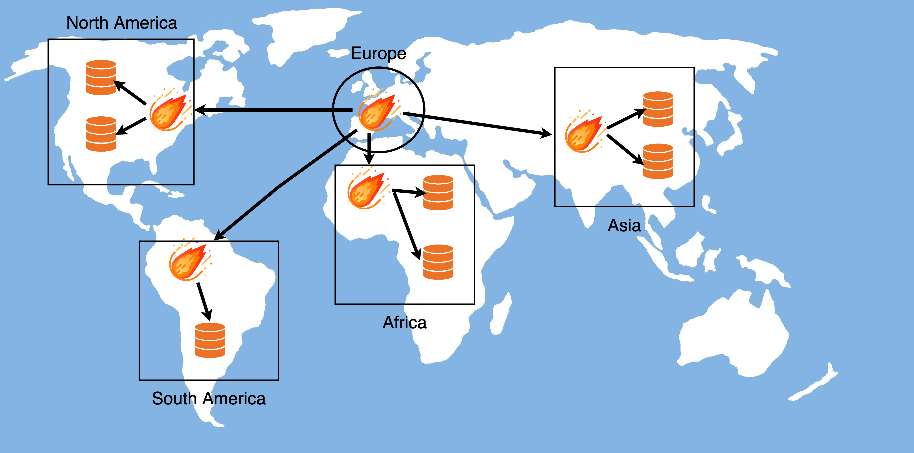

# Restore

This section is used to import SQL files from different sources to any database.

These are the available sources:

- **File**: A file located on a local drive.
- **URL**: An accessible url.
- **[Cloud Key](../inventory/cloud)**: A cloud computing service, such as Amazon Web Services (AWS).

The different available file formats accepted are SQL, GZ and TAR.


Here we can chose which columns we want to show or hide.


## Examples

### Importing from File

To import a file choose the `File` option from the sources list and then select the desired file from your local drive. 


Then select the server you want to import this file and the database name.


The last step is an overview showing all the filled fields. Click the `RESTORE` button to start the restoring process.


The restore process will start showing us some metrics.


### Importing from Cloud Key

To import a file from a Cloud Key choose the `Cloud Key` option. After that a table will appear showing all the Cloud Keys we have into our inventory. Choose the one you want to access.


After clicking the Cloud Key, the table will load the buckets containing in the Cloud Key. Choose the bucket that contains the file we want to restore.


After that, we will be able to navigate through the files into the selected bucket. Choose the file to be restored.


Choose the server and the database name that will be used to restore the selected file from the previous step.


Finally a summary will show with all the selected options. Click the `RESTORE` option to start the restore process.


After the process starts we will be able to track the process.


### Importing .tar / tar.gz files

When a .tar / .tar.gz file is selected using either URL or Cloud Key as source, a new process automatically starts and a new table is shown with all the files that are contained inside the one we selected.

At this point we can select any .sql or .gz files and Meteor will only restore the desired files. This use case is useful if for example we store the database backups as a .tar.gz file that contains one file per table. Thus, we are able to restore just a table on the fly without having to restore the entire database.


## Infrastructure

The underlying process of the Restore is similar of how the Deployments work. Basically the restoring process is performed at the region where the destination server is located. In this way the delay between regions is avoided.



To also reduce drastically the execution time needed to finish a restore, all the process is performed in a single pipe. So the file retrieval, the decompression and the restore is performed in a single computing unit. Bear in mind also that by using URL or Cloud Key as a source method, the file to be restored is never downloaded to the disk. So you won't have to worry about having as much disk space as your file to be restored.

## Requirements

There are some requirements that have to be fullfilled in order to perform restores in different regions.

This behaviour happens when we want to do a restore in a server which its region has the `SSH Tunnel` option enabled. In this case we will have to install some components in that SSH machine before starting the restore.

- **Pipeviewer**: A terminal-based tool for monitoring the progress of data through a pipeline.
- **MySQL Client**: The MySQL Command-Line Client.

These are the commands to install these components depending on your Linux distribution.

```bash
# Debian / Ubuntu
apt install pv
apt install default-mysql-client
# Centos / AWS Linux
yum install pv
yum install mysql
```