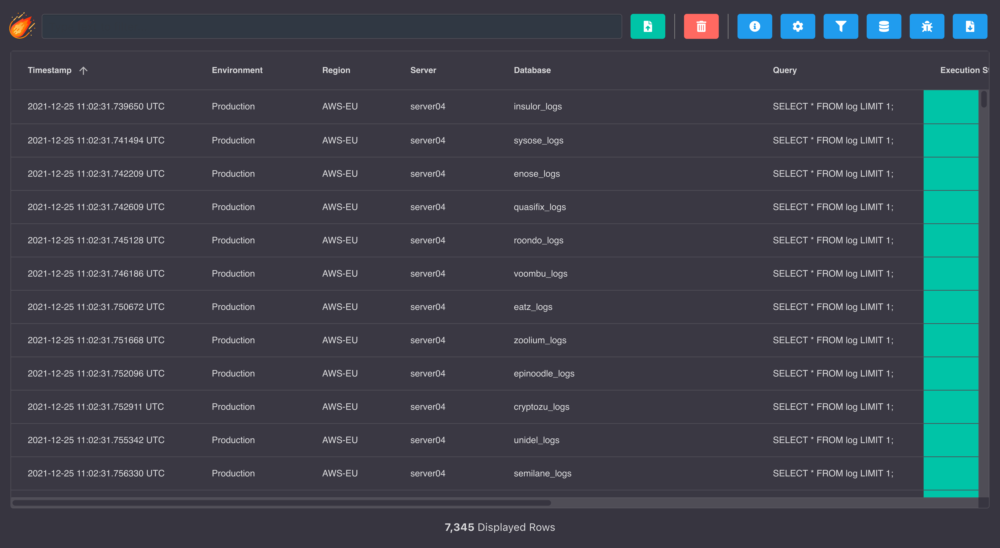

# Data Viewer

The Data Viewer section is used to import CSV or JSON files to perform data analytics.


:::tip
To better understand how this tool works and all features that contain, head to the **[Deployment Results](./deployments#results)** section.
:::

## Example

The following screenshot shows an example of importing a deployment results to the Data Viewer.



## Importing a CSV file

Here's an example of importing a CSV file.


```csv
id,name
1,Barcelona
2,New York
3,Tokyo
```

The following screenshot shows how this file would be displayed if it was imported into the Data Viewer.


## Importing a JSON file

Here's an example of importing a JSON file.


```json
[{"id": 1, "name": "Barcelona"}, {"id": 2, "name": "New York"}, {"id": 3, "name": "Tokyo"}]
```

The following screenshot shows how this file would be displayed if it was imported into the Data Viewer.


