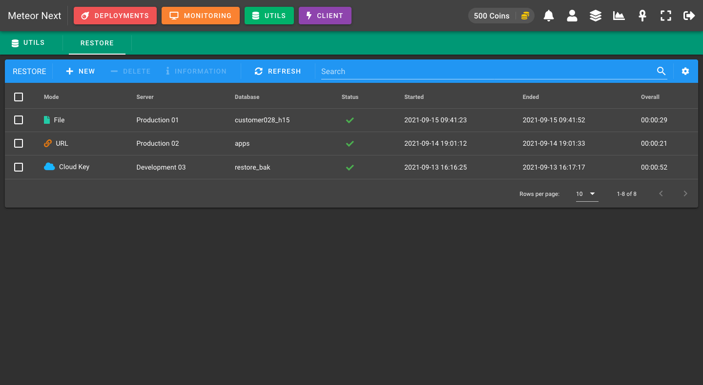
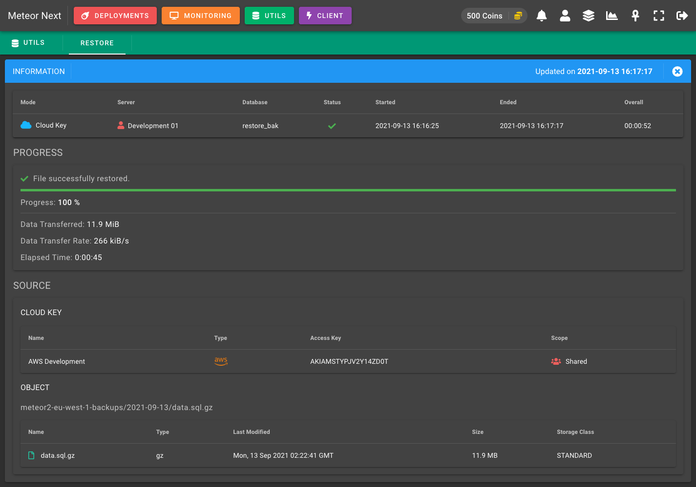

# Introduction

Meteor Next is a multiplatform web application that fully automatizes database workload operations.

## Features

- 🚀 **Deployments**: Execute thousands or millions of SQL queries to multiple servers/databases in a secured and automated way getting a detailed summary.
- 🖥️ **Monitoring**: Perform active monitoring in all the database servers (server metrics, parameters and queries).
- 🛠️ **Utils**: Different apps like performing SQL restores from files, url or directly from Amazon S3.
- ⚡ **Client**: A complete MySQL Client.

### Deployments

Deployments - List

Deployments - Execution

Deployments - Results

### Monitoring

Monitoring - List

### Utils

Restore - List

Restore - Execution

### Client

Client - Executing a query

## Why?

As Database Engineers, we spend a lot of time managing all the data infrastructure, and it can be hard to find relevant products that helps us with our daily needs. Most of the time we're coding scripts to automatize some repeating operations.

This is what happened me when I started working as a Database Engineer in my last job. I had to start performing some concurrent tasks such as massive and dangerous SQL deployments on each Release, monitor some metrics in hundreds of database servers and to manage all the database user's accounts.

At first, when I started working on this position, I only had a MySQL client and some legacy scripts to perform all those sql deployments.

I started digging in the net hoping to find a competent app that could aid me to perform all these repeated tasks in a secured and automated way. All I found was multiple applications, one to perform deployments, another one to manage all the database servers inventory, another to perform active monitoring and another one to give me access to all the servers (a MySQL Client).

Most of these applications I found were useful, but in some cases I had to continue write python scripts to solve corner cases that those apps could not fulfill.

At this point I thought, "why not building a multiplatform web app that could automatize all those concurrent database operations that every company need to handle?"

After two years and a half designing and coding this application in my free time, today the company where I work has all the database infrastructure automated and secured. Now I don't have to think about all those daily tasks. Everything works as it should. Developers also have access to this app (with limited access) and most of the tasks now can be done without the need of being reviewed by the Data Engineer.
