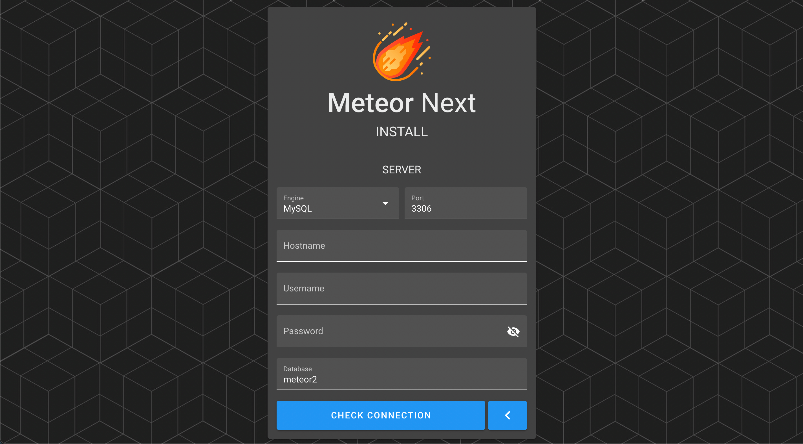
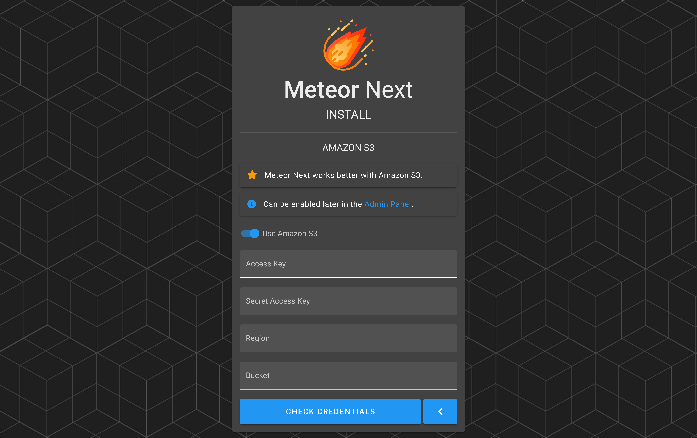

# Setup

After starting the meteor2 container it's now time to configure the application.

Open a web browser such as Firefox or Google Chrome and go to the following page:

```bash
http://host-ip:1234
```

> Change `host-ip` for the host ip where the meteor2 container is running.

After entering the URL the Login page will be shown. At this point click the `INSTALL` button.


The first step is to enter a valid license (Email & Key).


After entering a valid license, it's now time to enter the server credentials to store the app's database.



The last step is to create the admin account by entering the username and password.



After finishing the installation the Login page will be shown. Enter the admin account credentials.


ENJOY!


