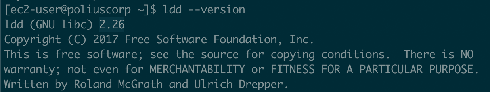

# Requirements

There are some requirements that have to be fulfilled in order to use some sections of Meteor Next.

## Deployments

This requirement only applies for regions that have the `SSH Tunnel` option enabled. All these machines that Meteor will perform an SSH tunnel to perform deployments will need to have the Glibc version >= 2.17.

The Glibc version can be retrieved by executing the command `ldd --version` using the terminal.



:::tip What is glibc?
The GNU C Library project, commonly known as glibc, is the GNU Project's implementation of the C standard library that provides the core libraries for the GNU system and GNU/Linux systems, as well as many other systems that use Linux as the kernel.

Some of the most best-known OS that includes this library are:

- Ubuntu
- Debian
- Fedora
- OpenSUSE
- CentOS
:::

## Monitoring

There are no requirements to be fulfilled.

## Utils

This requirement only applies for regions that have the `SSH Tunnel` option enabled. All these machines that Meteor will perform an SSH tunnel will need to have installed some binaries:

- **Pipeviewer**: A terminal-based tool for monitoring the progress of data through a pipeline.
- **MySQL Client**: The MySQL Command-Line Client (version >= 5.6).
- **AWS CLI version 2**: The AWS Command Line Interface (CLI) is a unified tool to manage AWS services. 

These are the commands to install these components, depending on your Linux distribution.

```bash
# Debian / Ubuntu
apt install pv
apt install mariadb
# Centos / AWS Linux
yum install pv
yum install mariadb
```

Here is the official documentation to install the AWS CLI version 2.

[https://docs.aws.amazon.com/cli/latest/userguide/getting-started-install.html](https://docs.aws.amazon.com/cli/latest/userguide/getting-started-install.html)

In order to perform Exports and Clones there is another requirement to be fulfilled. It is needed to have a valid `Amazon S3` account configured in the Administration Panel --> Amazon S3.

The advantage of using the Amazon S3 is that we won't have to worry about of running out of disk space or by exhausting the bandwidth.

## Client

There are no requirements to be fulfilled.
